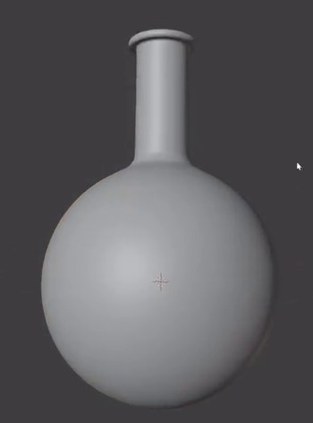
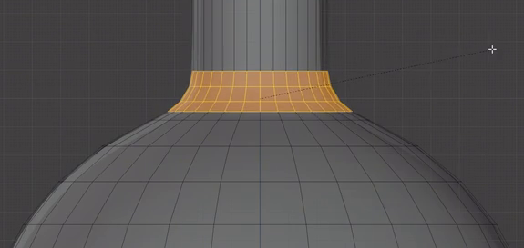
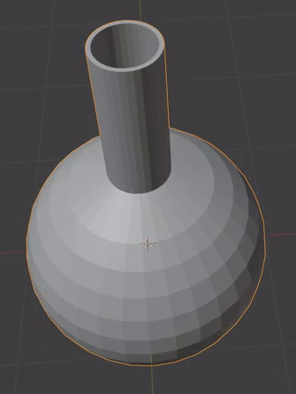
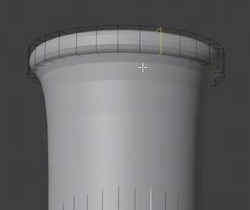

# Round Bottom Flask

Create an editable, hollow round-bottom laboratory flask with a broad spherical bulb, a slender upright neck, a smooth shoulder, and a rounded outward lip. Preserve the proportions and clean continuous silhouette shown in the references.

## Starting Scene

Use Blender 5.1.2 and configure Cycles with GPU rendering. Start from an empty scene and create the flask using native Blender geometry. No external input assets are supplied; the `input/` directory is empty. The result is a static geometry asset, and a neutral opaque surface is sufficient.

## 1. Rounded Bulb

Form a broad, nearly spherical bulb with a convex round bottom. Its horizontal cross-sections should be circular, and its lower profile should remain rounded rather than ending in a broad flat base or a sharp point. Keep the shape rotationally balanced around the flask's upright axis.

## 2. Neck and Shoulder

Place a long, narrow tubular neck above the center of the bulb. The bulb should be several times wider than the neck, while the straight neck portion should be clearly longer than its own diameter. Keep this portion nearly cylindrical and aligned with the bulb's axis.

Join the bulb to the neck through a short, smoothly narrowing shoulder. The profile should flow into the straight neck without a deep groove, an abrupt corner, or an elongated funnel. The bulb, shoulder, and neck must form a continuous vessel surface.

## 3. Hollow Interior and Walls

Keep the mouth open, with a clear passage through the neck into a spacious interior cavity that follows the bulb. The interior must extend down to a closed rounded floor. A shallow recess at the mouth does not provide the required cavity.

Give the vessel real, positive wall thickness around the neck, shoulder, bulb, and bottom. The walls should be thin relative to the vessel and broadly even, apart from the thicker lip. Inner and outer surfaces must meet around the mouth and enclose the wall material without tears, duplicate sheets, or self-intersections. The cavity's only opening to the exterior should be its mouth.

## 4. Rounded Mouth Lip

Finish the mouth with a continuous outward-projecting annular lip that is visibly wider than the neck. Keep it concentric with the neck, level around the opening, and even around its circumference. Give the lip a compact rounded cross-section and softened edges while retaining a distinct overhang. The opening must remain clear through its center.

## 5. Finished Geometry

Keep the flask's geometry editable in the saved scene. Equivalent mesh construction and modifier approaches are acceptable. The evaluated bulb, shoulder, neck, and lip should have smooth silhouettes and consistent surface shading, with no visible polygon bands, pinched shading, or inverted patches. Preserve the intended bulb, neck, and rim shapes as the surfaces are smoothed.

## Deliverables

- `submission.blend`: the editable flask and the scene used for its final render.
- `build.py`: a script that recreates the scene from an empty Blender scene and saves the completed result as `submission.blend`. The saved file must contain the rebuilt flask and render setup without relying on unprovided external assets.
- `B138_Round_Bottom_Flask.png`: a PNG rendered from the actual submitted scene. Frame the complete flask with clear lighting and an elevated three-quarter view that reveals its mouth opening while keeping the rounded bottom visible. The image must be an actual scene render, not a viewport screenshot, source image, or external replacement.
