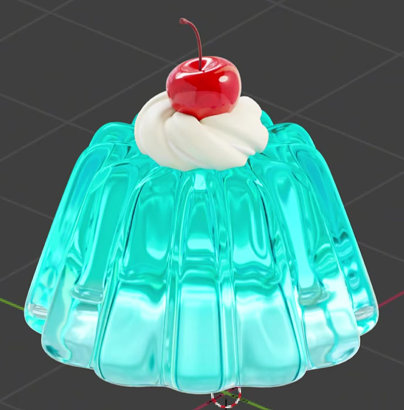
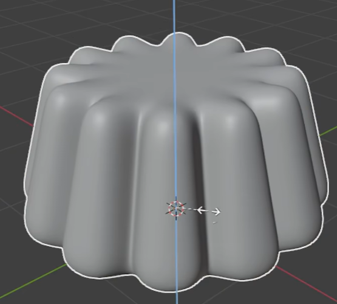
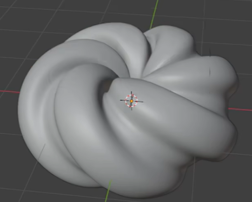
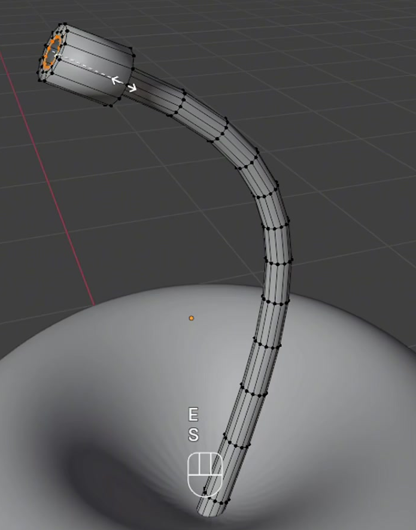

# Transparent Jelly With Cherry

Create a transparent cyan molded jelly topped with an ivory cream rosette, a glossy red cherry, and a slender curved stem. The finished asset should read as a small, neatly assembled dessert with rounded forms and clearly different jelly, cream, fruit, and stem surfaces.

## Starting Scene

Use Blender 5.1.2 and Cycles with GPU rendering. Start from an empty scene. No input assets are provided; `input/` is empty. Build the dessert from native Blender geometry and procedural materials. Choose a consistent scale and retain separately editable jelly, cream, cherry, and stem geometry. This is a static asset.

## Jelly Body

Make a low, broad molded body with a near-circular footprint, a narrower top, and twelve evenly distributed vertical flutes. Each flute should bulge outward between recessed valleys; the repeated lobes must remain visible from the top edge down to the base. Round the shoulders and lower edges while retaining the scalloped silhouette. Close the top and bottom so the jelly forms a solid volume, with enough top surface to support the topping.

## Cream Rosette

Place a compact cream rosette near the center of the jelly top. Its diameter should leave a clear band of exposed jelly around it. Give the cream a thick, low, ring-like body with broad rounded folds that sweep diagonally around the center, creating a twisted rosette rather than an unbroken smooth ring. Preserve grooves between the folds and a shallow central recess where the cherry rests.

## Cherry And Stem

Create one plump, slightly squat cherry that is smaller than the rosette. Shape broad shoulders, a fuller middle, a gently narrowing lower portion, a shallow top dimple, and a restrained bottom indentation. Seat the cherry in the cream without hiding the surrounding folds.

Add a slender stem emerging from the top dimple. It must have visible three-dimensional thickness, a smooth lateral bend, and a slightly enlarged, closed upper tip. Keep the stem distinctly thinner than the fruit and attached at its lower end.

## Surface Finish

Keep the rounded modeled surfaces smooth at close range. Preserve the jelly valleys, cream grooves, and cherry dimples without faceted silhouettes, accidental creases, open seams, or self-intersections. Surface orientation must be consistent so transmission and shading work across the jelly.

Give the jelly a glossy, transparent, refractive surface with a height-based transition from pale blue near the base to stronger cyan or turquoise toward the top. Light and background features seen through the body should be displaced by the curved flutes. Keep the tint endpoints and the height transition editable in the material. The transparent body should retain visible volume and colored edges.

Give the cherry a predominantly red, glossy, nonmetallic skin with restrained darker-red variation and subtle fine bump detail. Use active procedural texture variation for both the color and surface relief, with editable texture scale and relief strength. Preserve smooth fruit contours beneath the texture.

Make the cream opaque ivory to warm white, with soft highlights, fine procedural color variation, and delicate surface grain that is finer than its folds. Give the stem its own dark brown nonmetallic appearance. Keep these surfaces visually distinct from the clear jelly and glossy fruit.

## Presentation

Arrange the dessert as a supported stack: cream touches the jelly top and the cherry sits in the cream. Avoid visible floating gaps and deep intersections that erase a component's form. Use a clean, unobtrusive setting and a slightly elevated three-quarter camera view that includes the entire dessert, base, and stem tip. Light the scene so the jelly's flutes and transparency, the cream's folds, and the cherry's highlights are readable together. Keep bright reflections from obscuring large areas of the subject.

## Deliverables

- `submission.blend`: the saved, editable scene with the complete dessert, working procedural materials, and the final Cycles GPU camera and lighting setup.
- `build.py`: a runnable Blender Python script that recreates the scene from the empty starting scene and saves the recreated result as `submission.blend`. The saved file must reopen with its geometry, materials, camera, lighting, and render settings intact, without unavailable external dependencies.
- `B139_Transparent_Jelly_With_Cherry.png`: a finished still rendered from the actual submitted scene and its final camera. The image must show the complete dessert described above; a viewport screenshot, source reference, or external replacement image is not a substitute.
