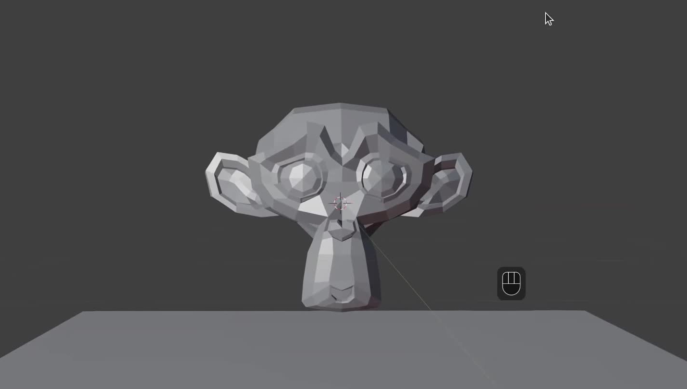
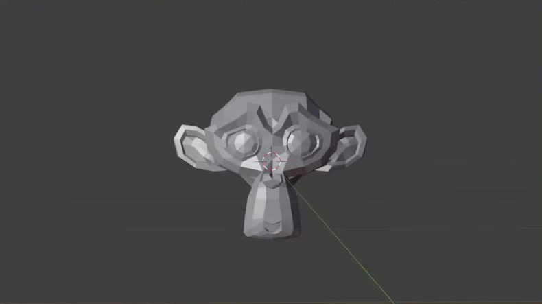
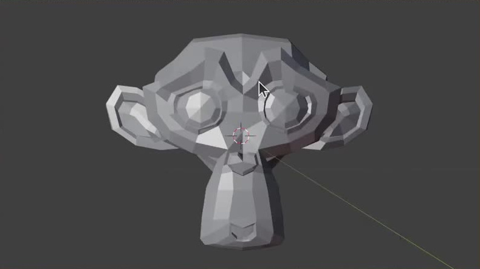

# 手持相机推进镜头

用代码创建一个连续的手持相机镜头：相机缓慢靠近静止的 Suzanne，画面由较宽的正面景别推进到较近的景别，同时叠加克制、不规则的位移与转角晃动。主体始终可辨认，地面提供稳定的空间参照，推进与晃动可以分别调整。

图 1：完成状态的场景与正面视角。参考中的鼠标标记、辅助线和灰色视口背景不属于交付画面。

## 起始条件

- 使用 Blender 5.1.2，从默认场景或空场景开始。`input/` 为空，无需外部模型、纹理或插件。
- 使用 Blender 自带 Suzanne 作为主体，保留可辨认的面部、双耳和低多边形形体；在其下方放置简单的水平地面。场景尺度、对象命名和实现结构自行决定。
- 令 `H` 为静止 Suzanne 从顶部到底部的世界空间高度。下文位移尺度均相对于 `H`，无需采用固定米数。
- 镜头为横向 16:9，帧范围为 1 至 250，24 fps。使用 Cycles，渲染设备设为 GPU Compute；照明应使主体和地面可见，不依赖外部资源。

## 1. 静止主体与空间参照

Suzanne 位于画面前方，双眼、鼻口和两侧耳部均可辨认。主体下方的平面形成清晰的地面区域及可辨认的远侧边缘，画面不需要复杂环境。主体与地面不相交，允许参考所示的小间隙。

在完整镜头中，Suzanne 与地面的世界空间位置、朝向和形状保持不变，画面的远近变化来自相机。地面应在起止帧均清晰出现在画面下部，以便判断位移与轻微倾斜。

## 2. 起止构图与全程可见性

第 1 帧是较宽的正面景别，第 250 帧明显更近。按最终相机画框计算，Suzanne 的投影高度在第 1 帧占画高的 40% 至 55%，在第 250 帧占画高的 65% 至 85%，结束高度为开始的 1.4 至 1.8 倍。两个端点的主体投影包围框中心与画面中心的水平、垂直偏移分别不超过画宽、画高的 8%。这些尺寸按正常晃动开启状态检查。

图 2：起始景别参考；此画面截取于地面加入之前，交付镜头仍应包含第 1 节的地面。

图 3：结束景别参考。两张端点参考均保留相同相机画幅，可比较主体在画面中的尺寸变化。

第 1 至 250 帧的默认完整镜头中，主体整体始终在画框内，四周距画框至少为相应画幅尺寸的 3%；双耳、面部及下端不得被画框或地面遮挡。镜头保持以正面为主，不应绕到主体侧后方。相机近裁剪、景深或运动模糊不得使主体难以辨认。

## 3. 有目的且连续的推进

基础运动从较远处沿视线方向接近主体。关闭晃动后，设第 1 帧相机到主体中心的距离为 `D0`，第 250 帧距离应为 `0.55D0` 至 `0.75D0`；整个区间的距离持续减小，不出现倒退或中途停住。焦距与传感器设置保持固定，主体尺寸也保持固定。

推进具有缓入缓出。关闭晃动后，第 1 至 25 帧以及第 226 至 250 帧的平均推进速度，都应小于第 101 至 150 帧的平均推进速度。相机的位置和朝向连续，没有切镜、瞬移或单帧角度翻转；开启晃动后仍能清楚读出同一条推进运动。该镜头是一次单向推进，播放到结束后可从第 1 帧重新开始。

## 4. 克制且不规则的手持晃动

默认晃动包含小幅平移与小幅转角变化，二者叠加于基础推进。以同一帧“晃动开启”与“晃动关闭”的求值相机变换相比较：全片最大位置偏差在 `0.003H` 至 `0.03H` 之间，最大朝向角差在 0.1 至 1 度之间。画面应呈现连续的细微漂移和轻微俯仰、左右摆动或滚转，不出现高频震颤。

位移与转角都应在不止一个方向上变化。各方向不应始终按同一比例同步变化，不能只沿一条固定斜线往返，也不能不断重复完全相同的短周期。默认效果在整段镜头内持续存在，不得连续 24 帧保持完全相同的晃动偏移；任何一次方向变化都应平滑衔接，不能用逐帧随机跳动代替手持感。

## 5. 可继续调整的镜头

保留基础推进与晃动的独立编辑能力。在文件内给出简短说明，标明活动相机、基础推进的调整位置、平移与旋转晃动的强度和时间快慢控制，以及默认值和恢复方法。可使用动画曲线、修改器、驱动或等价的实时结构，不限定关键帧数量、旋转表示方式或控制器外形。

将全部晃动强度设为零后，同一相机仍应完成第 3 节的基础推进。分别将默认平移强度或默认旋转强度乘以 1.5，对应的求值晃动幅度应增加，另一类晃动和基础推进不随之改变。还应能把晃动的变化速度降低，使起伏持续更久，而不改变基础推进所用的 250 帧时长。上述调整应在场景中直接生效，无需重新生成场景或逐帧手工重做；调整后能够恢复默认效果。

## 6. 交付与复现

提交 `submission.blend` 与 `build.py`。`build.py` 应能在 Blender 5.1.2 中从空场景生成并保存整个镜头，运行方式写在脚本开头。所需资源随文件保存或由代码生成，不依赖本机绝对路径或联网下载。

文件保存为默认晃动开启、第 1 帧、正确活动相机与 1 至 250 帧的播放区间。重新打开后可直接从相机视角播放完整镜头；连续两次播放，以及打乱顺序跳转到指定帧，都应得到相同帧的相同镜头状态。预览帧可以辅助展示，但实际相机运动和编辑能力须保存在 `.blend` 内。

图片来自参考视频实际画面的裁切。画幅占比、相对距离、晃动幅度区间与控制试验倍率为本任务的公开验收约定。

## 渲染效果交付

在原有交付文件之外，另提交 `B13_手持相机推进镜头_动态.mp4`。视频采用 MP4 格式，按本题规定的完整时间范围和帧率，从实际交付工程渲染动画，清楚展示动作与效果变化。使用本题规定的渲染环境；若原题没有指定展示相机，可设置能完整观察主体的相机。该文件应与 `submission.blend` 中的结果一致，不以参考图、视口截图或外部素材代替实际渲染。
