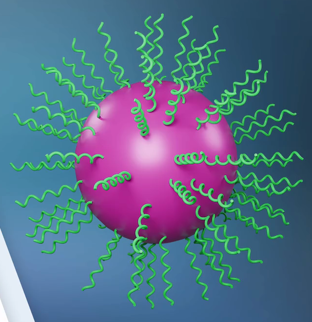
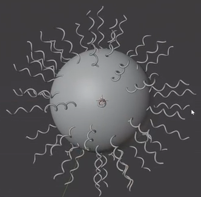
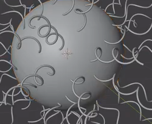

# Helical Strand Nanoparticle

Create an editable nanoparticle model with a smooth spherical core and many fine, open helical strands attached around its surface. The strands should form a separated radial shell, with visible coil depth and enough open space to read the core.

The reference colors are optional. The required result is the modeled geometry and its editable procedural relationships.

## Starting Scene

Use Blender 5.1.2. No external input assets are supplied or required; `../input/` is empty. Build the core, spherical distribution surface, and strand source from native geometry. Keep those three roles independently editable. A spiral extension is optional, and an equivalent native curve construction is acceptable.

## Spherical Core

Make a solid, nearly spherical core with a continuous silhouette and smooth shading. It must remain a visible part of the final model, independently adjustable from the strand population. The distribution surface should occupy the same spherical region as the core without appearing as a second exposed shell.

## Helical Strand

Create a reusable open strand with about three full turns around a longitudinal axis. It must be a three-dimensional helix, with an elongated overall form and a roughly consistent coil width, rather than a flat wavy line or a stack of disconnected rings. Give it a fine, round tubular cross-section.

The tube should stay continuous through the coils, with smooth bends and no visible faceting, sharp kinks, or local collapses. Keep the strand's shape and thickness editable through its source geometry.

## Radial Assembly

Populate the entire spherical surface with many copies of the strand. Their roots must meet or slightly enter the core surface, with no visible floating gap and no long exposed segment running through the core. Keep the strands small relative to the sphere: each should project outward by roughly half to one core radius, and its coil width should be much smaller than its length.

Distribute the roots irregularly but with clear separation, avoiding obvious latitude rows, a single belt, a large empty hemisphere, or dense clumps. The core must remain clearly readable between strands. Orient each strand's longitudinal axis outward along the local spherical normal; the coil may wrap around that axis. Different strands should have varied rotation around their outward axes.

## Editable Distribution

Preserve a working procedural relationship between the strand source, spherical carrier, and visible population. Geometry Nodes or another equivalent non-destructive generator is acceptable. A change to the source strand's shape or thickness must propagate to the generated strands, and a shared relative-size control must resize them without scaling the core.

Provide working population-density and minimum-separation controls. Lower density must reduce the population, while greater separation must increase spacing between roots. These adjustments must retain the source shape, attachment to the spherical surface, and outward alignment.

Provide a seed and a rotation-variation control. Changing them must alter the individual coils' rotation around their outward axes without turning the population inward. Restoring the settings must reproduce the same result. Preserve these functional relationships in the saved scene instead of leaving only a baked collection of unrelated meshes.

## Presentation

Use a neutral or simply colored presentation that makes the spherical silhouette, coil shape, root attachment, and gaps between strands easy to inspect. Use Cycles with GPU rendering. Frame the complete particle with margin around its outermost strand tips. Keep the standalone source strand and any helper carrier out of the final image. No specific material palette, decorative background, or animation is required.

## Deliverables

- `submission.blend`: the complete scene, including the visible model, working procedural controls, camera, and lighting.
- `build.py`: a Blender Python script that recreates the scene from scratch and saves the result as `submission.blend`. The saved file must preserve the modeled result and editable relationships.
- `B140_Helical_Strand_Nanoparticle.png`: a static PNG rendered from the actual scene saved in `submission.blend`. Do not substitute a source image, viewport screenshot, or external replacement.
