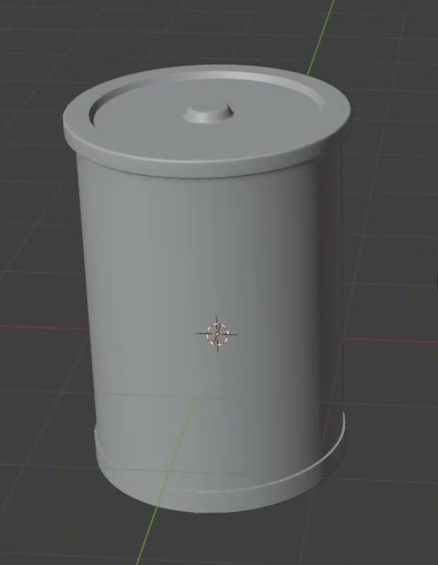
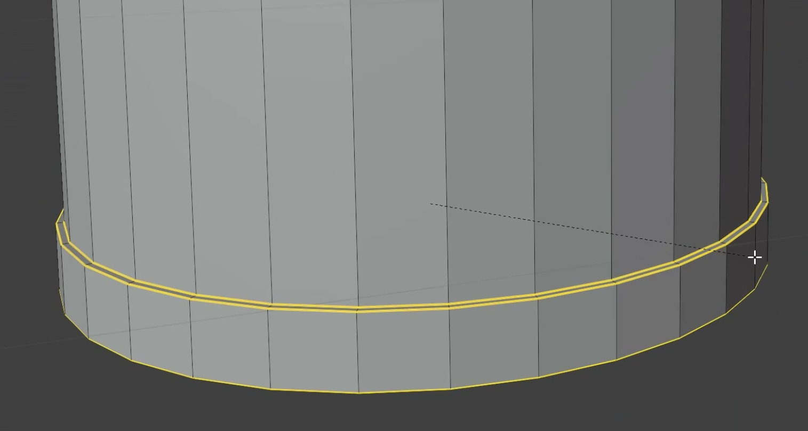
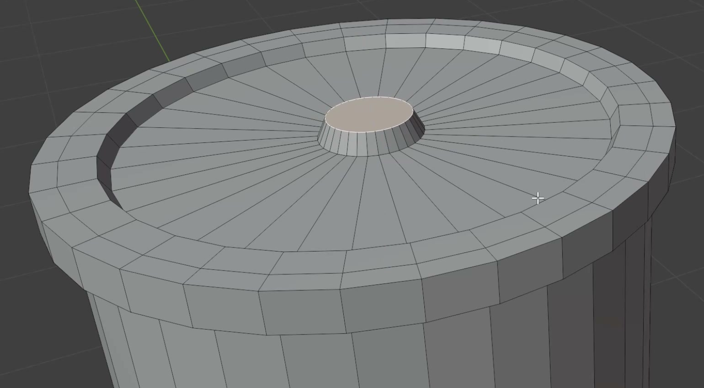
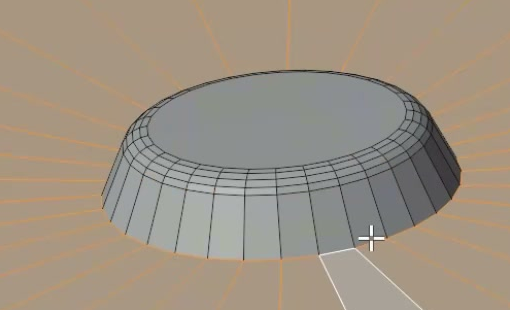

# Cylindrical Battery Gray Model

Create an editable, static gray model of a cylindrical battery can. Its straight body, narrow rolled rims, recessed top lid, and small central positive terminal must remain clearly distinguishable.

## Starting Scene

Use Blender 5.1.2. Start with an empty scene and create the geometry from native Blender primitives. The `input/` folder is empty; no external models, textures, or images are required.

## 1. Can Body

Make one upright battery with a circular cross-section and a straight cylindrical wall. Match the compact can proportions in the reference: the body is about one and a half body diameters tall. Keep the diameter constant through the main wall, with the end details occupying narrow regions at the top and bottom. The battery must have a closed, flat underside.

## 2. Rolled End Rims

Form a continuous narrow rim around each end of the can. Both rims project slightly beyond the main wall, remain concentric with it, and have uniform thickness around their circumference. The upper and lower rims should have comparable visual weight. Preserve a long uninterrupted stretch of straight wall between them.

## 3. Recessed Top Lid

Inside the upper rim, form a broad circular lid that sits slightly below the rim's upper edge. A short inner wall must make that depth change readable from an elevated view. Keep the lid predominantly flat, with a continuous annular area surrounding the terminal. The lid, rim, and body share the same center axis.

## 4. Positive Terminal

Place a low circular terminal at the center of the lid. It must rise clearly above the lid while occupying only a small portion of its diameter, approximately one fifth. Give it a flat top and a short side wall that narrows slightly toward the top. Leave a broad, unbroken area of lid visible around it, so the terminal reads as a separate raised feature.

## 5. Geometry Finish

Soften the exposed edges of both rims, the lid transition, and the terminal with small rounded transitions. Preserve the flat lid and terminal top, the shallow recess, and the crisp distinction between each structural level.

The can wall must shade smoothly around its circumference. The lid and other flat regions must remain visually planar, without rippling or pinching. Remove unintended openings, self-intersections, doubled surfaces, and shading seams. Keep the model editable; one mesh or a carefully fitted assembly is acceptable when it produces the same closed exterior.

## 6. Presentation

Present the battery as an opaque neutral gray model using Cycles with GPU rendering configured. Use an elevated three-quarter camera view that includes the complete battery and makes the lid recess, terminal, and both end rims readable. Provide simple illumination and a plain contrasting background. Keep the surface finish restrained so it supports inspection of the geometry.

## Deliverables

- `submission.blend`: the editable battery scene, with its camera and render settings saved.
- `build.py`: a Blender Python script that recreates the scene from an empty scene and saves the result as `submission.blend`. It must not depend on an existing solution file or unavailable external assets.
- `B141_Cylindrical_Battery_Gray_Model.png`: a still image rendered from the actual submitted scene. The image must show the modeled battery, not a reference image, viewport screenshot, or external replacement.
