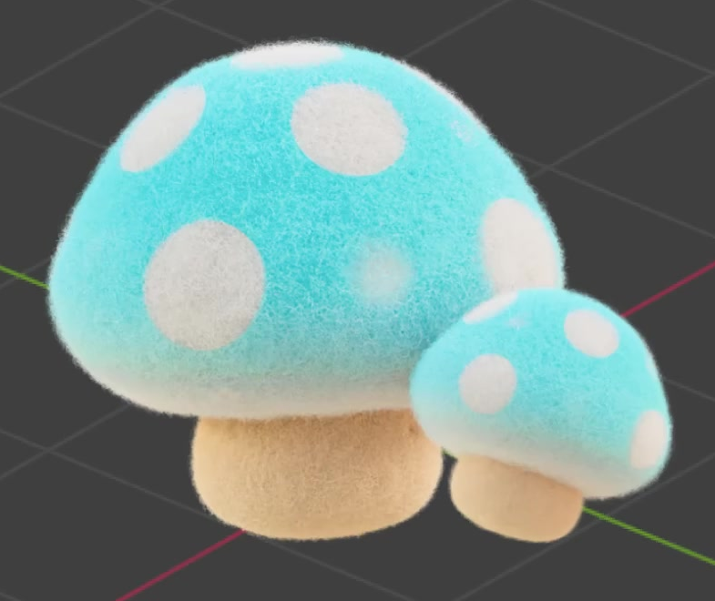
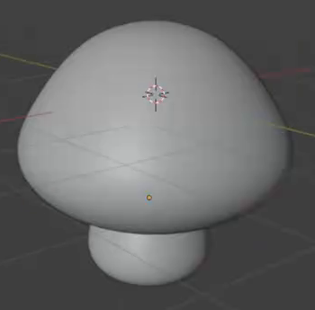
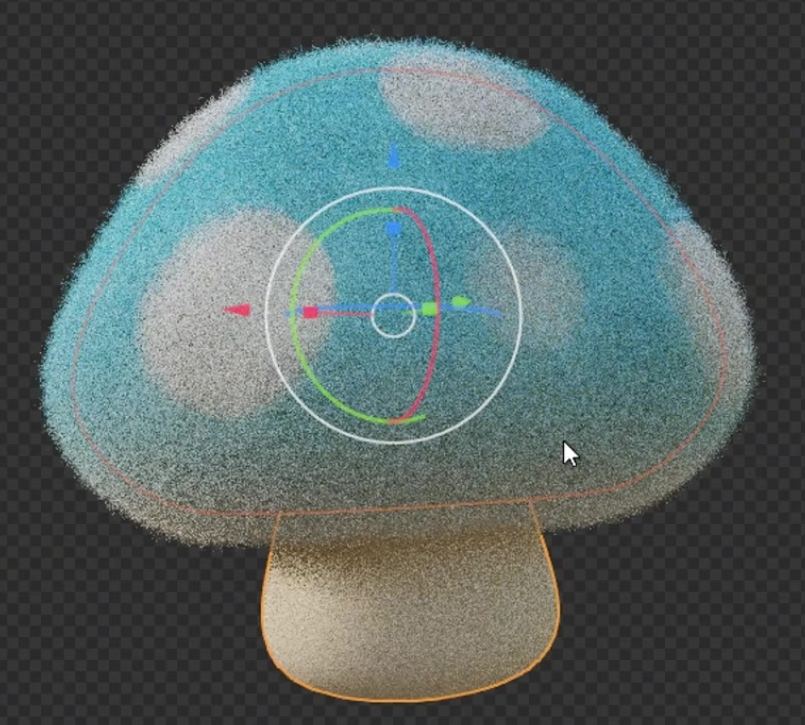

# Wool Felt Mushroom

Create one editable, rounded mushroom with a cyan-and-white spotted cap, a warm off-white stem, and a dense coat of short wool fibers. The result should read as a soft felt object while retaining a clear mushroom silhouette.

The large mushroom is the target. The smaller duplicate shown beside it is optional.

## Starting Scene

Use Blender 5.1.2 and configure Cycles with GPU rendering. No external assets are supplied or required; `../input/` is empty. Start from a new scene and construct the cap and stem from native geometry. Keep the two forms independently editable. Any native fiber implementation that meets the visible and editable outcomes below is acceptable.

## Cap and Stem Shape

Make a broad, rounded cap with a domed crown, a softly rolled lower rim, and an underside that turns inward toward the stem. The cap should extend well beyond the stem on every side. Avoid a thin disc, a sphere perched on a cylinder, or a sharply pointed cone.

Place a short, thick stem beneath the center of the cap. Give it a gently narrowed middle and a rounded, slightly wider base. Its upper end should enter the cap so there is no visible daylight gap. Keep the exposed stem substantially narrower than the cap and preserve the compact proportions in the reference.

## Smooth Editable Forms

The underlying cap and stem must retain useful editable geometry. Their evaluated surfaces should be smooth around the crown, rim, stem sides, and base, with continuous shading and no distracting facets, pinched corners, cracks, or exposed construction openings. The rounded shape must remain evident when the wool is hidden.

## Blue and White Surface Pattern

Give the cap a bright cyan body that fades toward near-white around its lower rim. Add several separate white, broadly rounded spots over the crown and sides. Vary their apparent sizes and spacing while keeping clear cyan areas between them. The spots should read as part of the felt surface and follow the curved cap without conspicuous stretching or seams.

Give the stem a warm off-white color that is visibly distinct from the cyan cap. Preserve the cyan, white spots, pale rim, and warm stem under neutral illumination, with a soft, nonmetallic surface response.

Keep the cap pattern procedural and editable. Provide working controls for spot size, spot distribution or spacing, and the height of the blue-to-white transition. Modest changes to each control must visibly affect its intended surface feature without altering the mushroom geometry or erasing the other pattern components.

## Short Wool Finish

Cover the cap and exposed stem with dense, fine, short fibers. The close view should reveal actual strands and a soft irregular fringe at the silhouette. Small bends, curls, and direction variation should give the coat a wool-like texture while the large-scale dome and stem remain readable.

Keep the fibers short relative to the cap and stem, without long shaggy locks, sparse isolated bristles, large bald areas, or a thick outer shell that obscures the shape. The cap's white spots and cyan areas must remain readable through the coat, and the stem fibers must retain its warm off-white appearance. A flat noise texture or bump map alone does not provide the required fibers.

## Editable Fiber Relationships

Keep the wool attached to the cap and stem surfaces through an editable relationship. Modest edits to either surface must carry its fiber roots with it, without leaving a floating coat. Provide working length and density controls for the wool on both parts; shared controls are acceptable. Changing length should alter strand extent, and changing density should alter surface coverage, while the underlying mushroom remains intact. Restore the intended short, dense coat before saving.

## Deliverables

- `submission.blend`: the editable scene, including the cap, stem, procedural materials, attached wool, and a camera and lighting setup that clearly show the complete mushroom and its fiber finish.
- `build.py`: a Blender Python script that recreates the scene from a new scene and saves the resulting `submission.blend`. It must create the geometry, materials, fiber relationships, and render setup without relying on an existing solution file or external assets.
- `B142_Wool_Felt_Mushroom.png`: a Cycles GPU render from the actual submitted scene. Show the complete primary mushroom with enough image detail to distinguish its spots, pale rim, warm stem, and wool fringe. The image must not be a source frame, viewport screenshot, or externally substituted picture.
