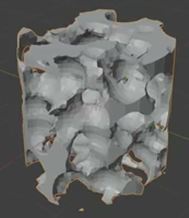
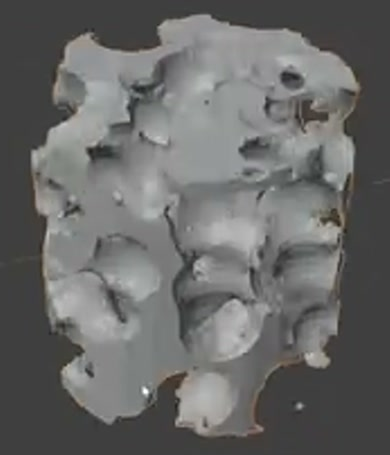
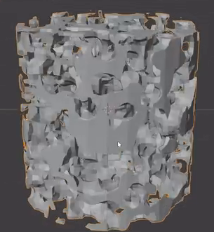

# Procedural Porous Foam Cylinder

Create an editable cylindrical foam specimen whose solid walls surround irregular three-dimensional cavities. The saved result should have the larger, clearly readable pores shown in the final references. Retain a live generator that can change pore size, cylindrical limits, and geometric sampling quality.

The final form has a cylindrical boundary. Its openings interrupt the side and end surfaces, allowing the interior structure to remain visible.

## Starting Scene

Use Blender 5.1.2 and Cycles with GPU rendering. Start from a new scene; a native primitive may serve as the generator's host. No external input assets are provided, and `input/` is empty. Build the pore geometry procedurally using native Blender data and retain the working generator in the saved scene. Equivalent procedural implementations are acceptable.

## Cylindrical Envelope

Make one upright foam specimen with an overall height approximately equal to its diameter. The surviving outer surface should follow a circular cylinder, with parallel end limits. Pores may break the top, bottom, and side outline, but the cylindrical envelope must remain recognizable from several viewing angles. Use proportions rather than a required world-unit size.

## Porous Structure

Distribute many rounded, irregular cavities throughout the body, with varied sizes and positions. The saved coarse-pore state should reveal several distinct cavities across the visible sides and top, separated by substantial walls and bridges. Avoid a regular grid of identical drilled holes.

Create real cavity geometry with concave inner walls. Multiple openings must lead into the body and connect with internal voids, producing overlapping layers of structure when viewed through the openings. A solid core with shallow surface dimples does not satisfy this interior requirement.

The dominant body should remain a coherent foam structure. Existing walls must have finite thickness and join neighboring regions without conspicuous broken sheets, isolated scraps, self-intersecting spikes, or inverted patches. Light faceting like the references is acceptable; preserve readable cavity curvature and usable wall geometry.

## Pore Size Control

Keep an editable control for the spatial size of the pores. Provide working fine and coarse settings: the fine setting produces more, smaller cavities, while the coarse setting produces fewer, larger cavities throughout all three dimensions. Changing this control must regenerate the cavity geometry while keeping the same cylindrical envelope. Save the coarse setting as the default.

Keep the control accessible in the submitted scene. Include a short in-scene text note identifying the control and its two working settings. The control may be a property or an editable parameter in the retained generator.

## Boundary Controls

Provide independent editable controls for the cylinder's radius and height. Each must support a visibly smaller setting than the saved default and produce a valid porous specimen. The controls must change the limits that trim the pore field: reducing radius trims the side extent, and reducing height trims the end extent. Surviving cavities should retain their spatial size and placement instead of being stretched with the whole object.

Add the locations and working default/smaller settings of both controls to the in-scene note. Retain the default, approximately equal-height-and-diameter specimen for delivery.

## Sampling Quality

Provide an editable geometric sampling or refinement control with working coarse and refined settings. Refining must improve the geometric approximation of curved cavity walls while keeping the principal pore arrangement and cylindrical limits recognizable. Adding redundant faces without changing the curved surface approximation is insufficient.

Both settings must evaluate to visible porous geometry. Record the control location and the two working settings in the in-scene note, and save a setting that makes the final cavities clear without conspicuous broken geometry.

## Deliverables

- `submission.blend`: the complete scene with the default foam specimen, live controls, the in-scene control note, and a camera ready to render.
- `build.py`: a Blender Python script that recreates the scene from a new scene and saves the result as `submission.blend`. It must preserve the generator and controls without manual preparation or missing external dependencies.
- `B143_Procedural_Porous_Foam_Cylinder.png`: a static PNG rendered from the actual submitted scene using Cycles GPU. Show the complete specimen in an angled view that reveals its side, top, and inner cavities. Use a simple solid material, lighting, and background that make the geometry readable. The image must be a scene render, not a viewport screenshot, source image, or external replacement.
