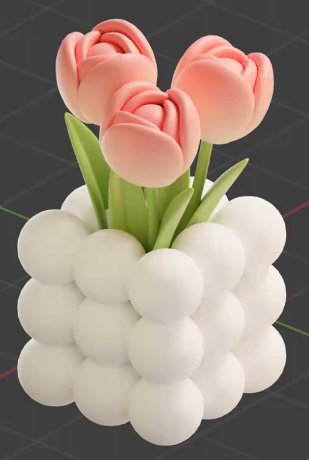
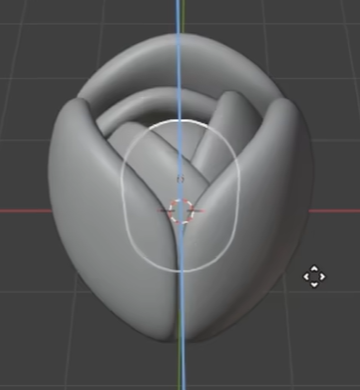
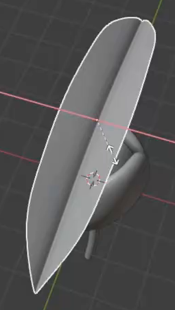
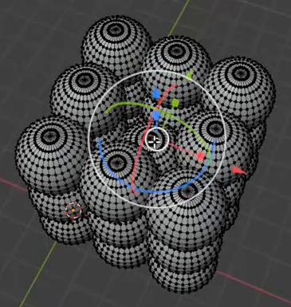

# Pastel Tulip Bouquet

Create a stylized bouquet of three pink-and-peach tulips with green stems and pointed leaves, planted in a white holder made from rounded spheres. The result should have soft, substantial forms and a clear layered-petal silhouette.

## Starting Scene

Use Blender 5.1.2 and Cycles with GPU rendering. Start from an empty scene. The input folder is empty; construct the flowers and holder from native Blender geometry. No external model, image texture, or HDRI is required.

## Tulip Heads

Make three plump, upright tulip heads. Each head has overlapping outer petals around a smaller, staggered inner layer. The bottom closes around the stem, while the top opens enough to reveal the inner petal rims. Keep distinct curved seams between the petals so that the head reads as a layered flower.

Shape each petal with a broad rounded body, a tapered lower end, and an inward-curving upper edge. Give it a convex exterior, a concave interior, and real thickness with softly rounded edges. The visible curved surfaces should be smooth, without coarse facets or sharp shading creases. Any interior filler must remain contained inside the petals.

Keep the petals accessible as editable objects or mesh components; equivalent construction methods are acceptable.

## Stems and Leaves

Give every flower a slender, gently curved stem with a round cross-section. Its upper end meets the flower base, and its lower end extends into the center of the holder. The stems should be much narrower than the flower heads, with continuous silhouettes and no abrupt kinks.

Place a pair of elongated leaves around each stem. Each leaf narrows into a pointed tip and a tapered attachment, with a broader middle, a shallow lengthwise fold, and a gentle longitudinal bend. Give the leaves thin solid edges and smooth surfaces. Their bases meet the stem area, and their tips rise below the flower heads while spreading outward from the bouquet.

## Sphere Holder

Build a compact, approximately cubical holder from similarly sized rounded spheres. Its outer walls show three horizontal levels of spheres and three lobes across each side. Neighboring spheres touch or overlap slightly while keeping their individual round profiles visible.

Leave a central opening through the upper and middle levels for the stems, with supporting geometry beneath it. This opening must exist in the geometry, even where the planted flowers partly obscure it. Keep the sphere surfaces smooth and the repeated spacing regular.

## Bouquet Arrangement

Arrange one flower lower and toward the front, with two higher flowers behind it. Vary their positions and tilt slightly so that all three heads remain distinct and the bouquet spreads naturally above the holder. The stems enter the central opening, and the leaves fill the spaces between stems without concealing the heads. Keep the holder as a substantial lower mass beneath the flowers, following the reference proportions.

Keep each flower assembly independently selectable and editable, including access to its petals, stem, and leaves, and keep the holder separately editable. Ordinary object groups or editable mesh components are sufficient; no animation is required.

## Materials

Use a soft lengthwise color transition on the petals: pale peach or cream near the lower portion, becoming coral pink toward the upper rims and curled inner areas. Apply this treatment consistently to the visible outer and inner petals of all three flowers, with smooth transitions and a soft, opaque surface response.

Use a fresh yellow-green material on the stems and leaves, with gentle highlights that reveal the leaf folds. Give the holder an opaque white material with soft highlights and readable shading between its spheres. These colors must come from materials assigned to the corresponding geometry and remain distinguishable under neutral lighting.

## Deliverables

- `submission.blend`: the complete editable bouquet and holder, their materials, and a camera and lighting setup that show the entire arrangement clearly from a slightly elevated three-quarter view.
- `build.py`: a Blender Python script that recreates the scene from an empty scene and saves the completed result as `submission.blend`. It must not depend on a prebuilt solution scene or unavailable external assets.
- `B144_Pastel_Tulip_Bouquet.png`: a PNG rendered from the actual submitted scene. Show the entire bouquet, its distinct flower heads, green foliage, and white holder with enough detail to inspect the petal layers and sphere arrangement. Do not substitute a source image, viewport screenshot, or externally created image.
