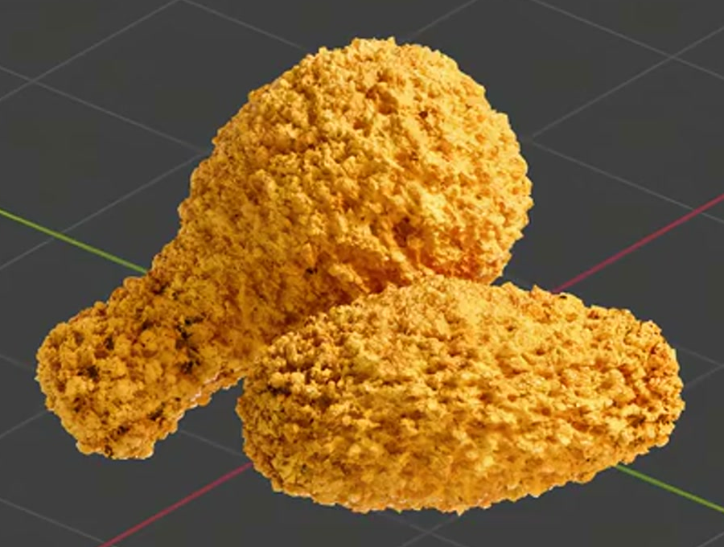
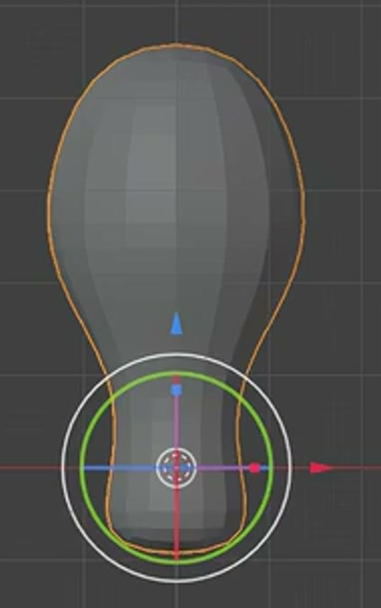
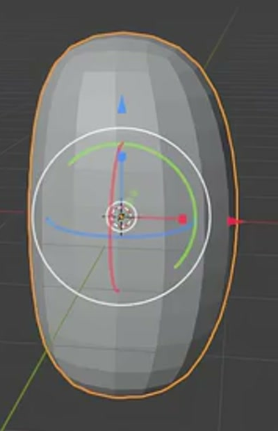
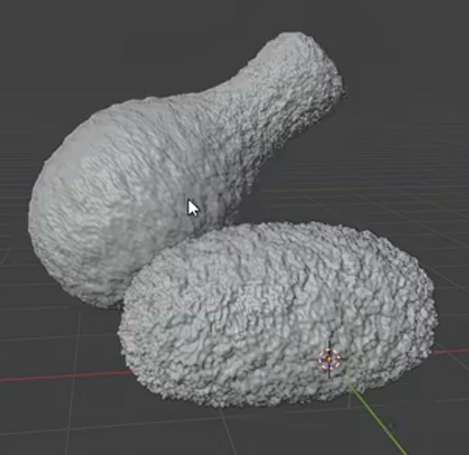

# Crispy Fried Chicken

Create a static fried-chicken asset consisting of one drumstick and one rounded nugget. Both pieces should have a dense, irregular crust with real relief, golden yellow and orange color variation, and a rough fried-food response to light.

## Starting Scene

Use Blender 5.1.2 and Cycles with GPU rendering. No input assets are supplied; the `input/` folder is empty. Start from an empty scene and construct both pieces from native Blender geometry. The shapes, crust, and materials must remain editable in the saved scene. The reference images establish the form and surface character; viewport overlays are not part of the asset.

## Drumstick Form

Make a solid drumstick with a broad, rounded meaty end that tapers through a narrower neck into a short, rounded handle. The handle remains coated in the same crust as the body. Give the meaty end appreciable depth and keep the neck transition continuous, so the drumstick is recognizable from the front and from an oblique view after the crust is added.

## Nugget Form

Make a separate, solid nugget with a gently asymmetric oval outline, a broad face, and rounded sides. It should be a thick, flattened piece with visible depth, distinct from both a sphere and a thin sheet. Its width should be comparable to the width of the drumstick's meaty end. Keep the two food pieces independently selectable and positionable.

## Crust Geometry And Finish

Cover both pieces, including the drumstick handle and the nugget sides, with dense irregular raised crumbs and small recesses. Mix small granular details with larger clustered ridges. The coating must produce actual geometric relief that changes the silhouette and casts local shadows; a smooth outline with only a color or normal pattern is insufficient. Preserve the underlying drumstick and nugget proportions, with a comparable apparent crumb scale on the two pieces.

The food bodies must remain closed volumes. Their rounded forms and transitions should be free of accidental holes, disconnected coating fragments, long needle-like spikes, and obvious coarse polygon facets. Fine, uneven crust edges are intentional and should remain visible.

## Fried Coating Material

Give both pieces a coherent golden-yellow to warm-orange coating, with irregular local color variation and some deeper toasted tones. The color variation must come from the assigned material and remain apparent under neutral lighting. Avoid a single flat color, large regular bands, and abrupt mapping seams over the curved forms.

The coating should read as opaque, nonmetallic fried food. Use a predominantly rough surface with local variation in sheen: soft highlights and occasional brighter crumb tips should break into small patches across the relief. Recesses should retain depth without turning the whole coating into a wet glaze, a mirror, or a featureless matte blob. The response must work on actual curved regions of both food pieces. Any native technique that produces the required appearance is acceptable.

## Two-Piece Presentation

Arrange the nugget in front of the angled drumstick in a compact composition. A small overlap may establish depth, while the meaty end, narrow handle, nugget outline, and crust remain easy to read. Both pieces should fit fully inside the camera view. Use lighting and a simple background that reveal the golden color, surface relief, and separate forms without distracting elements.

## Deliverables

- `submission.blend`: the complete editable scene, including both food pieces, their materials, and the final camera and lighting setup.
- `build.py`: a runnable Blender Python script that recreates the complete scene from an empty scene and saves the resulting `submission.blend`. It must recreate the geometry, materials, composition, and render setup without relying on an existing solution scene or unavailable external assets.
- `B145_Crispy_Fried_Chicken.png`: a final still rendered from the actual scene in `submission.blend`. Use the composition described above, with sufficient detail to inspect the crust. Do not substitute a reference image, viewport screenshot, or external replacement.
