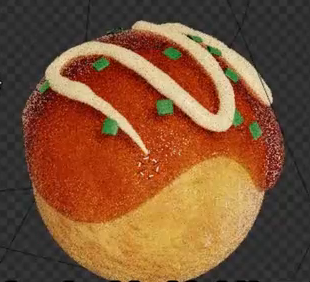
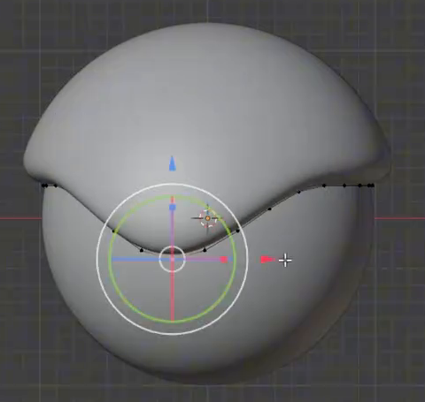
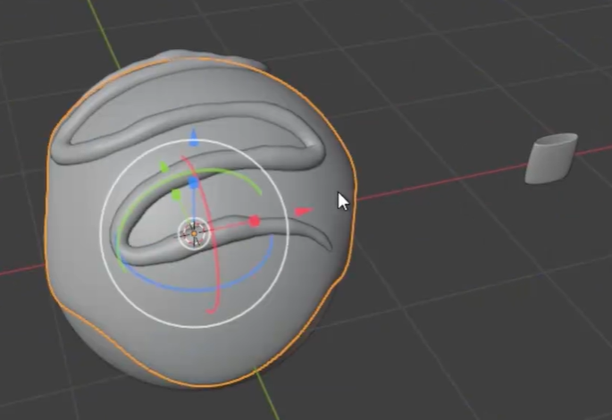
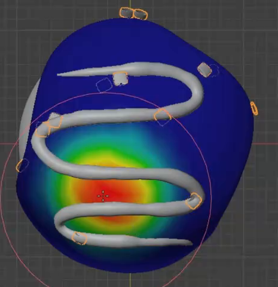

# Glazed Takoyaki With Scallions

Create one golden takoyaki ball with a glossy reddish-brown sauce cap, a pale raised mayonnaise drizzle, and small green scallion pieces scattered over the upper sauce. Keep the garnish distribution editable in the saved scene.

## Starting Scene

Use Blender 5.1.2 and Cycles with GPU rendering. Start from an empty scene and create the ball, sauce, drizzle, and scallion source using native Blender geometry. The input directory is empty; no external model, image texture, HDRI, or add-on is required. Use native lights or a procedural World for illumination.

The required asset is one dressed ball. A serving tray, duplicated servings, and animation are optional and do not replace the single-ball requirements below.

## Rounded Ball

Make a solid, approximately spherical food body with a softly rounded silhouette. A slight handmade irregularity is welcome, but the form must remain recognizably a ball rather than a flattened disk or an elongated capsule. Keep enough of its lower region exposed to show the golden cooked surface.

The evaluated body must shade smoothly around its full circumference, with no unintended holes, spikes, or conspicuous polygon facets. Its shape must remain editable as geometry.

## Dripping Sauce Shell

Add a separate geometric sauce layer that closely follows the upper ball. Give the layer visible thickness with a softly rounded lower edge. Its lower boundary should alternate between raised arcs and several uneven downward lobes, leaving a clear exposed band of the ball below.

The cap should read as a coating attached to the food. Avoid visible gaps between the coating and ball, broken edges, and large intersections that erase the dripping outline. Keep the edge irregularity smooth rather than angular.

## Raised Mayonnaise Drizzle

Build a slender, rounded drizzle that snakes back and forth across the upper sauce. Include several broad traverses with smooth turns, noticeable height above the coating, tapered free ends, and slight natural variation along the strand.

The drizzle should follow the curved sauce surface closely, remain continuous through its turns, and leave sauce visible between neighboring runs. Avoid a flat painted stripe, sharp corners, detached floating lengths, or a strand so thick that it hides the cap.

## Scallion Garnish and Controls

Create a small scallion source shaped like a short, slightly flattened hollow tube slice with wall thickness and softened edges. A gentle bend or slant should keep it from reading as a rigid straight pipe. The final garnish should contain at least five small pieces, each much smaller than the ball, so the sauce remains broadly visible between them. Hide any separate construction source from the final camera while keeping it available for editing.

Retain a live surface-scatter relationship between the garnish and sauce in the saved scene. Provide an editable quantity or density control that visibly changes the number of evaluated pieces without manually placing them or rerunning the full scene build. Pieces should remain attached to the sauce as this control changes.

Provide an editable spatial mask on the sauce that restricts the default garnish to the upper region and keeps the lower dripping edge and underside clear. The mask may use painted weights or an equivalent editable surface field. Altering a local allowed region must change the resulting distribution; disabling the mask everywhere must remove the garnish while preserving the ball, cap, and drizzle. Leave the default masked distribution active in the submitted scene.

## Food Materials

Give the exposed body an editable procedural cooked surface: warm golden-yellow and toasted orange-brown mottling at a broader scale, plus finer irregular bump or normal relief. The body should read as cooked dough with restrained sheen, not smooth plastic or deep rocklike craters.

Make the sauce visibly reddish-brown to amber, glossy and partly translucent, with soft wet highlights, subtle uneven surface detail, and richer color through thicker areas. The sauce must retain its colored coating appearance over the ball rather than becoming an opaque flat paint layer or clear colorless glass. Equivalent shader constructions are allowed.

Use an opaque pale cream material with soft highlights on the mayonnaise. Use a distinct green material on the scallion pieces. Keep both materials applied to the actual visible toppings, with enough contrast to separate the pale drizzle, green garnish, brown sauce, and golden body.

## Deliverables

- `submission.blend`: the complete editable scene, with the default garnish controls and materials active, a useful camera view, and Cycles GPU render settings.
- `build.py`: a runnable Blender Python script that recreates the scene from an empty scene and saves the resulting scene as `submission.blend`. It must recreate the live garnish controls and materials and work without unavailable external assets.
- `B146_Glazed_Takoyaki_With_Scallions.png`: a finished PNG rendered from the actual submitted scene. Frame the entire dressed ball from an elevated three-quarter view so the exposed body, sauce edge, drizzle, and garnish are all readable. Use lighting that reveals the different surface qualities. The image must not be a source image, viewport screenshot, or external replacement.
