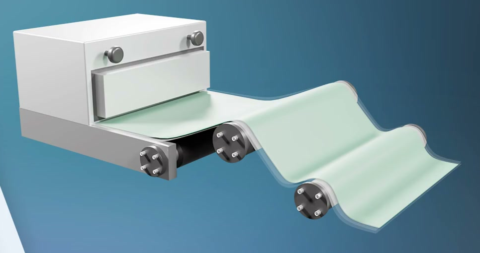
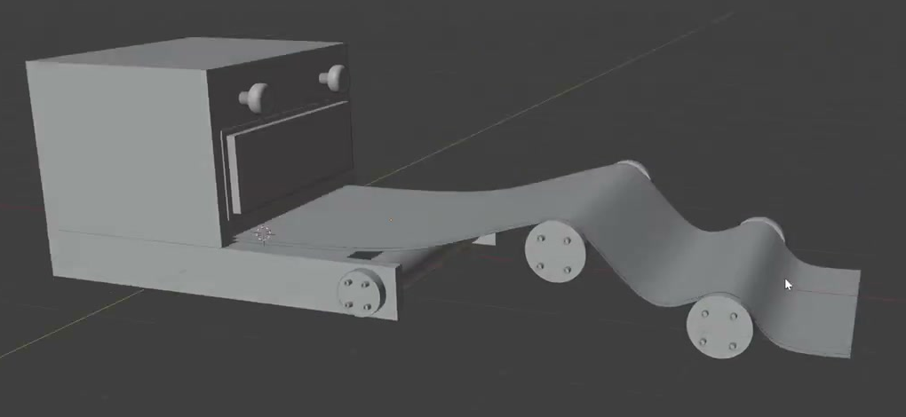
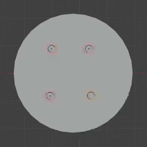
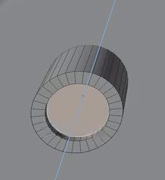
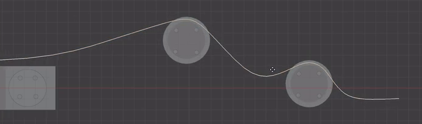

# Three-Roller Film Forming Assembly

Create an editable, static machine illustration with an L-shaped rear frame, three parallel rollers, circular end caps, and a continuous thin film that rises and falls over the rollers. Match the proportions and exposed arrangement in the references.

## Starting Scene

Use Blender 5.1.2 and Cycles with GPU rendering. Start from an empty scene and build the geometry from native Blender shapes. The `input/` directory is empty; no external model, image, texture, or plugin is required. Use consistent proportions rather than a particular world-unit scale. This is a static asset with no animation or physical simulation requirement.

## 1. Rear Frame

Build a broad, low rectangular base joined to a taller upright rear housing, forming an L-shaped side silhouette. The housing spans the machine width and the base extends forward. The base ends in two matching side arms with an open gap between them for the first roller. Keep the arms attached to the base, level with each other, and outside the film's working width.

The other two roller stations remain exposed beyond the base in the schematic arrangement shown below. They do not need an additional enclosing chassis.

## 2. Front Panel and Controls

Give the rear housing a wide rectangular front panel with a clearly modeled narrow border and a shallow depth step. Place two matching round controls above it, one toward each side. Each control has a short stem and a wider circular head that projects from the housing. Align the controls horizontally and keep the panel centered on the working width.

## 3. Roller Layout

Create three cylindrical working rollers that span the film width. Their axes run across the machine, remain parallel, and have comparable barrel lengths and radii. Place the first roller between the base's two front arms. Place the second farther forward and higher, then place the third farther forward again and lower than the second. Leave enough separation for a visible valley in the film between the second and third rollers.

Use short, narrower axle necks and wider circular end caps at both ends of each barrel. Keep each barrel, neck, and cap coaxial. At the first station the axle necks enter the side arms and the caps sit outside them. The caps are thin relative to their diameter and have gently rounded outer rims.

## 4. End-Cap Fasteners

Put four small round fasteners on every end cap, arranged evenly around its center in a balanced four-point pattern. Each fastener projects from the cap and has an inset center on its exposed end. Keep the fasteners inside the rim, equally spaced, and seated against the cap. These are modeled projecting parts, with visible end-face depth.

## 5. Continuous Film

Form a single continuous rectangular film from beneath the front panel, across the base and first roller, over the raised middle roller, down into a smooth valley, over the last roller, and out to a short, flatter free end. Center it across the working width. Its straight transverse edges and nearly constant width should sit inside the end caps while covering most of the barrel length.

The film's side profile must have rounded crests and valleys, with gradual transitions into the flatter entry and exit. Keep it close to the upper barrel surfaces at the roller crossings, without visible penetration or large gaps. The film must have real, thin, approximately uniform thickness with joined edge walls, including through a curved crest-to-valley region. Its thickness should be much smaller than a roller radius. Keep the film separately editable from the mechanical parts so that its path and thickness can be revised.

## 6. Finish and Appearance

Keep the housing and arms as crisp manufactured forms with small softened edges and broad flat faces. Barrel sides should shade smoothly with round silhouettes, without conspicuous faceting or shading creases. Maintain distinct component boundaries and avoid accidental overlaps between neighboring parts.

Use a light neutral housing, dark working rollers, and pale green film, following the first reference. Give the visible caps and controls a restrained metallic appearance. Material differences must appear on the actual parts and remain readable under the scene lighting. Basic materials are sufficient.

## Deliverables

- `submission.blend`: the complete editable scene, including the film, mechanical parts, materials, camera, and lighting. Save a view that makes the three-roller arrangement inspectable.
- `build.py`: a Blender Python script that recreates the scene from an empty scene and saves the resulting `submission.blend`. It must work without unavailable external assets.
- `B147_Three_Roller_Film_Forming_Assembly.png`: a Cycles GPU render from the actual submitted scene. Use a clear three-quarter view that shows the housing, both controls, all three roller stations, the near-side end-cap details, the film's full path, and its free end. Keep the whole assembly in frame at a size where its main details can be judged. Do not substitute a source image, viewport screenshot, or externally created replacement.
