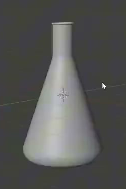
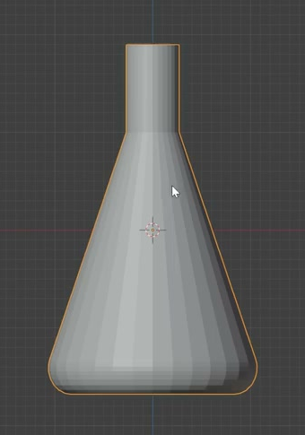
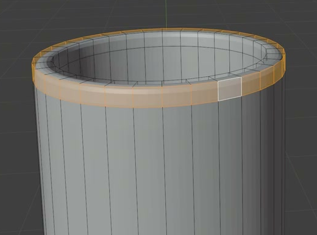
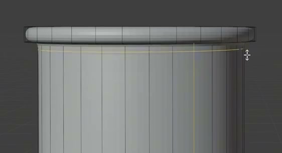

# Hollow Conical Flask

Create an editable, upright laboratory flask with a broad conical body, a narrow straight neck, an open cavity, continuous walls and floor, and a small outward-rolled mouth. Present the finished geometry as a neutral gray model.

## Starting Scene

Use Blender 5.1.2. No external input assets are supplied; `input/` is empty. Start from a new scene and construct the flask from native geometry. Use Cycles with GPU rendering for the final image. The flask must remain an editable three-dimensional asset, with its interior available for inspection.

## 1. Flask Proportions

The flask stands vertically and is visibly taller than its maximum width. Its broadest region is near the bottom. Above the rounded lower corner, the body narrows steadily toward the neck, giving the flask a long conical silhouette rather than a spherical belly.

The neck is a distinct straight cylindrical section centered over the body. Its diameter is substantially smaller than the body's maximum diameter, and its length is clearly shorter than the tapered body. Preserve the overall relationships shown in the references; absolute dimensions are unrestricted.

## 2. Circular Form and Shoulder

Horizontal outer cross-sections through the body and neck are circular and share one vertical centerline. The flask should have the same basic profile when viewed from different horizontal directions, without a flattened side, lean, or off-center neck.

Join the tapered body to the straight neck with a continuous, gently rounded shoulder. Preserve the long sloping body and straight neck while avoiding a pinched waist, bulging collar, sharp step, or disconnected junction.

## 3. Hollow Vessel

Keep the mouth genuinely open. It leads through the hollow neck into a broader interior that follows the tapered body down to the inner floor. The opening must expose real interior geometry, with no cap across the mouth or neck and no shallow recess used to imitate the full cavity.

Provide separate inner and outer wall surfaces with positive, visually thin thickness. The walls continue around the entire vessel and meet a closed floor with positive thickness between its upper and lower surfaces. Join these surfaces into a coherent vessel shell, without leaks, crossing walls, detached interior liners, or zero-thickness sheets. The cavity occupies most of the body's volume.

## 4. Rolled Mouth

Finish the top of the neck with a continuous circular lip that projects modestly outward. Its cross-section has visible thickness and rounded edges, giving the mouth a small rolled flange instead of a razor edge or oversized collar. The lip joins the neck around the full circumference while preserving the central opening.

## 5. Base and Surface Finish

Give the flask a broad, level underside that can rest upright on a flat horizontal surface. Round the transition from the bottom edge into the sidewall while retaining a stable footprint; the flask must not end in a rounded point or a swollen spherical foot.

The curved body, shoulder, and neck must have smooth silhouettes and coherent surface shading, without visible radial faceting, dents, pinching, or inverted-normal patches. Keep the geometry editable. Any modeling method that produces the required evaluated form is acceptable.

## Deliverables

- `submission.blend`: the complete, self-contained flask scene, including its editable geometry and final render setup.
- `build.py`: a script that recreates the scene from a new Blender scene and saves the resulting `submission.blend`. It must not depend on an existing solution file or unavailable assets.
- `B148_Hollow_Conical_Flask.png`: a Cycles render made from the actual submitted scene. Use neutral gray shading and a plain background, with the whole flask comfortably framed in a slightly elevated three-quarter view that reveals the mouth and keeps the tapered profile readable. Submit the rendered image itself, not a viewport screenshot, source reference, or external replacement.
