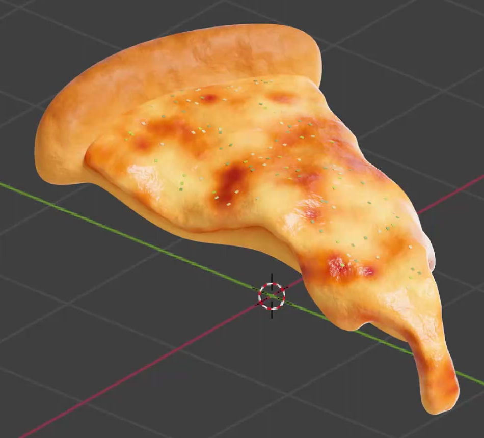
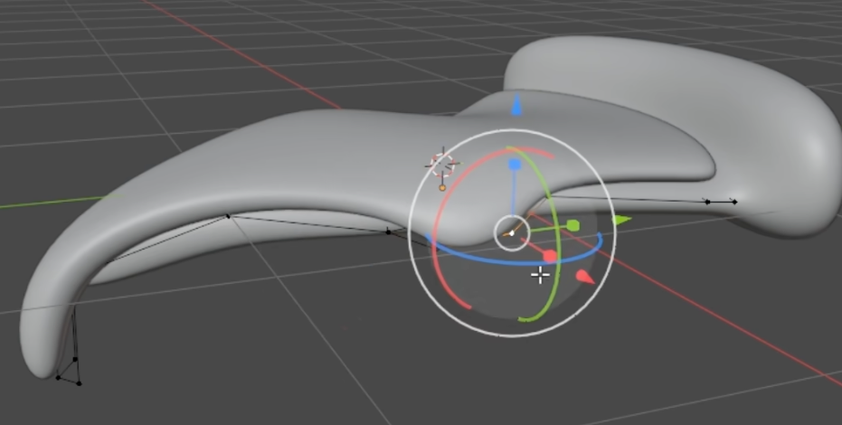
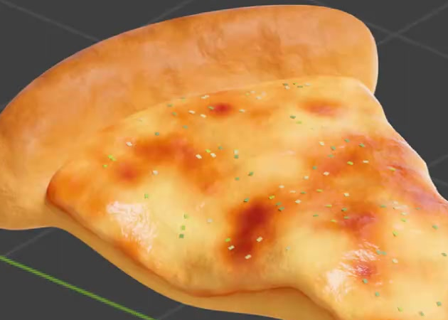

# 披萨与程序化材质

制作一块尖端自然下垂的披萨切片：后端饼边蓬松鼓起，薄饼底承托起伏的融化芝士，表面散落少量绿色香草碎。成品应保留独立可编辑的饼皮、芝士及碎料材质，烘烤色与微表面由程序化方式生成，碎料数量可继续调整。

## 起始条件与输入

- 使用 **Blender 5.1.2**，从空场景或默认场景开始，以 Python 构建工程。
- `../input/` 为空，无需外部模型、贴图或插件。参考图只作为结果依据。
- 尺寸、朝向、对象名称与具体建模方法自行确定。饼皮、芝士及碎料应能分别编辑；允许等效的对象、组件或节点实现。
- 最终形态和材质以上方整体图为准。灰模图只帮助理解分层关系；网格线、选择轮廓、坐标轴和操作控件不属于模型。

## 1. 楔形饼身与连续下垂

整体是一块前窄后宽的披萨切片。后端具有横向延伸、圆润鼓起的饼边，饼边明显厚于前方的薄饼身，连接处自然过渡。不能只用平坦三角面片表示整块披萨。

从侧面可以看出中前段向下弯曲，尖端低于相邻中段；弯曲来自模型形状，不能仅通过倾斜整个对象制造。两侧轮廓有克制的不对称波浪，末端圆钝，整体保持柔软、连续的弧度，没有生硬折角或尖刺。

## 2. 饼皮与芝士的分层厚度

芝士覆盖饼身上表面，在后端饼边前收住；饼底可从侧边和下方辨认。芝士自身具有可见的薄层厚度和圆润边缘，两侧及尖端呈融化后的起伏，局部边缘可以略伸出饼底。

两层具有分别可编辑的几何结构与独立材质归属。近距离观察边缘和底面时，层间关系应连续合理，没有大面积互穿、悬空缝隙、破面或共面闪烁。此处要求真实体积与分层，不以一张颜色贴图代替。

## 3. 芝士的程序化烘烤表面

芝士以暖黄色至浅金色为主，散布大小和形状有变化的橙红、红棕色烘烤斑。斑块与浅色区域自然过渡，分布不呈机械网格或重复条纹，仍能看到大片浅色芝士。

表面有融化芝士的柔和油润高光，并能在近看和侧光下辨认细微起伏；较缓的表面变化与更细碎的纹理共同改变高光，不能只留下单一尺度的粗颗粒。微表面应服从原有形体，不形成遍布表面的尖刺，也不遮盖烘烤色。

烘烤色和微表面必须由实际参与着色的程序化材质生成，并保留可编辑参数。具体纹理种类、节点组合及数值不限；不能用完成效果的图片投射代替。颜色变化与微表面强弱应可分别调整，调整后仍作用于芝士。

## 4. 饼皮与绿色碎料的材质区别

饼皮呈浅金黄至烘烤棕色，鼓起的饼边具有大尺度色泽变化和细微面包表面凹凸。它应比芝士更干爽，仍保留柔和的明暗层次，不能与芝士共享完全相同的焦斑和油亮外观。饼皮颜色与表面细节同样使用可编辑的程序化材质。

香草碎主要呈绿色，粒与粒之间有浅绿、黄绿至深绿的变化，至少能辨认两档绿色；颜色应来自碎料自身的材质变化，而不是仅靠阴影产生。碎料材质可独立调整，不改变芝士或饼皮的颜色。

## 5. 可编辑的表面碎料散布

用细小、扁平的碎料点缀芝士上表面，默认保持几十粒量级的疏散分布，芝士大部分仍然暴露。碎料顺应局部表面的方向和起伏，不组成规则排队，不显著悬浮，也不散布到饼底或后端饼边外侧。

保留可重新求值的散布系统与有效的数量或密度控制。调整该控制能得到明显较疏和较密的分布，碎料仍限制在芝士上表面，并保持原有披萨形状。分布区域可以用遮罩或等效方式限定；无须固定节点配方，也无须逐粒手工增删。

在工程内的简短文本说明中标明散布控制的位置、默认值，以及一组较疏与较密的有效设置。恢复默认值后应回到提交时的分布。

## 提交文件

- `submission.blend`：保存完整可编辑模型、材质、散布系统及默认状态；配置可用的相机与照明，默认采用 **Cycles GPU** 渲染。展示需完整包含披萨，能看清饼边、下垂尖端、层次和材质。背景与灯光布置自行选择。
- `build.py`：在 Blender 5.1.2 中从起始场景重建工程，注明运行方式与输出位置；不依赖本机绝对路径、网络下载、未提供的资产或插件。随机过程固定种子，使重复构建保留相同默认形态与散布结果。

提交应能打开并显示实际披萨资产。只有图片、空工程或无法加载的工程不构成有效提交。外部依赖如确有使用，须随工程打包并以相对路径定位。

## 渲染效果交付

在原有交付文件之外，另提交 `B14_披萨与程序化材质.png`。图片采用 PNG 格式，从实际交付工程渲染，清楚展示主要成品及其形体或材质效果。使用本题规定的渲染环境；若原题没有指定展示相机，可设置能完整观察主体的相机。该文件应与 `submission.blend` 中的结果一致，不以参考图、视口截图或外部素材代替实际渲染。
