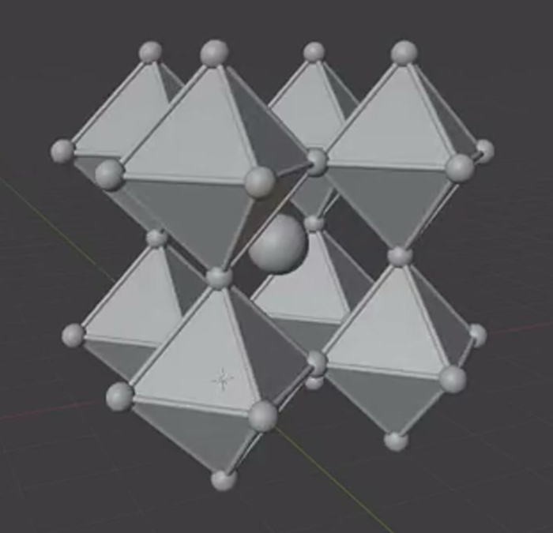
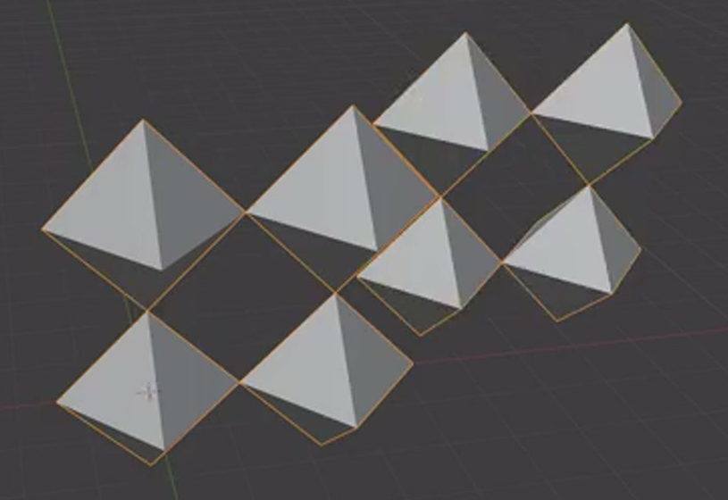
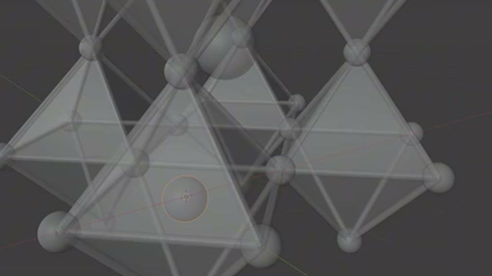

# 钙钛矿晶格

制作一个可编辑的三维晶格模型：八个八面体按 2×2×2 排列并在顶点处相接，保留三角面片、沿边的细圆杆和顶点球；中央空位有一颗较大的球，每个八面体内部另有一颗较小的球。整体结构、占位和尺度层次应与参考一致。

## 输入与交付

- 使用 Blender 5.1.2，从默认场景开始整理并制作模型。没有外部输入素材，`input/` 为空。
- 交付 `submission.blend` 和可从默认场景重建同一结果的 `build.py`。脚本应使用 Blender 自带功能，资源如有使用须随文件打包并采用相对路径，不依赖原作者机器或网络下载。
- 这是静态灰模资产。整体尺寸、世界朝向、对象名称与对象拆分方式自由；共享网格、实例、修改器和几何节点等实现均可。
- 如需渲染，使用 Cycles GPU。无需复现参考中的网格、选择高亮、界面面板或视口灯光。

## 八面体与三维排列

每个单元由上下两个尖点和四个腰部角点构成，外表面保留八个三角面区域，轮廓是上下相对的双四棱锥。允许等效细分，不能只留下线框或球阵列。

默认结果在三个互相垂直的方向各有两个同向、同形、同尺寸的单元，形成 2×2×2 的空间排列。相邻单元在对应尖点或腰部角点处相接；相邻面的内部不应大面积重叠，也不应变成彼此分离的漂浮单元。正交观察时有规则的菱形空隙，斜视时能看出前后两层。

各轴的重复间距应与该方向的单元跨度相符。以单元最大轴向跨度为 L，相接顶点的位置误差不超过 0.03L。

## 边杆与顶点球

八面体的每条外轮廓边都有连续、圆截面的实体细杆，杆件沿相邻角点之间的直线连接，并进入两端球体，不能在连接处留出可见断口。不要添加穿过面心或空位的无关对角杆。

每个八面体角点都有球形标记，所有顶点球尺寸一致。共享角点在外观上只表现为一个球形接头；允许共享球体或位置一致的实例。杆直径不超过顶点球直径的一半，球体之间保留清晰间距，面片仍可辨认。

## 内部球体占位

默认 2×2×2 结构只有一颗中央大球，位于八个单元共同围出的中央空位，不能放到任意一个八面体的中心。它与周围面片和杆件之间保留空间，球面不应穿出空位边界。

每个八面体内部各有一颗同尺寸的小球，共八颗，球心接近该八面体的几何中心；它们与角点上的顶点球是不同占位。内部大球的直径至少为内部小球的 1.5 倍，两类球都应是真实的完整球形几何。大球相对中央空位中心、小球相对所属八面体中心的位置误差均不超过 0.05L。

下图是内部小球的局部穿透检查：前方八面体内的圆形轮廓表示其内部球体。穿透显示只用于观察，不要求制作透明材质；可以通过隐藏面片或切换检查显示来确认内部占位。

## 可编辑的周期与尺寸

保留能实际改变结果的重复关系和尺寸参数，不要只提供一份固定展开后的几何。参数可以位于修改器、几何节点、共享原型或等效的编辑结构中，并在 `build.py` 中简要注明入口。

- 三个方向的单元数量可以分别修改。将任一方向从 2 改为 3、其他方向保持 2 时，应得到 3×2×2 或对应方向的十二个完整八面体，新增单元继续按原周期相接，面片、杆件和顶点球一同出现。
- 内部小球也能沿同样的周期扩展到新增八面体的中心。允许分别调整主体与小球的重复计数，不要求统一控制器，也不要求逐个移动新增球体。中央大球在此检查中保留原来的空位即可。
- 顶点球尺寸与杆件粗细可以分别统一调整。将顶点球半径增大 25%，所有顶点球应随之变化而球心保持不动；将杆半径减小 25%，所有杆件应同步变细而连接线位置保持不动。两个调整不应改变八面体面片、内部球体或周期位置。

修改后能恢复默认 2×2×2 结果及默认尺寸，并将恢复后的状态保存为最终工程。

## 几何质量与检查视图

球体与杆件在正常近景下应圆滑，没有明显棱面、断裂、尖刺或错误法线造成的破损阴影；八面体的三角面区域和尖点轮廓保持清楚。允许球、杆和面片之间合理相交，不要求把所有部件布尔焊接成单一网格。

保留可从斜视图查看整体、从正交或穿透视图检查内部球体的工程状态。面片必须仍然存在；检查时临时隐藏或穿透显示即可。参考只定义几何结构和编辑行为，不要求增加化学元素标签、晶体学数据或展示场景。

## 渲染效果交付

在原有交付文件之外，另提交 `B15_钙钛矿晶格.png`。图片采用 PNG 格式，从实际交付工程渲染，清楚展示主要成品及其形体或材质效果。使用本题规定的渲染环境；若原题没有指定展示相机，可设置能完整观察主体的相机。该文件应与 `submission.blend` 中的结果一致，不以参考图、视口截图或外部素材代替实际渲染。
