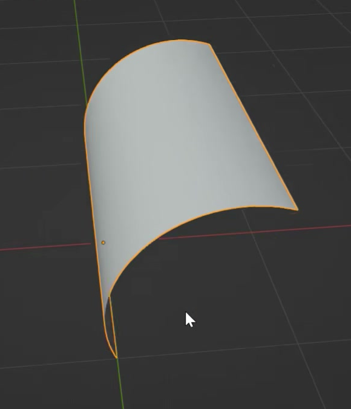
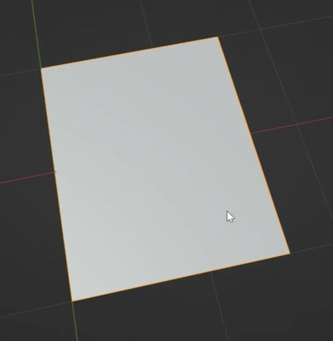
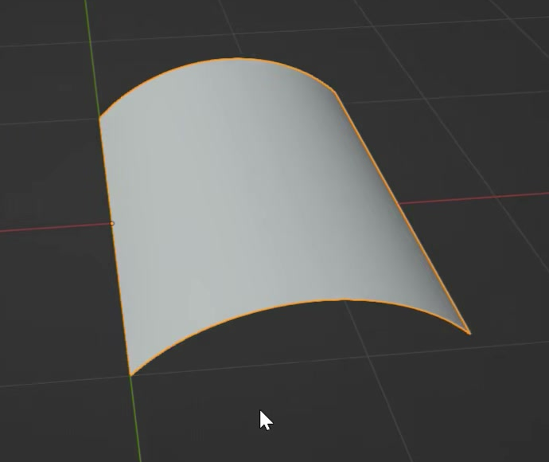
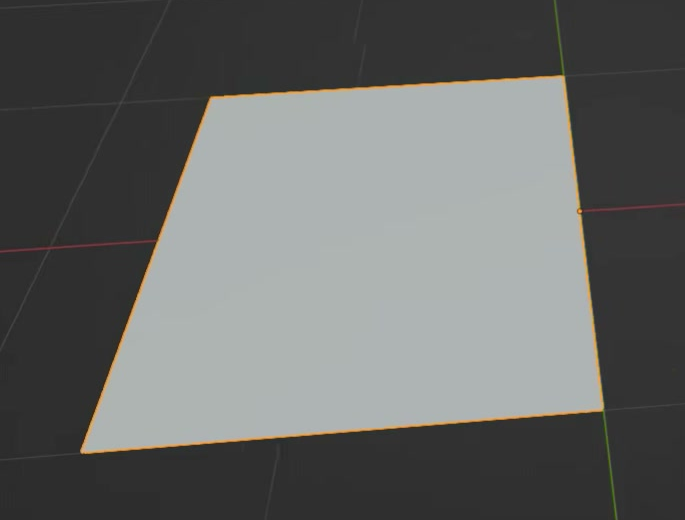

# 单页翻转动画资产

用代码创建一张能沿书脊翻到另一侧的纸页。纸页从平放状态抬起，逐渐形成明显的弧形卷曲，翻过书脊后重新落平；保留可独立调整翻转与弯曲的控制关系。

图 1：翻页中段的形态参考。纸面沿宽度连续弯曲，沿书脊方向保持整齐。

## 起始条件

- 使用 Blender 5.1.2，从空场景开始。`input/` 为空，无需外部模型、贴图或插件。
- 令纸页宽度为 `W`，书脊方向的长度为 `L`，整体尺度自行选择。`+Z` 向上，书脊沿世界 Y 轴，静止纸页位于 `Z=0`。
- 交付内容是一张灰色纸页及其动画控制。参考图中的选中轮廓、网格和辅助线用于观察，不属于纸页外观。
- 用视口即可检查本任务；如制作渲染展示，使用 Cycles GPU。相机和灯光自行安排。

## 1. 纸页形态

纸页是完整的竖向矩形，`W/L` 在 `0.76` 至 `0.84` 之间。初始状态一条长边位于 Y 轴，纸页向 `+X` 展开。纸面可采用零厚度表面或视觉上足够薄的壳体，整体应读作单张纸。

弯曲状态下，纸面和边缘形成连续、平滑的弧形，不能出现明显折板、尖刺或几何造成的明暗断带。纸面保持连贯，不能有破洞、撕裂、脱开的碎片或面片重叠闪烁。纸页保持简洁的灰色显示外观。

图 2：初始比例与书脊位置参考，左侧长边与书脊重合。

## 2. 默认翻页过程

设置帧范围为 `1-115`，帧率为 `24 fps`。纸页在第 1 至 100 帧完成一次翻转，第 101 至 115 帧保持结束姿态。默认动画应呈现以下阶段：

| 阶段 | 纸页状态 |
|---|---|
| 第 1 帧 | 纸页在书脊的 `+X` 一侧平放，正面朝上。 |
| 第 15-20 帧 | 纸页已抬离初始平面，并形成清楚可辨的拱曲。 |
| 第 45-55 帧 | 卷曲达到本次翻页最明显的阶段，表面形成较深的连续圆弧。 |
| 第 100 帧 | 纸页翻到书脊的 `-X` 一侧，正反面翻转，并重新平放。 |
| 第 101-115 帧 | 保持落平，不继续漂移、弯曲或反弹。 |

初始与结束时纸面偏离 `Z=0` 的距离不超过 `0.01W`。动画应实际改变纸面形状：早期拱起、中段加深、后段展开。整个过程连续，没有跳帧式姿态突变、瞬间换成另一张纸或无意的反向抖动。

图 3：早期拱曲参考，此时纸页仍主要位于起始侧。

## 3. 固定书脊与空间连续性

整次翻页围绕同一条书脊进行，书脊长边各点相对初始位置的漂移不超过 `0.01W`。纸页不会在翻转时沿书脊滑动，也不会像绕中心旋转的卡片一样整体离开书脊。

纸页始终从初始平面的上方经过，尤其在早期拱曲时，自由边和纸面不能明显扫入 `Z=0` 以下；允许的数值误差为 `0.01W`。纸面在翻页过程中保持连贯且不自穿插，正常视角下能清楚观察到同一张纸由一侧过渡到另一侧。

图 4：结束保持阶段的参考，纸页已落到书脊另一侧。

## 4. 可编辑的翻转与弯曲控制

保留能单独调整翻转姿态和卷曲程度的实时控制。控制可以通过对象、骨骼、属性、形变参数或等价结构实现，在 `.blend` 内用简短说明标明两类控制、操作位置以及恢复默认动画的方法。

暂停在中段后，固定弯曲控制，分别将翻转姿态向前、向后调整约 15 度。整张已经弯曲的纸页应一起绕同一书脊转动，书脊保持固定，纸面自身的卷曲形状保持不变。

固定翻转控制，再把弯曲程度分别调整为平直、适度弯曲和较深弯曲。纸面应即时更新，书脊仍固定，翻转控制的设定不被改写。恢复两类控制后，默认时间线动画应继续正常播放。控制调整无需重跑生成脚本或手动逐点修改纸面。

## 5. 交付与重放

提交 `submission.blend` 和 `build.py`。脚本应能在 Blender 5.1.2 中从空场景生成并保存完整资产，运行方式写在脚本开头；所有必要数据应内嵌或由代码生成，不依赖本机绝对路径、联网下载或缺失缓存。

文件保存于第 1 帧，并保留默认动画及第 4 节的控制说明。重新打开后，从第 1 帧播放至第 115 帧可以直接观察完整翻页，再回到第 1 帧播放仍得到相同结果。辅助控制的显示方式应便于检查纸页轮廓。

图片均为实际参考画面裁切。比例范围、24 fps、阶段时间窗口、控制测试幅度与数值容差是本任务的公开验收约定。

## 渲染效果交付

在原有交付文件之外，另提交 `B16_单页翻转动画资产_动态.mp4`。视频采用 MP4 格式，按本题规定的完整时间范围和帧率，从实际交付工程渲染动画，清楚展示动作与效果变化。使用本题规定的渲染环境；若原题没有指定展示相机，可设置能完整观察主体的相机。该文件应与 `submission.blend` 中的结果一致，不以参考图、视口截图或外部素材代替实际渲染。
