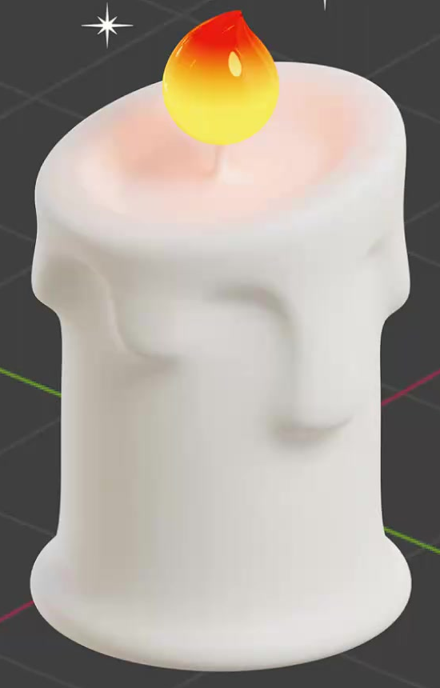
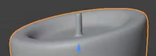
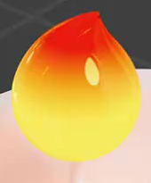

# 融蜡蜡烛

用代码制作一支白色融蜡蜡烛：圆柱蜡体带有浅而外扩的底沿，顶部是圆润的熔蜡凹面，厚蜡沿侧面形成长短不一的垂滴。一根细烛芯承托略向一侧弯曲的暖色火焰，火焰具有明亮内层和透亮外层的视觉层次。

## 输入与交付

- 使用 Blender 5.1.2，从空场景开始。没有外部输入素材，`input/` 为空。
- 交付 `submission.blend` 和可从空场景重建提交结果的 `build.py`。所有依赖须随交付提供，使用相对路径或打包进文件；重建不能依赖网络或本机专用路径。
- 完成材质并设置能看清整体和顶部细节的视图。需要渲染时使用 Cycles GPU。尺寸、世界朝向、对象名称和建模方法自由。
- 本任务交付静态模型；参考中的界面、网格、选择高亮和装饰星光不属于模型要求。

## 1. 柱状蜡体与外扩底沿

蜡体整体直立，中段近似圆柱，高度明显大于中段宽度。主体下端自然过渡为一圈比中段稍宽的浅底沿，底沿圆润、连续，与蜡体相连。底部应形成可放置的支承面，不能像悬浮圆环或另加的高台。

## 2. 顶部熔蜡与垂蜡

顶部保留完整的圆润厚边，边缘高度有轻微起伏或倾斜；中央向内下凹，形成能从斜上方辨认的浅熔蜡凹面。它是实际几何凹面，有连续底面，不是贯穿蜡体的洞。

上部蜡层向侧面延伸，至少形成三处可辨认的垂蜡轮廓。各处垂蜡长短、宽窄和间距有变化，至少一处明显长于另一处；下端呈圆头，根部与上部蜡层自然衔接。垂蜡须有立体厚度，紧贴或融入主体，不能仅靠颜色图案表示。

## 3. 烛芯与偏斜火焰

凹面中央附近有一根细而短的烛芯，根部进入蜡体，顶部与火焰下端相接；正常近景能辨认烛芯，不能出现明显悬空间隙。

火焰位于烛芯上方，整体比蜡体窄。下部饱满圆润，上部逐渐收尖，尖端稍向一侧偏斜，形成有体积的泪滴形。它应保持完整、平顺的轮廓，不能变成圆球、直锥或平面剪影。

## 4. 几何表面完整性

蜡体、垂蜡、底沿、凹顶和火焰在普通近景中应有连续平顺的表面。除火焰预期的尖端外，不应有明显棱面、锯齿、夹痕、意外尖刺、破洞或重叠面闪烁。圆润处理后仍须保留凹顶深度和不同垂蜡的轮廓。

## 5. 蜡质与火焰材质

蜡体、底沿和垂蜡具有一致的近白色、低饱和蜡质外观，呈柔和的非金属反射，能够读出体积及垂蜡起伏。允许火焰附近出现暖色映照；不要求额外纹理或特定次表面散射设置。

火焰颜色沿高度连续变化：下部以明亮黄色为主，向上过渡到橙色和橙红色。保留颜色层次，不能整体过曝成一块白色。内焰应产生实际发光，外部有包覆内焰的透亮层，呈现玻璃般的透射与高光，同时能看见里面的发光部分。允许使用等效的几何与材质实现，不限制火焰对象数量、具体节点或折射率。

## 6. 可重建交付

`build.py` 在干净场景中运行后，应重建 `submission.blend` 所提交的几何、材质及展示设置。交付内容在移至另一目录后仍可使用，不需要手动补接材质或寻找丢失文件。蜡体与火焰的几何和材质保持可编辑，允许通过独立对象、可分离区域或清晰的参数结构组织。

## 渲染效果交付

在原有交付文件之外，另提交 `B17_融蜡蜡烛.png`。图片采用 PNG 格式，从实际交付工程渲染，清楚展示主要成品及其形体或材质效果。使用本题规定的渲染环境；若原题没有指定展示相机，可设置能完整观察主体的相机。该文件应与 `submission.blend` 中的结果一致，不以参考图、视口截图或外部素材代替实际渲染。
