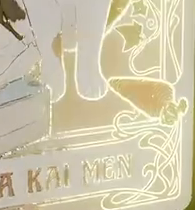

# 视角扫光烫金闪卡

把提供的彩色插画与线稿制作成一张可实际观察的烫金闪卡。卡面保留完整原画；改变观察角度时，一条带有细碎闪点的暖金亮带扫过图案，使带内的轮廓与装饰线亮起，带外仍保持普通彩色印刷效果。

## 起始条件与输入

- 目标环境为 **Blender 5.1.2**，从空场景开始，用 Python 构建工程；默认使用 **Cycles GPU** 渲染。
- 必须使用 [input.png](../input/input.png) 作为彩色卡面，使用 [input_line.png](../input/input_line.png) 提取烫金图案。两张输入分别是彩色插画、白底黑线的线稿；线稿中的黑色笔画对应需要亮起的图案，白色空白不应整体变成烫金面。
- 可在工程内调整线稿的映射、明暗与阈值，使它与彩色原图对齐；两张输入文件本身保持原样。无需其他外部素材。
- 参考图展示同一效果的不同观察状态，不要求复制界面、背景或曝光。允许等效材质实现；最终效果必须来自交付工程中实际生效的表面着色。

## 1. 完整卡面与彩色原画

制作一个竖向、平整、连续的矩形卡面，尺寸可自定，宽高比与彩色输入图的比例偏差不超过 2%。卡面在正面及斜侧观察时保持平整，没有缺面、折叠或重叠面造成的闪烁；允许薄平面或有薄厚度的卡片，不要求背面设计。

彩色原图应完整、正向、单次铺在卡面上。主体、帽子、花卉、纸巾盒、胡萝卜及底部“DA KAI MEN”文字保持原图的相对位置和颜色关系，不镜像、不平铺、不裁掉主要内容。没有被扫光照亮的区域仍能看清原来的印刷图案。

## 2. 与线稿对应的烫金图案

发亮图案取自线稿的黑色笔画，并与原画中的对应轮廓配准。重点保留并检查四处：外框装饰、主体面部与帽子、花卉枝叶、底部文字。允许两张输入本身的细微绘制差异，但不能出现明显偏移的双重轮廓。

线稿控制的是烫金图案的覆盖位置。亮起时应辨认出原有轮廓、纹样和字形；线稿中的白色空白应保留彩色底图，不变成覆盖主体的大块金色填充。不得用另一幅手绘线稿代替所给输入。

## 3. 随观察方向变化的扫光

保持卡片、灯光、材质参数和时间不变，只改变观察方向，就能使亮带移到卡面上的不同位置。同一段图案应能在这些视角间由暗变亮、再回到普通印刷状态。

工程中记录至少三个正面仍可见的观察方向，覆盖较弱扫光和明显扫光状态，其中至少两个状态的亮带位置明显不同。在这些方向之间连续转动观察时，亮带应连续经过图案，不出现整张卡瞬间开关或分段跳变。这个效果不依赖播放时间轴。

## 4. 局部亮带与细碎闪点

明显扫光状态中应同时存在亮起与未亮起的图案区域，避免整张线稿持续全亮。亮带可以倾斜或略有形变，但整体仍是一片有方向性的局部区域，不是零散的无规律大光斑。

在亮带的过渡区域加入细小、密集且有疏密变化的颗粒闪点，使部分轮廓呈现烫金闪粉的破碎亮边。颗粒尺度明显小于眼睛、花瓣和字母；不能把整张底图变成雪花噪声，也不能只依赖渲染采样不足产生的噪点。

保留一个有明确位置和说明的**扫光宽度或覆盖范围控制**。在同一观察方向下，该控制应能产生明显较窄和较宽的两个有效状态，同时保持线稿与底图对齐、视角响应正常。默认状态应是局部扫光。

## 5. 暖金光泽与克制的辉光

被扫到的笔画呈暖金黄色，亮处可接近浅金或暖白；周围保留柔和的金色光晕。光晕应跟随亮起的线条，使亮区有闪亮感，但不会把未扫到的区域一并漂白。

在整体观察时，原画主体、花卉和文字仍可辨认；近看能够区分发亮线条与其外侧较柔的光晕。可以使用材质、合成或等效方式实现，不限定节点种类和连接配方。

## 提交文件

- `submission.blend`：完整且可编辑的工程，保存有效的默认材质、相机与照明；两张输入图已打包，打开后即可观察整体并切换观察方向。
- `build.py`：在 Blender 5.1.2 的空场景中重建同一默认结果的脚本。脚本写明运行方式，使用可传入的输入、输出路径，不依赖本机绝对路径、网络下载或未提供插件；有随机过程时固定种子。
- 在工程文本中记录三个观察方向的重现方式，以及扫光范围控制的位置、默认值、较窄值和较宽值。无需提交时间轴动画或视频。

仅有截图、预渲染贴图或无法观察实际卡面材质的工程不构成有效提交。材质行为和可编辑控制将通过交付工程重新观察。

## 渲染效果交付

在原有交付文件之外，另提交 `B18_视角扫光烫金闪卡.png`。图片采用 PNG 格式，从实际交付工程渲染，清楚展示主要成品及其形体或材质效果。使用本题规定的渲染环境；若原题没有指定展示相机，可设置能完整观察主体的相机。该文件应与 `submission.blend` 中的结果一致，不以参考图、视口截图或外部素材代替实际渲染。
