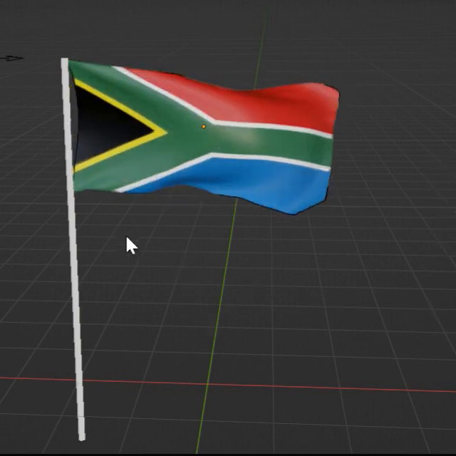
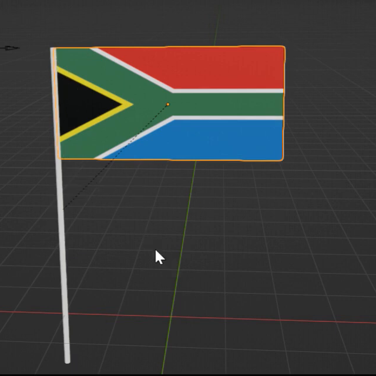
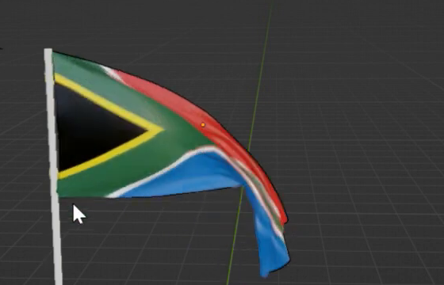

# 风中旗帜

用代码创建一面挂在细旗杆上的彩色布旗。旗面从平展状态开始，在风力和重力作用下形成不断变化的褶皱与卷曲；靠杆的两个挂点保持连接，自由端能够柔软地摆动。旗杆移动后，挂点随之移动，旗面仍能重新模拟。

图 1：旗面沿离开旗杆的方向展开，彩色图案随布面弯曲，细杆向下延伸。

## 起始条件

- 使用 Blender 5.1.2，从空场景开始。需要渲染展示时使用 Cycles GPU。
- 使用提供的 [旗面贴图](../input/flag_texture.png)，将它作为旗面的颜色图案。没有起始 `.blend` 文件，也不需要插件或联网素材。
- 令 `H` 为未变形旗面的高度，`W` 为宽度，整体尺度自行选择。`+Z` 向上，初始旗面位于竖直的 XZ 平面，从旗杆向 `+X` 延伸。

## 1. 旗面与旗杆

初始旗面是一张连续的薄矩形布面，`W/H` 在 1.9 至 2.1 之间，允许边角轻微圆滑。旗杆为直立的细圆杆，高度为 `2.8H` 至 `3.2H`，直径为 `0.04H` 至 `0.08H`；旗面靠杆边位于杆的上部，旗杆顶端与旗面上挂点的高度差不超过 `0.05H`。

旗面应有足够的几何细节表现柔软的连续弯曲。近看褶皱与外轮廓时不能呈现明显的大块折面、锯齿或断裂；圆杆外观平滑。网格密度、拓扑及平滑方式自行选择。

图 2：平展状态下的旗面比例、上下挂点位置及细杆长度关系。选中轮廓和辅助线不属于资产外观。

## 2. 随布面变形的图案

提供的贴图应完整覆盖旗面一次：黑色三角形靠杆，红色在上、蓝色在下，绿色分叉带及其边线清楚可辨。允许将贴图横向拉伸到旗面的比例。旗面弯曲时，图案应附着于对应的布面区域，不出现重复平铺、突然翻转、纹理滑动或缺失贴图的粉色区域。背面可以自然呈现透过或反向观看同一图案的效果。

## 3. 可重算的风吹布料

使用真实的布料动力学求解，使风力与重力共同影响旗面。提供可辨认的风力强度设置；默认风主要沿 `+X`、从挂点一侧吹向自由端。可以采用 Blender 布料系统或等价的可重算物理求解方式，但静态雕出的褶皱、整面刚体摆动或只播放预制形变不能替代这一行为。

将播放范围设为第 1 至 250 帧、24 fps。第 1 帧为平展初始状态；前 60 帧允许起动和下垂，之后旗面应持续起伏。依次计算到第 120、180、240 帧，其中至少两帧的旗面沿 `+X` 展开长度达到 `0.6W`，且这三帧中至少两帧具有明显不同的褶皱或自由端卷曲。无需闭环，也不要求与参考图的波形相位一致。

风力设置必须实际起作用：在独立副本中关闭风力、清除旧缓存并从第 1 帧重算至第 120 帧，旗面应比默认有风状态明显下垂或更少向外展开。作为可比较的差异，无风时自由半幅的平均高度降低至少 `0.1H`，或沿 `+X` 的展开长度减少至少 `0.15W`，满足其一即可。

图 3：播放中的另一种卷曲状态，用于说明布面会改变形状；不要求持续保持这个姿态。

## 4. 稳定挂点与连续布面

旗面通过靠杆边的上、下两个局部挂点连接旗杆。每个固定区域沿旗面高度的范围不大于 `0.05H`，两处之间的布边可自由弯曲；不要把整条靠杆边刚性固定。默认播放中，挂点相对旗杆连接位置的漂移不超过 `0.02H`，自由端不得被额外固定。

第 1 至 250 帧内旗面应保持一张完整布面，不得炸开、撕裂、出现尖刺或穿过自身后长期重叠成结。局部贴合、短暂遮挡和自然翻卷可以存在。旗杆与靠杆布边的极小接触穿插不单独限制，但不能用它掩盖挂点脱离。

## 5. 旗杆带动连接位置

保留可编辑的旗杆与挂点连接关系。从第 1 帧分别测试旗杆沿 `+X` 平移 `0.5W`、沿 `+Z` 平移 `0.25H`，每次均从原始状态独立开始。两个挂点应跟随旗杆同量移动，相对连接位置误差不超过 `0.02H`；清除缓存后顺序重算，旗面仍应挂在新位置并保持可弯曲的风吹运动。

允许使用对象关系、约束、Hook 或其他等价连接方式。操作旗杆时不需要手动移动旗面、修改旗面顶点或重新执行整个构建脚本。无需制作旗杆移动的预设动画。

## 6. 交付与回放

提交 `submission.blend` 和 `build.py`。脚本应能在 Blender 5.1.2 中从空场景生成并保存该资产，并在开头写明运行方式。贴图和必要缓存应打包或采用随交付文件移动仍有效的相对路径，不依赖作者机器的绝对路径。

文件以第 1 帧保存，并在 `.blend` 内保留简短说明，标出旗面、旗杆、风力设置，以及清除缓存、恢复初始状态、从第 1 帧顺序重算至第 250 帧的方法。允许附带可重新生成的缓存；应能在清除缓存后重复得到相同类型的风吹运动，调整风力或旗杆后也能重算。相机、灯光和背景自行安排，展示时应能看清旗面与整根旗杆。

参考图为实际视频画面的裁切。比例容差、24 fps、观察帧和功能测试幅度为本任务的验收约定。

## 渲染效果交付

在原有交付文件之外，另提交 `B19_风中旗帜_动态.mp4`。视频采用 MP4 格式，按本题规定的完整时间范围和帧率，从实际交付工程渲染动画，清楚展示动作与效果变化。使用本题规定的渲染环境；若原题没有指定展示相机，可设置能完整观察主体的相机。该文件应与 `submission.blend` 中的结果一致，不以参考图、视口截图或外部素材代替实际渲染。
