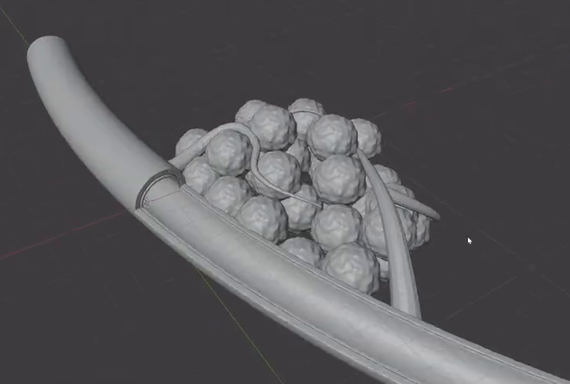
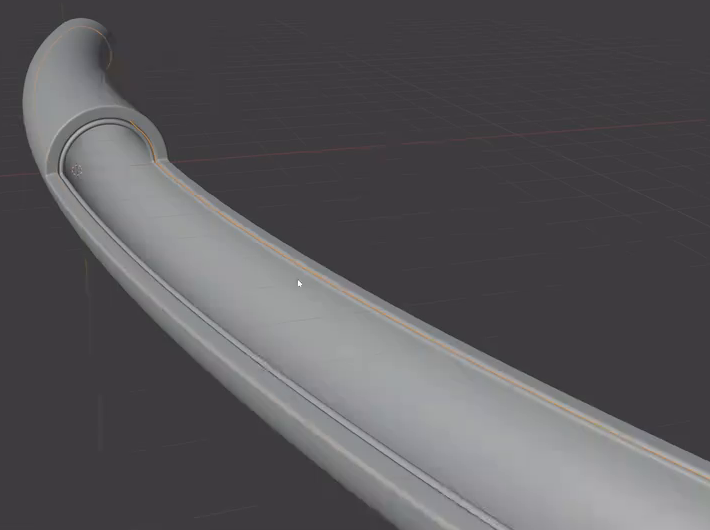
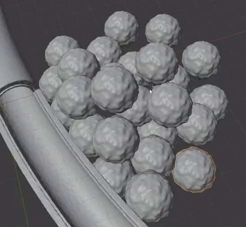
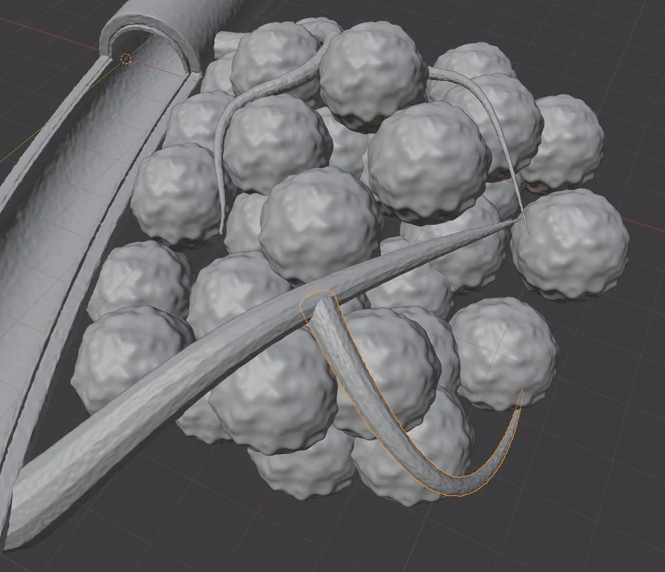
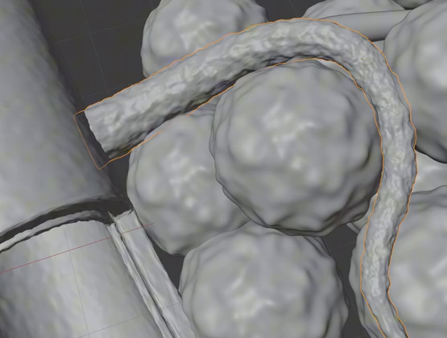

# 肿瘤血管结构灰模

用代码制作一个静态组合灰模：弯曲的粗主血管带有可见双层管壁和纵向剖口，密集的结节状团块贴在它的一侧，多条细血管在团块周围回弯、横跨和下垂。整体外形与空间关系以参考图为准。

## 输入与交付

- 使用 Blender 5.1.2，从空场景开始；没有外部输入素材，`input/` 为空。
- 交付 `submission.blend` 和从空场景重建结果的 `build.py`。脚本应仅依赖 Blender 自带能力；如使用随机分布，固定随机种子。
- 保持灰模表现。整体尺度、世界朝向、对象名称和实现方法自由，参考图中的选择高亮、网格线和视角无需复现。
- 如需渲染，使用 Cycles GPU。模型必须能在实体视图中检查真实几何。

## 1. 弯曲主血管与纵向剖口

主血管是一条细长、连续弯曲的粗管，具有舒展的弧线而非直杆或折线。它的长度明显超过团块的单个结节尺寸，粗细层级与细血管清楚区分。

主血管保留一段完整周向管体，另一段沿长度方向敞开，形成能看到内部凹形管腔的纵向剖口。两条长边和完整管段交界处的弧形边共同说明剖开关系。剖口必须由真实几何形成，不能用涂黑区域或实心表面凹槽代替；管轴端口保持通畅。

## 2. 双层管壁与边缘

主血管沿同一弧线形成内外嵌套的两层管壁，两层都有真实厚度。剖口长边和弧形交界边能分辨内外层，间距连续且窄于主血管管腔；两层不得大面积重合或相互穿出。

内外壁和开口侧壁连续相接，边缘带细窄圆角，保留清楚的剖开轮廓。主血管整体以平顺曲面为主，允许轻微自然起伏。

## 3. 三维结节团块

团块由大量可辨认的近球形单元密集堆叠而成，呈不规则的紧凑体积。单元分布在前后不同深度，侧面观察仍有明显厚度，不能仅靠一层球面的遮挡制造纵深。允许相邻单元局部相交，但它们的边界和大小变化应清晰可辨。

单个单元具有宽缓、不规则的结节起伏，仍保持近球形体量；这些起伏要改变真实几何。团块外围的单元尺寸和位置有变化，避免规则网格排列、单一光滑大球或长尖刺形态。不要求逐个复制参考中的单元数量和坐标。

## 4. 细血管的路径与空间联系

围绕团块建立至少三条可分别追踪的细管路径，整体明显细于主血管，截面有体积且大体圆润。路径整体应覆盖三种走向：上部贴着结节回弯、横跨团块的长弧线、下部下垂后折回的弯钩。允许由不同管段组合实现这些走向，细管可沿长度逐渐变细。

团块靠近主血管剖口的一侧，至少一条细管从主血管附近向团块延伸，其余细管沿不同深度穿绕结节。绕视模型时仍应形成同一组空间结构，不能把所有细管放在团块前方的一个平面，也不能让主要路径大段远离团块。局部进入结节或与其他管体贴接可以保留，但主要走向必须可追踪。

这里要求可见的邻接和穿绕关系；各管段可独立存在，不要求焊接成一个连通网格或构成流体通路。

## 5. 几何细节与完整性

细血管具有比肿瘤结节更细密的连续几何起伏，近看呈轻微不规则的组织状轮廓，同时保留可追踪的管状路径。不能仅以灰色材质、法线贴图或随机散点冒充管体表面的真实起伏。

在整体视图和正常近景下，主血管、团块和细管都应保持完整：没有意外孔洞、长刺、折段、塌陷截面、重叠表面闪烁或明显破损阴影。设计中的端口、剖口及结节间隙不属于缺陷。

## 6. 独立编辑与重建

主血管的两层、肿瘤单元和细管路径能够分别选取或隔离编辑。移动一个外围肿瘤单元，或调整一条细管的局部路径时，其余类别的几何保持不变。可使用独立对象、可选择的几何分组或等效参数，不强制特定修改器、曲线备份或对象数量。

`build.py` 应能在另一空场景中生成相同的主要形体、细节和空间布局，并保存 `submission.blend`。交付文件不得依赖本机绝对路径、外部插件或未随文件提供的资源。

## 渲染效果交付

在原有交付文件之外，另提交 `B20_肿瘤血管结构灰模.png`。图片采用 PNG 格式，从实际交付工程渲染，清楚展示主要成品及其形体或材质效果。使用本题规定的渲染环境；若原题没有指定展示相机，可设置能完整观察主体的相机。该文件应与 `submission.blend` 中的结果一致，不以参考图、视口截图或外部素材代替实际渲染。
