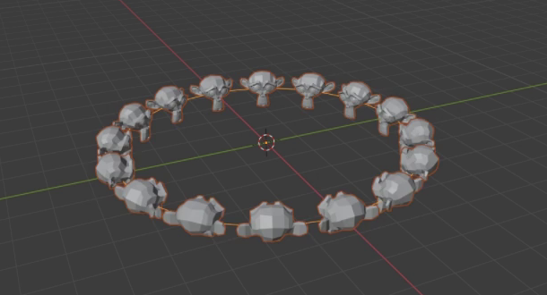
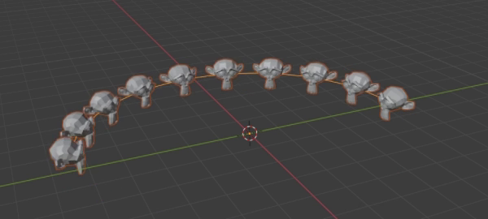
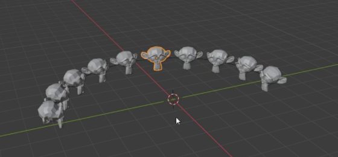

# 可调环形与圆弧猴头阵列

用代码创建由 Suzanne 猴头组成的环形阵列资产：猴头等距围绕圆心、面朝圆心，能调节半径、整圈数量和保留的圆弧范围。交付文件还应包含一份已实体化的圆弧，其猴头可以单独选择和变换。

图 1：完整圆环。参考的是猴头形状、圆周分布与朝向，画面中的辅助线和选择轮廓不是模型的一部分。

## 起始条件

- 使用 Blender 5.1.2，从空场景开始。`input/` 为空，无需外部素材或第三方插件；可使用 Blender 内置 Suzanne。
- 整体尺度自行选择。以下以阵列圆心为中心、所在平面为基准；`R0` 是默认半径，`N0` 是完整圆环的默认数量。
- 本任务要求可检查的生成源与实体化圆弧同时保存在文件中。允许用修改器、实例系统、Geometry Nodes 或其他等效方式实现。

## 1. 猴头形状与朝向

重复单元保持 Suzanne 的双耳、眼窝、额头和突出的口鼻轮廓，比例一致，无明显破损或被压扁的单元。保留参考中的低多边形外观即可，无需重做拓扑或添加装饰材质。

猴头直立于阵列平面，面部朝向圆心。完整圆环与实体化圆弧中至少 90% 的猴头，其向上方向与平面法线、面部前向与指向圆心的方向均相差不超过 10 度。环绕一周时应随位置转向，不能全部朝同一个世界方向。

## 2. 完整圆环

生成源的覆盖范围设为完整时，猴头沿同一圆周均匀分布，闭合处的间距与其他间距相当。各猴头的对应定位点到圆心的半径误差、离开阵列平面的高度误差均不超过半径的 2%；相邻角间距相对平均值的偏差不超过 10%。定位点可采用原型原点或原型中同一固定参考点，不能通过为各副本任意移动原点来伪造位置。

默认完整数量 `N0` 在 12 至 24 之间，自行选择。默认状态下单元之间保留清楚间隔，中心留空，不显示多余的中央源猴头，也不出现首尾重叠的重复单元。

## 3. 连续的部分圆弧

交付一份接近半圈的实体化圆弧，对应默认生成源的 50% 覆盖状态。它保留完整圆环上连续的一段猴头，只有一个明显的大开口；不得拆成多段，也不得把同样数量的猴头重新挤到一小段轨迹上。各单元的位置、大小、朝向与生成源该状态一致，位置误差不超过 `2%R0`，旋转误差不超过 10 度。

圆弧上仍保持完整圆环的半径和角间距，圆弧两端自然停止，不用额外连接条封闭开口。可见猴头数与 `0.5 × N0` 相差不超过 1 个。

图 2：圆弧由完整圆环保留连续部分形成，剩余单元的间隔没有缩短。

## 4. 可编辑的生成源

保留可编辑的猴头原型和阵列生成源，并提供用途明确、可在文件内修改的控制项。修改控制后应更新求值结果，无需逐个移动副本或重新运行构建脚本。

- **半径：** 在数量与覆盖范围不变时，设为 `0.8R0` 和 `1.2R0`，实际半径分别达到对应值，允许 5% 相对误差。圆心、阵列平面、猴头数量与单体尺寸保持不变。
- **数量：** 完整圆环的数量可在 8 至 24 的整数范围内设置；设为 8、20 时分别得到对应数量，仍均匀覆盖完整一圈。半径、单体尺寸和原型形状不随数量变化。
- **覆盖范围：** 可从空阵列调整到完整圆环。25%、50%、75%、100% 四档的可见数量与相应比例乘以完整数量的结果相差不超过 1 个。0% 为空；100% 恢复整圈。部分覆盖保留一个固定起点和单一连续区段；已有保留单元的位置、大小和朝向不变，只在区段末端增减单元。无需制作随时间自动播放的动画。
- **原型修改：** 对源猴头作可辨认的小范围形状修改，例如改变一侧耳朵轮廓，全部生成单元应同步更新；恢复原型后恢复原结果。已实体化的圆弧不要求与原型断开网格数据共享。

上述控制来回修改并恢复后，分布应恢复原样。参数组合的检查在生成源上进行，实体化副本不必随控制变化。

## 5. 可独立操作的实体化圆弧

默认显示第 3 节的实体化圆弧。每个猴头都是可独立选择和变换的真实对象，不能仅是同一个对象内部的网格岛或仍无法单独操作的求值实例。任意选择两个不同猴头，分别移动或旋转其中一个，其他猴头保持原位；允许共享网格数据。

生成源与实体化圆弧应可分别查看，可用不同集合或其他清楚的组织方式区分。默认视图中只显示一份圆弧，避免两份几何重合；隐藏生成源不会让实体化圆弧消失。两者同时保留是本任务的交付约定。

图 3：圆弧中的一个猴头可单独选中。图中的橙色选择轮廓不是材质要求。

## 6. 交付与重建

提交 `submission.blend` 和 `build.py`。脚本开头写明运行方式，能够在 Blender 5.1.2 的空场景中重建并保存上述资产。需要的内容应内置或由脚本生成，不依赖本机绝对路径、联网下载或额外插件。

文件内提供简短说明，标明原型、生成源、实体化圆弧、控制位置、默认值，以及分别显示两份资产的方法。保存时生成源处于默认半径、默认数量和 50% 覆盖状态；实体化圆弧完整可见。采用能看清形态的视口即可；如附渲染，使用 Cycles GPU，无固定相机和灯光要求。

图片为原视频的实际画面裁切。数量范围、调节幅度、误差容限，以及同时保留两份资产的组织方式，是本任务公开的交付约定。

## 渲染效果交付

在原有交付文件之外，另提交 `B21_可调环形与圆弧猴头阵列.png`。图片采用 PNG 格式，从实际交付工程渲染，清楚展示主要成品及其形体或材质效果。使用本题规定的渲染环境；若原题没有指定展示相机，可设置能完整观察主体的相机。该文件应与 `submission.blend` 中的结果一致，不以参考图、视口截图或外部素材代替实际渲染。
