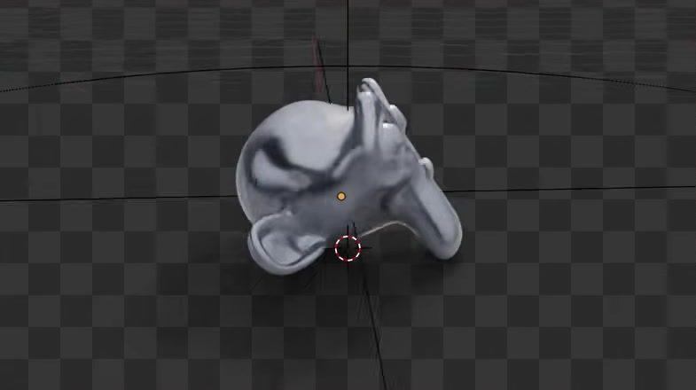
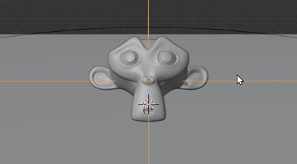
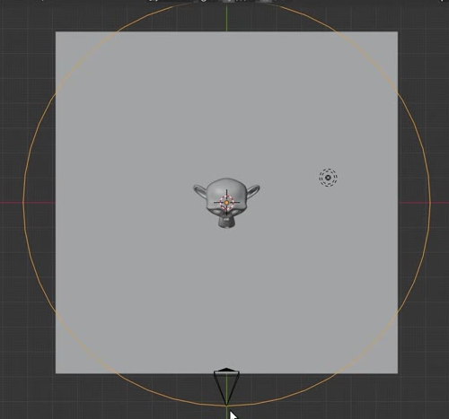
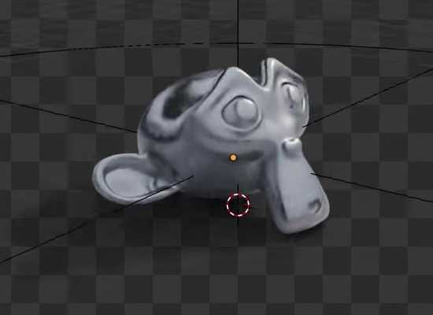

# 可调整的相机环绕系统

用代码创建一套可继续编辑的相机环绕系统：相机围绕静止的 Suzanne 做水平圆周运动，始终对准头部，并能整体调整环绕周期、半径和瞄准高度。最终画面只有受光的主体及其接触阴影，背景和地面本身透明，可叠加到其他画面上。

图 1：环绕中的一个侧面视角。棋盘格表示透明背景；图中的细线属于视口辅助显示，不应进入最终渲染。

## 起始条件

- 使用 Blender 5.1.2，以 Cycles GPU 渲染。
- 从默认场景或空场景开始。`input/` 为空；直接使用 Blender 内置 Suzanne，不需要外部模型、纹理或插件。
- 以 Z 轴为竖直方向。整体尺寸和世界坐标位置自行选择。下文 `H` 表示默认姿态下主体的世界空间包围盒高度，`R` 表示默认相机的水平环绕半径。

## 1. 主体与默认取景

Suzanne 静止放置于水平地面上，头部略向后仰、面朝前上方，接触处自然，不明显悬空或穿入地面。相机从主体上方斜向下观察；默认第 1 帧采用能辨认双眼与鼻部的正面或近正面视角。

整圈运动中，主体完整位于画面内，四周保留至少 5% 画幅的余量。主体投影的包围框中心落在画面中央三分之一区域，其高度占画面高度的 25% 至 65%。相机持续对准头部中部的瞄准点，实际光轴与指向瞄准点的方向偏差不超过 2 度；画面相对竖直方向的滚转不超过 3 度。正面或近正面视角下，照明应使耳部、眼部及鼻部清楚可辨；绕到侧面和背面时，允许这些部位被主体自然遮挡。

图 2：正面取景与瞄准高度的关系。地面在此图中用于说明空间位置；最终输出的透明与阴影要求见第 5 节。

## 2. 水平圆形轨迹

运动来自相机绕主体移动。主体、地面和照明在默认播放中保持静止，不能通过旋转主体或整幅图像来替代相机环绕。

相机轨迹在水平投影上为围绕主体的闭合圆。环绕轴的地面投影距主体包围盒中心的地面投影不超过 `0.1H`。一圈中实际半径相对平均半径的偏差不超过 2%，相机高度变化不超过 `0.02H`，镜头始终处于地面上方。

图 3：相机在主体外侧环绕的空间关系。参考线只表达圆形轨迹，不要求使用相同的曲线对象或层级。

## 3. 周期与连续播放

默认以 24 fps、步长 1 播放第 1 至 100 帧，周期为 100 帧。第 101 帧与第 1 帧具有相同的相机姿态；第 1 至 100 帧是周期内 100 个不同的采样时刻，第 100 帧到下一轮第 1 帧应继续前进一个正常步长。

相机保持同一环绕方向，匀速完成一圈。连续两帧的角度增量以 3.6 度为目标，允许各步偏差不超过 10%，包括播放首尾交界。不得出现停顿、倒退、突然加速或跳切。第 1、26、51、76 帧应依次形成约四分之一圈的观察角度；播放和任意顺序跳帧都应得到对应的相机状态。

## 4. 可编辑的运动与瞄准

在场景内保留能辨认用途的周期、半径和瞄准位置设置，并写明默认值与恢复方法。允许曲线、约束、驱动、关键帧或其他等价实现；关键是修改设置后，完整系统能更新，无需逐帧重做动画或重新运行构建脚本。

- 将周期从 100 改为 200 帧，并把播放范围改为 1 至 200 帧后，相机仍沿原轨迹完成一圈，速度为默认的一半；第 201 帧回到第 1 帧姿态。默认与修改后第 1 帧的起点相同。
- 从默认状态把半径改为 `1.25R` 后，整条相机轨迹相对同一环绕轴一致扩大，实际半径变化与目标值相差不超过 2%。相机高度变化不超过 `0.02H`，周期和主体位置保持不变，镜头仍对准瞄准点。
- 从默认状态把瞄准点沿 Z 轴抬高 `0.25H` 后，相机在整圈各处均指向新位置，光轴偏差不超过 2 度。此修改只改变取景方向，相机路径位置变化不超过 `0.01H`，主体位置与周期不变。

各项修改分别从默认状态开始验证，完成后可恢复默认状态。

## 5. 透明背景与接触阴影

使用 Cycles GPU 生成带 Alpha 的画面。主体之外没有不透明的世界背景或可见地面色块，也没有辅助路径、控制器或其他展示物。主体本身正常可见；远离主体与阴影的区域 Alpha 应不超过 0.01，不能把棋盘格绘制在背景中模拟透明。

地面保留承接阴影的作用，主体附近呈现与接触位置相连、边缘自然过渡的阴影。相机环绕时，阴影维持与固定主体、固定光照一致的世界空间关系；不能出现阴影消失、穿帮或被承影面边界截断。结果应能直接叠加在浅色与深色背景上，保留主体和阴影，不露出矩形地面、实色底或明显边缘光晕。

图 4：另一观察角度下的主体和接触阴影。参考图用于表达透明合成效果，不要求复制金属感高光或具体光源位置。

## 6. 交付与重放

提交 `submission.blend` 和 `build.py`。脚本应能在 Blender 5.1.2 中从起始场景生成并保存完整资产，在脚本开头说明运行方式。文件保存为默认周期、半径和瞄准设置，活动相机可直接播放第 1 至 100 帧，也可直接渲染任意帧的 RGBA 图像。

资源应保存在文件内、随包提供或由代码生成，不依赖本机绝对路径、联网下载、外部插件或未提供的缓存。保留简短的场景内说明，标明三个可编辑设置及恢复默认状态的方法。重开文件后，播放、跳帧、参数调整和透明渲染应仍可使用。

图片是实际参考画面的裁切。比例、容差和参数测试幅度是本任务的公开验收约定。

## 渲染效果交付

在原有交付文件之外，另提交 `B22_可调整的相机环绕系统_动态.mp4`。视频采用 MP4 格式，按本题规定的完整时间范围和帧率，从实际交付工程渲染动画，清楚展示动作与效果变化。使用本题规定的渲染环境；若原题没有指定展示相机，可设置能完整观察主体的相机。该文件应与 `submission.blend` 中的结果一致，不以参考图、视口截图或外部素材代替实际渲染。
