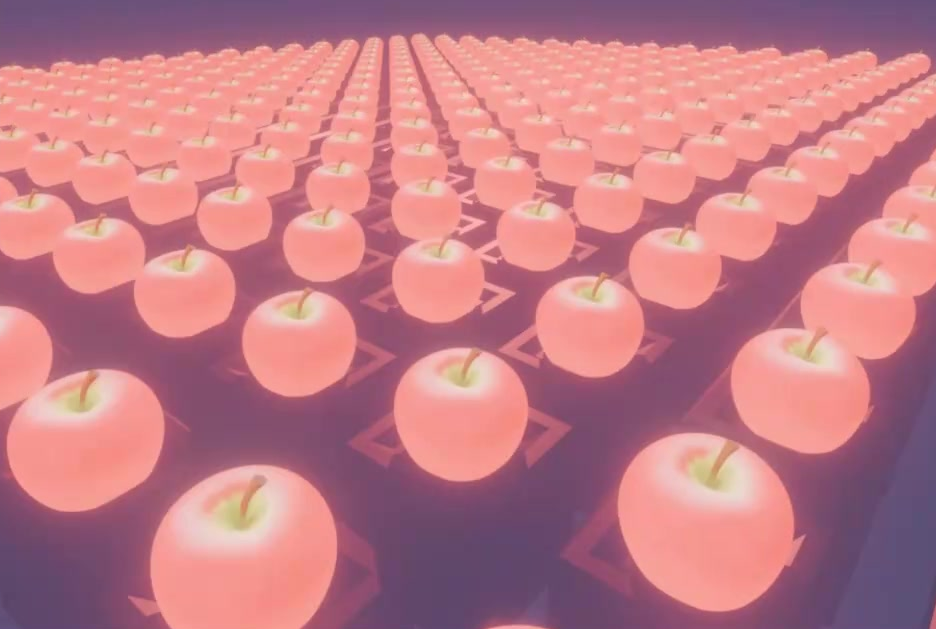
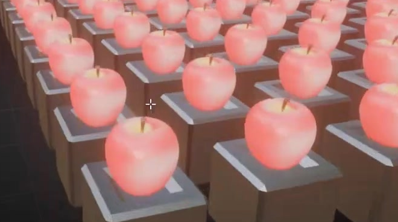
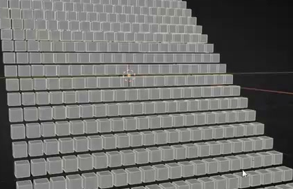
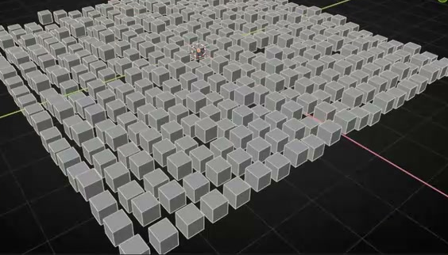

# 可调的发光矩阵阵列

用代码创建一个可编辑的 Geometry Nodes 阵列：规则方格中，每个方形底座上都有一个发光小模型。阵列能在有规律的阶梯坡面与带局部随机起伏的高度场之间调节，底座和上方模型始终成对移动。

图 1：参考整体重复关系、明暗对比和柔和光晕。上方模型可自行设计为紧凑的小型网格，不必复制图中的苹果。

## 起始条件

- 使用 Blender 5.1.2，从空场景开始。`input/` 为空，无需外部模型、贴图或第三方插件。
- 整体尺寸自行选择。以下以默认底座宽度 `B`、高度 `H` 和相邻底座中心距 `D` 表示相对尺寸。
- 使用 Geometry Nodes 保留生成器及可编辑的底座、上方模型原型。节点组织方式自行决定。
- 为观察发光外观提供可用的 Cycles GPU 渲染设置；视口也应能清楚检查实体结构。

## 1. 规则的双层方格阵列

默认状态沿两个水平方向各至少有 10 个位置，行列数量相同，水平投影形成近方形阵列，宽长比为 `0.9-1.1`。每个位置有一个底座及其上方的小模型。底座中心排列在直角网格上，各行、各列的相邻中心距相对误差不超过 5%；升降不得改变这些水平坐标。

相邻底座之间留有清楚可见的缝隙，上方模型保持统一尺度和直立朝向，不能连成不可分辨的连续块。默认阵列内不混入独立展示的源对象。

## 2. 底座和上方模型

底座是有厚度的方形实体，具有平整的承托区域，以及围绕顶部的一圈窄边框或倒角式轮廓。轮廓在四角连贯，侧壁和顶部不能破损。上方模型应具有可辨认的三维体积，表面完整；其水平轮廓能落在底座承托范围内。

图 2：观察顶部边框、实体侧壁和小模型的承托关系。模型的具体造型、边框截面及网格划分可自行决定。

至少 95% 的成对单元中，上方模型中心与底座中心的水平偏差不超过 `0.15B`；模型最低点与承托表面的竖直间隙或嵌入深度不超过 `0.1H`。改变阵列高度后仍保持同样的相对位置，不能出现底座移动而模型留在原处的情况。

## 3. 两类可叠加的高度变化

提供用途清楚的 X 向坡度、Y 向坡度、随机起伏强度和随机变化参数。所有高度变化沿世界竖直方向发生，底座及上方模型本身不随坡面倾倒。

**规则高度：** 随机起伏强度为零时，沿任一行或列的高度增量基本恒定，形成阶梯式坡面；高度增量的误差不超过该状态总高度差的 5%。两个坡度均为零时阵列平铺；单独改变 X 或 Y 坡度时，只改变对应方向的升降趋势；反转坡度符号后，高低方向反转。交付默认值采用能看清高低关系的非零坡度，最高与最低底座中心的高度差至少为 `B`。

图 3：灰色底座阶段展示规则高度关系。该图只说明升降方式，交付成品还须包含上方模型与最终材质。

**随机起伏：** 在规则高度上增加局部不规则升降。强度为零时完全回到规则高度；使用非零强度时，至少能辨认三档不同的高度偏移，并同时存在高于和低于规则高度的位置。增大强度会增大偏移幅度；改变随机变化参数会改变分布。同一参数组合重新求值或重新打开文件后，分布应保持一致。

图 4：随机模式仍保留规则水平网格，只改变各单元的高度。无需复刻图中的逐格高度。

交付时随机起伏强度设为零，并在文件内注明一个能显示上述随机效果的非零示例值。切换两类高度状态应直接更新成品，不需要重新运行构建脚本。

## 4. 生成器的可编辑关系

提供行数、列数及间距控制。行数或列数增加 2 时，只沿对应方向新增完整的成对单元；将间距增大为默认值的 `1.25` 倍时，水平中心距同比增大，单元数量及原型尺寸保持不变。调整密度和间距后，两类高度控制仍然有效。

底座与上方模型使用各自可编辑的源几何。修改一个源的可见局部轮廓或材质后，该类所有生成单元应同步更新，另一类的造型不被替换。上方模型原型应可替换为另一个自建网格，并可通过统一的尺寸、朝向和竖直偏移调节恢复承托关系，无需逐个移动阵列成员。

在 `.blend` 内附简短说明，指出两个原型、阵列生成器、控件位置、默认值和随机模式示例值。修改控件或原型后恢复默认值，应恢复同一阵列。

## 5. 发光外观

底座采用较暗、不透明的非发光材质；上方模型采用明亮的暖粉红色自发光材质，二者在最终渲染中有明确明暗区分。发光效果必须来自实际参与模型表面着色的材质。分别修改底座原型的表面颜色或上方模型原型的发光颜色后，对应整组成员应随之变色，另一类保持原色。

最终渲染中，高亮轮廓附近有柔和光晕；光晕不能抹去底座缝隙、上方模型轮廓和顶部细节。保持前、中、后三段都能辨认出成对单元。光晕实现方式、相机位置和展示背景自行决定。

## 6. 交付内容

提交 `submission.blend` 和 `build.py`。脚本应能在 Blender 5.1.2 的空场景中生成并保存资产，并在开头说明运行方式。必要资源应随文件保存或由脚本生成，不依赖作者机器上的绝对路径或联网下载。

保存时保留可编辑生成器、两个原型及控件说明，采用前述默认状态。提供能查看整套阵列的视口状态及可用渲染视角。无需制作时间轴动画。

图片均为参考画面的实际裁切。数量下限、比例、调节幅度和容差是本任务的验收约定。

## 渲染效果交付

在原有交付文件之外，另提交 `B23_可调的发光矩阵阵列.png`。图片采用 PNG 格式，从实际交付工程渲染，清楚展示主要成品及其形体或材质效果。使用本题规定的渲染环境；若原题没有指定展示相机，可设置能完整观察主体的相机。该文件应与 `submission.blend` 中的结果一致，不以参考图、视口截图或外部素材代替实际渲染。
