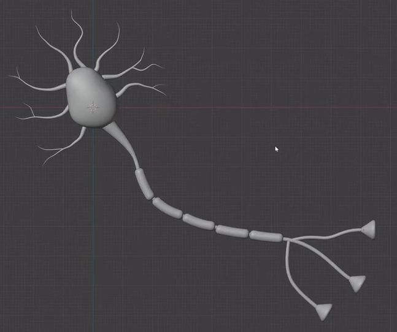
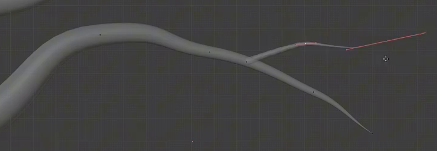
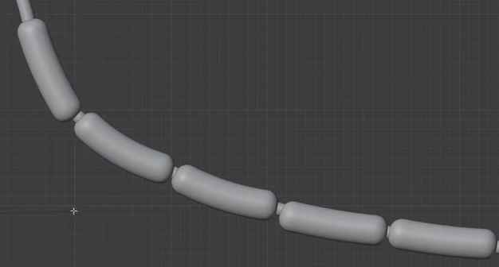
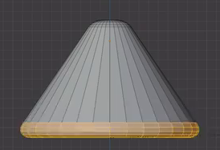

# 神经元灰模

用代码制作图示的静态神经元示意灰模：不对称的卵形胞体周围伸出渐细的弯曲树突，一条较长的轴突从胞体延伸，经分段包覆后分成三支，每支连接一个圆润外扩的终末件。整体形状、粗细层级和连接关系应清楚可辨。

## 输入与交付

- 使用 Blender 5.1.2，从空场景开始。没有外部输入素材，`input/` 为空。
- 交付 `submission.blend` 和能从空场景重建结果的 `build.py`。所有依赖须随交付提供或打包，脚本不能依赖本机绝对路径或在线下载。
- 保持中性灰模，能在实体视图中检查实际三维形状。整体尺寸、世界朝向、对象名称和建模方法自由；参考图中的网格、控制线与选择高亮不属于目标模型。
- 如需渲染，使用 Cycles GPU。相机、灯光与背景可自行安排。

## 1. 胞体与放射树突

胞体应是饱满的三维卵形或水滴形，上部略向一侧偏斜，下部较宽，形成不对称轮廓。表面平顺，没有尖刺、破洞或明显多边形明暗分块。

围绕胞体建立不规则的放射状树突群。相对于整体参考的主视方向，顶部、左侧、右侧和下侧均有向外伸展的树突；各自长度、间隔和弯曲方向有所变化。树突根部与胞体视觉连成一体，不能悬空。数量可自行安排，但应保留参考中疏密不一、方向丰富的轮廓。

## 2. 渐细管体与局部侧枝

树突具有真实厚度和近圆形截面，从根部向自由端逐渐收细。中心线以流畅弧线转向，粗细变化连续；不能仅用细线、平面图形或均匀粗直杆代替。

至少两根一级树突上应出现更细的侧枝。侧枝从主干侧面接出，与主干形成清楚的分叉角度，并继续向外收细；分叉处不能有可见断口或明显错位。可以采用相接的独立部件，不要求焊接为同一拓扑。

## 3. 长轴突与三支远端

从胞体一侧延伸出一条长轴突，其伸展范围明显超过周围普通树突。轴突根部较宽，向外收窄后形成连续的细管，整体沿一条平缓转弯的路径伸向远处，根部与胞体相接。

轴突远端形成三条可辨认的分支。三支在包覆段之后分开，各自具有连续的管状体积、不同的弯曲方向和分离的自由端。分叉附近要保持视觉连接，不能把三根互不相接的管子摆在主干旁充当分叉。

## 4. 分段髓鞘造型

在长轴突的主干上建立至少五个可辨认的胶囊状包覆段，形成分段髓鞘的示意造型。每段比内部细管粗，具有细长中段和圆润双端；各段尺度相近，可以随所在位置轻微弯曲或调整长度。

包覆段沿轴突路径排列，各段中心与局部轴突对齐，长轴顺着该处的走向。相邻段之间保留能看见细轴突的小间隙，包覆链在远端三叉之前结束。隐藏包覆段后，其内部仍应有连续的轴突管体；不能用一串互不连接的胶囊代替整条轴突。

## 5. 三个终末件

三条远端分支各连接一个短而宽的终末件。终末件近似圆滑截锥或小喇叭的外轮廓，窄端较小，宽端外扩且边缘圆润，整体尺度相近。形状以图示外轮廓为准，不要求内部空腔。

每个终末件的窄端与对应分支末梢相接，宽端朝外，方向跟随该分支末段。三件应彼此分开，不出现明显悬空间隙或贯穿宽端的管体。

## 6. 编辑与重建

胞体、管状突起、包覆段和终末件须保留可继续编辑的结构。能单独隐藏包覆段检查内部轴突，也能调整一条树突的弯曲或长度而不意外改变其他树突。可使用曲线、网格、修改器或其他等效方法。

`build.py` 在干净场景运行后应生成与 `submission.blend` 一致的主要轮廓、分叉、包覆段和终末连接关系，并保存结果。脚本中注明运行方式及必要依赖。

## 渲染效果交付

在原有交付文件之外，另提交 `B24_神经元灰模.png`。图片采用 PNG 格式，从实际交付工程渲染，清楚展示主要成品及其形体或材质效果。使用本题规定的渲染环境；若原题没有指定展示相机，可设置能完整观察主体的相机。该文件应与 `submission.blend` 中的结果一致，不以参考图、视口截图或外部素材代替实际渲染。
