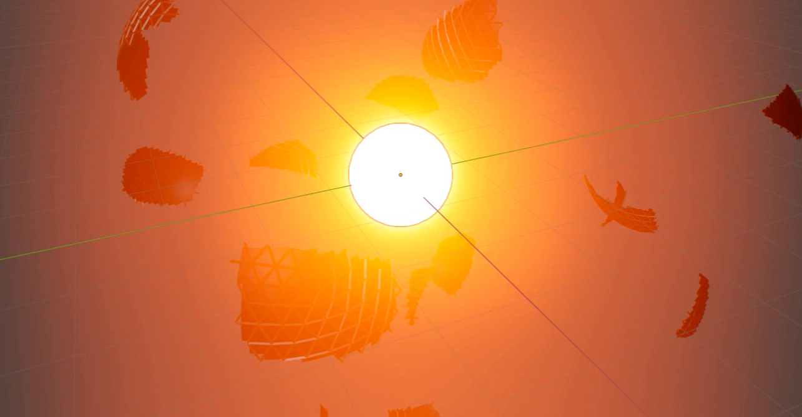
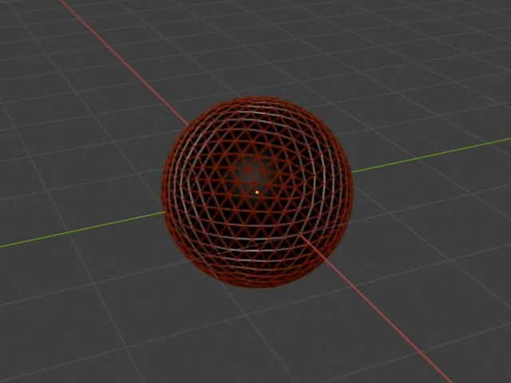
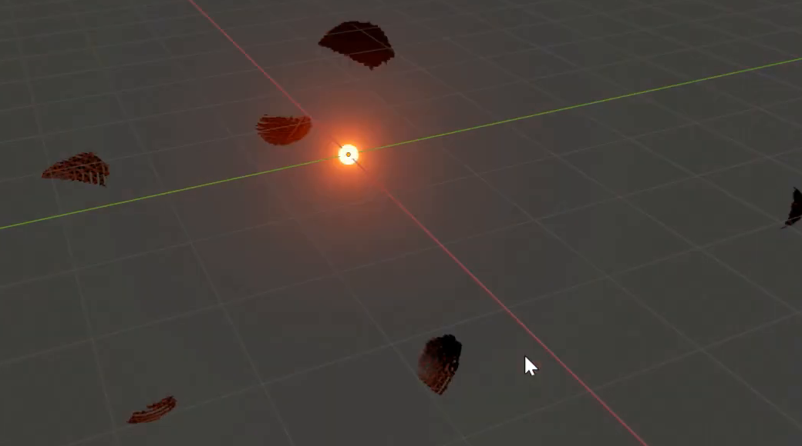
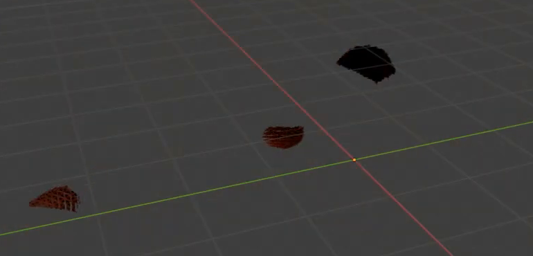

# 网笼球壳爆炸与闪光

用代码创建一个可重放的爆炸资产：深红褐色三角网笼包裹黑色球壳，短暂停留后一起碎裂，弧形碎片向四周飞散；球心出现一次橙红色闪光，迅速膨胀、变亮，再收缩消失。

图 1：闪光高亮阶段的局部参考。碎片保留球面的弧度和网笼条纹，中心为明亮球形光源及向外衰减的暖色辉光。

## 起始条件

- 使用 Blender 5.1.2，从空场景开始。`input/` 为空，几何、材质和运动均由代码创建。
- 本任务采用 EEVEE GPU 展示实时风格的发光效果；使用该版本可用的辉光或合成方式实现参考外观。无需照搬旧版本的渲染开关。
- `+Z` 向上，完整球体的中心位于世界原点。令 `D` 为完整球壳直径，整体尺度自行选择。
- 时间范围为第 1 至 60 帧，24 fps。所有时序均指场景帧号。

## 1. 完整球壳与三角网笼

初始状态是完整、平滑的球壳，外部紧贴一层细密的三角形网笼。网笼由真实三维细条组成，围绕整个球体分布；从斜视和侧视都能看到条体的厚度及其与球壳的前后关系。三角网格的空隙中可见黑色球面，不能用实心外球或仅画在球面上的线纹代替网笼。

网条粗细大体一致，明显小于三角空隙的宽度；网笼与球壳同心，稍微高于球面，整体仍读作一个紧凑球体。初始球壳不能存在醒目的缺口、裂缝或尖刺。分片后的主要碎片应保留原球面的曲率，以及可辨认的壳片和网条片段；不要求实体厚块或封闭断面。

图 2：爆炸前的完整状态。参考网格密度和壳体、网条之间的比例；网格细分级别及碎片数量自行决定。

## 2. 材质与闪光外观

球壳为不透明、接近哑光的黑色，保留轻微高光以显示球面；网笼为独立可辨的深红褐色，不能与黑色球壳混成同一种外观。爆炸后这些材质继续附着在相应的壳片和网条上，不能整体变成白色或发光材质。

中心闪光来自三维球形表面的实际自发光，颜色为橙红色。高亮时中心可接近白黄，外侧呈橙红色并形成柔和衰减的辉光；附近碎片仍有可辨识的轮廓。将闪光的发光强度暂时降为零时，亮核和辉光应消失。相机、灯光和中性背景自行安排，以便看清完整状态和爆发阶段。

## 3. 爆发与碎片模拟

第 1 至 9 帧球壳及网笼保持完整、静止。第 10 帧开始爆发，并在第 12 帧结束前完成主要分离；第 15 帧应能明确看出多块独立碎片和空出的球心区域，不能仍有完整球体留在中心。

球壳和网笼都参与碎裂。主要碎片有大小差异，能看出它们来自原来的球体；不要仅让完整球体移动、只炸开网笼，或把全部结构变成看不清形状的细粉。模拟载体本身不应额外显示为无关的白点、光晕精灵或重复球体。

碎片运动必须由可重算的粒子或动力学模拟产生，可采用等价的模拟方案。碎片向球心周围多个方向外抛，速度存在差异，运动中保持各自形状并出现朝向变化。向下重力参与后续轨迹；碎片不能始终保持同一队形整团平移，也不能只原地下落。保留实际影响运动的重力设置，改变它并重算后，后期轨迹应随之变化。

## 4. 闪光时序

闪光中心始终位于原球心，不能随任何碎片移动。第 1 至 10 帧没有可见闪光，随后在碎片开始分离时膨胀并增强；第 15 帧达到最大尺寸和最亮状态。峰值亮核直径约为 `0.6D` 至 `0.8D`，不包含外围辉光。

第 20 帧缩为明显小于峰值的光点，亮核直径不超过 `0.15D`，发光强度也已下降；第 22 帧完全不可见，此后一直保持消失。峰值前后必须能观察到大小和发光强度的变化，不能只在两个静止状态之间突然切换。允许关键帧、驱动或等价的时间控制方式，不固定关键帧数量和插值配方。

图 3：第 20 帧附近的衰减状态，中心缩成小光点，壳片和网条片段已经离开原位置。

## 5. 完整播放与重算

从第 1 帧顺序播放至第 60 帧，应完成一次完整的静止、爆发、闪光和飞散过程。第 22 帧之后闪光消失，碎片继续运动，到第 60 帧中心附近不再留有完整球体或成团残骸。碎片不能在途中无故消失、跳回原处、冻结或再次组装；超出相机画幅的碎片应仍存在于场景中。

图 4：第 24 帧的局部参考。光源已不可见，碎片仍在远离中心；不要求所有碎片始终留在同一个镜头内。

保留模拟来源及重新计算的方式。文件内附简短说明，指出完整球体、闪光、实际运动系统、重力设置及缓存重建方式。回到第 1 帧并按说明清理或重建缓存后，应能再次得到相同的默认过程。只保留无法重算的外部动画缓存不满足此要求。

## 6. 交付内容

提交 `submission.blend` 和 `build.py`，文件以第 1 帧保存。`build.py` 应能在 Blender 5.1.2 的空场景中生成资产、建立所需模拟或缓存并保存结果；在脚本开头写明运行方式。所有必需资源应打包、随交付保存或由脚本生成，不依赖本机绝对路径、外部插件或联网下载。

本任务的效果范围为球壳碎裂、碎片运动和表面发光球闪光，无需体积火焰、烟雾、引线、地面碰撞或飞入路径。图片为参考视频的实际画面裁切；网格、对象、节点和粒子数量不作固定要求。

## 渲染效果交付

在原有交付文件之外，另提交 `B25_网笼球壳爆炸与闪光_动态.mp4`。视频采用 MP4 格式，按本题规定的完整时间范围和帧率，从实际交付工程渲染动画，清楚展示动作与效果变化。使用本题规定的渲染环境；若原题没有指定展示相机，可设置能完整观察主体的相机。该文件应与 `submission.blend` 中的结果一致，不以参考图、视口截图或外部素材代替实际渲染。
