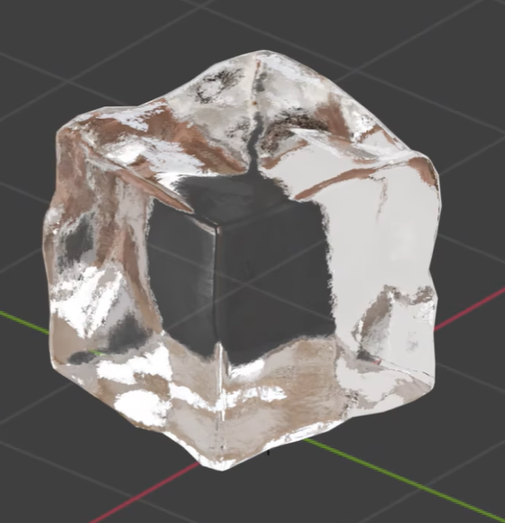
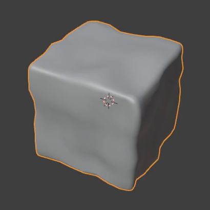
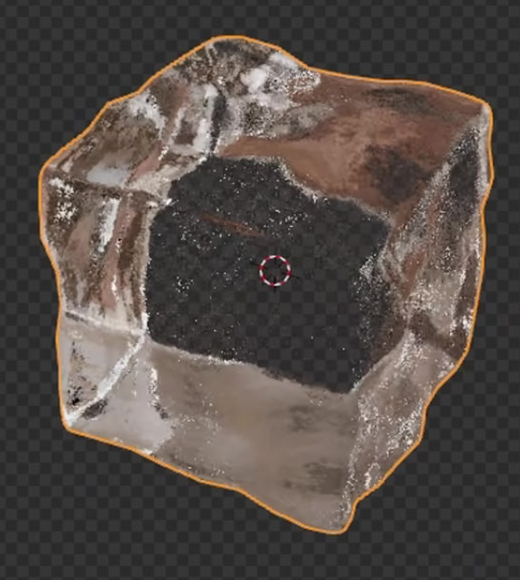

# 程序化透明冰块

制作一块可编辑的透明冰块：整体仍能辨认出立方体，表面与外轮廓有宽缓的不规则起伏，边角圆润；透过冰体能看到受折射影响的背景，近看有细碎、克制的冰面变化。保留一个能改变大尺度起伏的参数，让同一资产产生不同但仍可信的冰块外形。

## 起始条件与输入

- 使用 **Blender 5.1.2**，从空场景或默认立方体开始，通过 Python 构建工程。
- `input/` 为空，没有必须使用的外部素材。模型和材质均自行建立；实现方式可自选。
- 提交一块完整冰块作为主要资产，使用 **Cycles GPU** 设置材质展示。提供能够观察完整冰块、边缘和透射区域的相机与照明。
- 参考中的网格线、选中轮廓、视口标记和环境倒影只辅助观察；展示背景可自行选择。下方灰色模型图用于说明形状，成品以透明材质图为外观目标。

## 1. 冰块外形与连续表面

整体三轴尺寸接近，具有立方体的主要面向，不能变成球体、薄片或细长柱体。各面及外轮廓带有宽缓、不规则的凹凸，仍保留大块面之间的关系；不能只有完全规则的平面和一致的圆角。

主要边缘与角部均有可见的圆润过渡，同时保留方块的辨识度。灰色材质下近看，面与圆角的明暗连续，没有明显多边形台阶或异常的硬阴影接缝。

冰体的外表面闭合，形成有厚度的完整实体；各主要表面连续，无意外裂口、穿插、翻面或塌陷。透明参考中间的深色区域不要求做成贯穿孔或独立的内部零件。

## 2. 清透的冰体与光学厚度

冰体以接近无色的透明材质为主。在有明暗或色块对比的背景前，至少有清晰可辨的区域能透过冰体看到背景；整体不能成为不透明的白色块或金属块。环境反射可以带色，但换成中性照明后冰体本身不应有明显的棕色或其他浓重固有色。

透明效果要来自实际作用于冰体的光学材质。透过不同面向和弯曲区域观察，背景应出现与厚度、朝向及表面起伏相关的偏移或变形；移动视角后这些关系会随之变化。边缘和受光面同时具有清晰的反射亮区，从而读出冰体的体积与表面走势。

不以透明图片、镂空几何或单纯降低不透明度代替有厚度的透射和折射。无需额外制作气泡、裂纹冰芯或内部悬浮物。

## 3. 细碎但克制的冰面质感

在整体宽缓起伏之外，表面还应有更细小的不规则变化，使近距离观察到的反射与高光出现细碎扰动。这层变化的尺度明显小于大块面的凹凸，不能只把外轮廓变得更破碎。

细节应保留清透、带亮光的冰面感觉：在通常的观察距离仍能看清透明区域和主要面向，不能把整块做成均匀磨砂、乳白雾面或严重皱缩的材质。无需复制参考中的具体反射形状或采样噪点。

## 4. 可调整的大尺度起伏

保留并标明一个控制大尺度起伏尺度或分布的参数。给出默认值以及一组有效的对照值；在同一视角下修改它，冰块表面宽缓凹凸的位置、尺度或分布应产生可辨变化，而不是仅改变颜色、整体缩放或刚体位置。

两种设置都应保留完整的近立方体外形、圆润边缘和有效透明材质。改变参数后能够在现有场景中更新，无需逐点手工修形、替换预制图片或清空并重新构建整个场景；恢复默认值后回到默认外形。控制可以位于修改器、纹理、节点组或场景内可调用的参数更新函数中，不限定具体节点或修改器组合。

在工程内附简短文本，说明控制位置、默认值、对照值及如何触发更新。

## 提交文件

- `submission.blend`：完整可编辑工程，保存默认形态、有效材质、相机和照明，能查看透明成品，也能切换灰色视图检查几何。
- `build.py`：在 Blender 5.1.2 空场景中重建默认工程的脚本，注明运行方式与输出路径。不能依赖本机绝对路径、网络下载或未提供的插件；如使用自建外部资源，应随提交提供并正确引用或打包。随机过程应固定种子。

工程能正常打开并包含有效冰块，是验收内容的前提。脚本应能从干净场景重建同一默认外形、材质和参数行为；单张渲染图不能代替工程。

## 渲染效果交付

在原有交付文件之外，另提交 `B26_程序化透明冰块.png`。图片采用 PNG 格式，从实际交付工程渲染，清楚展示主要成品及其形体或材质效果。使用本题规定的渲染环境；若原题没有指定展示相机，可设置能完整观察主体的相机。该文件应与 `submission.blend` 中的结果一致，不以参考图、视口截图或外部素材代替实际渲染。
