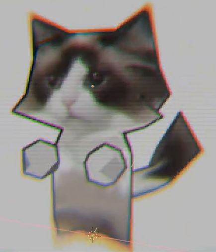
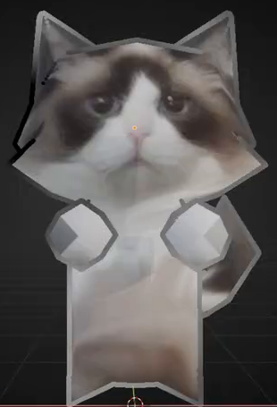
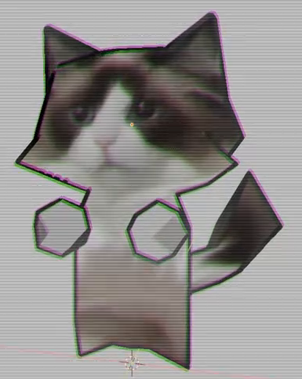

# LowPoly 线描与老电视滤镜

为一个可渲染的 LowPoly 演示场景制作可编辑的静态合成效果：沿模型轮廓和明显的面转折添加略带明暗变化的描线，再叠加彩色错位、水平扫描线和轻度像素化。最终画面仍能辨认主体、原有材质和明暗关系。

图 1：完整滤镜效果参考。图中的角色和照片纹理仅用于展示效果，不要求复刻；主体底部接近原画面的边缘也不是构图要求。

## 起始条件

- 使用 Blender 5.1.2；渲染使用 Cycles GPU。最终合成结果必须能通过保存的相机直接渲染得到。
- 从空场景开始，`input/` 为空，无外部模型或贴图。可以用 Blender 内置网格或自建简单 LowPoly 物体作为演示主体，不要求复杂建模。
- 演示主体需有清楚的角状外轮廓、可见的面转折，以及能够分辨的材质色块或纹理；这样可以判断描线与图像内容的关系。背景采用与主体有反差的浅灰或中性颜色，主体完整位于画面内。
- 本任务交付静态画面，无需关键帧、扫描线闪烁、角色运动或动画循环。

## 1. 随模型变化的轮廓描线

在主体的可见外边界形成清楚的描线，保留角状转折、凸起和凹口。线条贴合模型边界，不能成为与主体分离的光圈，也不能填成大面积实心块。允许少量轻微断续，但主要外形应保持连续可读。

在主体内部有明显面转折或部件交界的地方，出现与结构对应的线条。平坦面上的色块、纹理细节和光照变化不应全部变成密集碎线。描线应由当前三维场景产生；轻微改变观察角度后，边线应跟随新的可见结构，不能只是覆盖一张预先画好的轮廓图片。

## 2. 略带斑驳的线条质感

描线沿长度方向有轻微、不规则的深浅变化，呈现手绘线条的丰富程度，而不是处处完全相同的纯色。变化仍集中在描线范围内，不应在背景和物体表面随机铺满噪点；也不能使一整段主要外形消失。

图 2：描线调节阶段的实际效果，尚未叠加老电视滤镜。参考边线的局部深浅变化；最终线条以能从主体和背景中分辨为准，无需逐段匹配此图的黑白分布。

## 3. 彩色错位与色散

高反差边缘出现窄幅、方向可辨的彩色错位，例如绿色与洋红色等通道分离形成的边缘色带。同时保留轻微色散造成的彩边扩展：画面不同位置的彩边宽度可以有差异，不能仅把整个主体复制成几张相隔很远的彩色图像。

在最终状态下，各色带仍围绕同一个主体，主要色块和形状可辨。无需严格复制参考图的颜色顺序、像素偏移值或镜头参数。

## 4. 水平扫描线与像素质感

横向、相互平行的细条纹叠加在整幅图像上，形成老电视扫描线。条纹有规律地穿过主体和背景，不随模型表面方向弯曲；其明暗强度不应使主体的大面积区域变成不可辨认的黑带。

图 3：扫描线较明显的阶段，用于观察方向和分布。最终强度可比此图更轻，但扫描线仍需可见。

画面还应有轻度离散像素质感：在实际输出尺寸的局部放大图中，边缘可看到有限大小的像素块或阶梯，不能只有均匀模糊。像素化后仍能辨认角状外轮廓、主要面转折和彩色边缘。

## 5. 原图保留与可调节性

描线以透明叠加的效果与原始渲染结合，原有材质色块、纹理和大范围明暗关系应继续可见；图像不能被一层不透明底色取代。保存“原始渲染”“仅线描”“完整滤镜”三种可切换状态。可以通过已有处理的启用、禁用或其他等效方式切换，不要求特定节点或界面布局。

保留两个能实际影响最终输出的调节项：描线粗细和扫描线密度。在文件内的简短说明中标明它们的位置、默认值，以及适合比较的低档和高档。粗档应让同一边缘的典型线宽明显增加，密档应在同一画幅内产生明显更多的横线；调节时不改变模型、材质或相机，恢复默认值后恢复默认效果。不要求额外制作控制面板。

## 6. 交付内容

提交 `submission.blend` 和 `build.py`。脚本应能在 Blender 5.1.2 的空场景中重建演示场景、材质、相机与可编辑的合成效果，并保存文件；在脚本开头说明运行方式。全部必要资源应由脚本生成或随提交文件携带，不依赖联网下载、第三方插件或作者机器上的绝对路径。

文件打开后处于“完整滤镜”的默认状态，所述调节项和三种观察状态可使用。最终输出必须来自当前场景的渲染和处理，不能用参考截图、预先完成的结果图片或仅视口可见的覆盖层代替。

## 渲染效果交付

在原有交付文件之外，另提交 `B27_LowPoly 线描与老电视滤镜.png`。图片采用 PNG 格式，从实际交付工程渲染，清楚展示主要成品及其形体或材质效果。使用本题规定的渲染环境；若原题没有指定展示相机，可设置能完整观察主体的相机。该文件应与 `submission.blend` 中的结果一致，不以参考图、视口截图或外部素材代替实际渲染。
