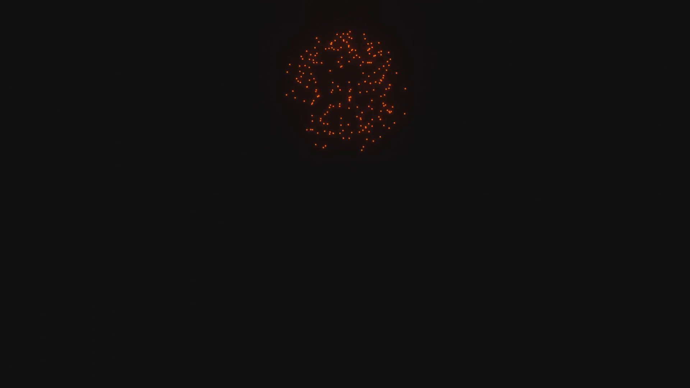
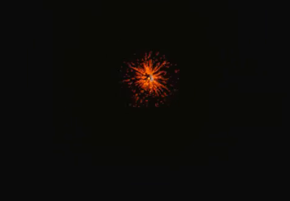
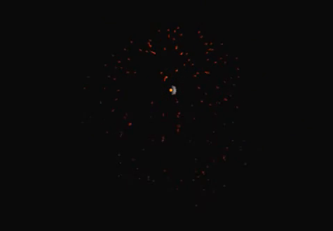
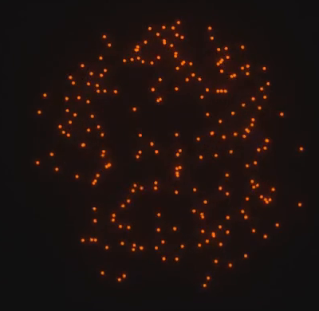
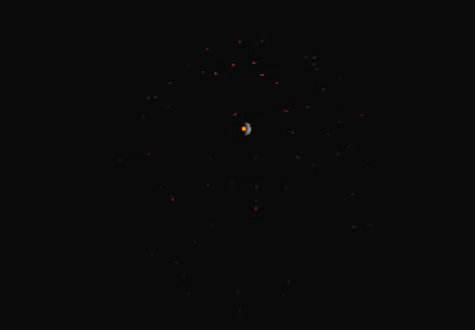

# 单次橙色烟花爆发

用代码创建一次可重播的橙色烟花爆发：许多细小发光火花从一个紧凑起点向四周展开，形成有空间厚度的近球形壳层，运动中轻微向下弯曲，随后逐渐变稀、变暗并完全熄灭。成片只呈现这一次爆发，背景接近黑色。

图 1：成片参考。完整火花团位于画面上半部，周围保留空白，火花仍能分别辨认。

## 起始条件

- 使用 Blender 5.1.2，从空场景或默认启动场景开始。`input/` 为空，无需外部模型、纹理或插件。
- 采用 EEVEE GPU 渲染。柔和光晕可以由合成器或其他等价方式实现，不限定旧版 Bloom 选项、材质节点组合或色彩管理预设。
- 世界 `+Z` 为上方。整体尺度和爆发位置自行决定，但爆发起点与相机在动画中保持固定。
- 允许粒子系统、几何节点、独立对象动画或其他等价的时间求值方式；每个可见火花应具有真实的空间位置与随时间变化的轨迹。

## 1. 单次爆发与时间范围

设置动画范围为第 1 至 80 帧，帧率为 24 fps。第 1 帧是爆发起点；第 5 帧应已出现紧凑的火花团。新的火花只在第 1 至 15 帧产生，之后不再继续补充，也不出现第二次爆发。

所有火花都从同一个紧凑、固定的空间区域发出，不能形成沿路径移动的发射源、持续喷泉或多处同时爆炸。无需复制特定的火花总数，密度应足以读出清晰的烟花壳层。

图 2：较早的展开状态，供观察集中起点和向外发散的趋势。以下预览裁图采用相同裁切范围。

## 2. 空间扩散与轻微下坠

第 20 至 40 帧，火花连续向外飞散。跟踪在这两个时刻都存活的火花，其到固定爆发起点的距离中位数在第 40 帧至少达到第 20 帧的 1.4 倍。不能用一张图片、面向相机的平面圆环或整体缩放的静态点云代替各火花的运动。

中期应形成近球形、有前后层次的离散壳层，内部能透过间隙看到背景。从相互垂直的观察方向仍应具有空间分布，不能只在成片角度看似圆形。各火花的轨迹连续，不出现无缘由的瞬移或长期悬停。

火花向外运动的同时，轨迹应轻微向 `-Z` 弯曲，显示重力式下坠。向上飞的火花逐渐减小上升速度，横向飞的火花稍向下偏转；整体仍保持向外展开的烟花形态，不能完全沿直线匀速扩张，也不能迅速坠成竖直的一柱。

图 3：中期空间扩散参考。中心灰白小点属于预览中的辅助发射对象；交付成片应隐藏这种实体。

## 3. 火花表面与柔和光晕

火花以饱和的橙色至红橙色自发光，在暗背景中清晰可见。它们应具有发光的细小亮核，而不是依靠外部灯光照亮的灰色球体。不同火花可有轻微亮度差异，但整次爆发保持统一的暖橙色印象。

每个火花周围具有柔和、向外衰减的光晕。中期主体应由许多分开的微小亮点组成，亮点之间仍有暗处；避免光晕连成不透明光团、大片纯白过曝斑块，或把火花做成占据大面积的实体球。允许短小的运动延展，不要求长尾、光线条或额外烟雾。

图 4：成片局部。暖色亮核、柔和光晕和亮点之间的暗隙应同时存在。

## 4. 逐渐稀疏和熄灭

第 15 帧后，火花应逐渐减少，不同火花在不同时刻消失。第 50 帧仍能辨认残余火花；第 50 至 70 帧，仍存活的火花自身逐渐降低发光亮度，直至熄灭。

比较第 55、60、65 帧，应看出残余火花持续变暗，不能只靠删掉火花或缩小整个火花团造成总亮度下降。消隐不应发生突然的整团闪灭，也不应重新变亮。第 70 至 80 帧不再出现可见火花或残留光晕。

图 5：后期预览中的残余火花。该图用于观察减少和减暗的趋势，最终应达到完全熄灭；中心辅助对象不属于最终成片。

## 5. 构图与场景

使用固定相机和 16:9 画幅。第 39 帧为默认展示帧：完整火花团位于画面上半部，高度约占画面高度的 20% 至 40%，四周留出空白。第 15 至 65 帧的可见火花均不能被画面边缘截断，动画中不能用移动相机追赶火花。

背景为近黑色，具有足够反差衬托火花。成片不得出现发射球、实例源球、地面或其他辅助几何；不需要夜景、景观、星空或多色烟花组合。

## 6. 交付与重播

提交 `submission.blend` 和 `build.py`。脚本开头写明运行方式；它应能在 Blender 5.1.2 中从起始场景生成并保存完整资产。文件保存于第 39 帧，保留固定相机、上述时间范围、材质和完成光晕的渲染设置。

在 `.blend` 内保留简短说明，指出如何从第 1 帧重播，以及实现依赖的缓存或时间求值方式。必要资源与缓存应打包或随交付提供相对路径，不依赖本机绝对路径、联网下载或未提供的外部文件。

重新打开文件后，从第 1 帧顺序播放到第 80 帧，再回到第 1 帧重播，应得到相同的运动和亮度变化。随机跳转到第 20、40、60 帧也应得到与顺序播放相同的状态；无需先执行缺失的手工烘焙步骤。

图片均为实际参考画面的裁切。24 fps、第 1 至 80 帧的交付范围、1.4 倍扩散下限和构图比例区间是本任务的公开约定。

## 渲染效果交付

在原有交付文件之外，另提交 `B28_单次橙色烟花爆发_动态.mp4`。视频采用 MP4 格式，按本题规定的完整时间范围和帧率，从实际交付工程渲染动画，清楚展示动作与效果变化。使用本题规定的渲染环境；若原题没有指定展示相机，可设置能完整观察主体的相机。该文件应与 `submission.blend` 中的结果一致，不以参考图、视口截图或外部素材代替实际渲染。
