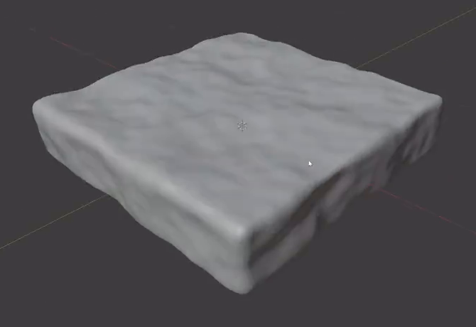
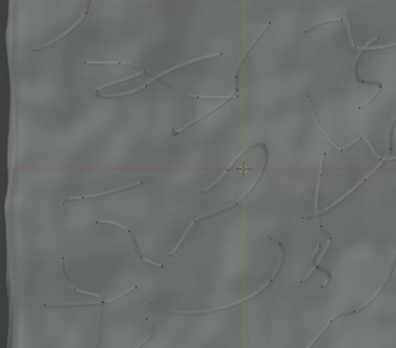
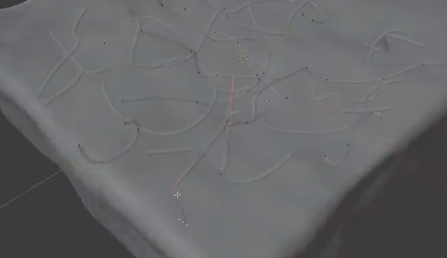

# 柔软水凝胶表面

制作一块静态水凝胶表面模型：主体是低矮、近方形的圆角厚板，顶面与侧壁有连续的低幅不规则起伏；多段细小、圆截面的弯曲线纹分散在顶面，并与起伏表面贴近。整体保持宽扁、柔和的形态。

## 输入与交付

- 使用 Blender 5.1.2，从空场景开始。没有外部输入素材，`input/` 为空。
- 交付 `submission.blend` 和能从空场景重建结果的 `build.py`。脚本须能在其他目录运行；所需依赖随交付提供或打包到工程内。
- 灰模即可，以便观察真实轮廓、起伏与线纹。若需要渲染，使用 Cycles GPU。
- 这是静态建模任务。尺寸单位、世界朝向、对象名称及具体建模方法自由；参考图中的网格、选择高亮和控制点只用于观察形态。

## 1. 低矮的闭合厚板

主体的俯视轮廓近方形，两个平面方向的边长之比不超过 1.3；厚度不超过较短平面边长的四分之一，但侧面仍有清楚可辨的厚度。主体具有连续的顶面、底面和四周侧壁，形成完整实体，不能只有一张无厚度平面。

## 2. 圆角与柔和起伏

四个外角以及顶面到侧壁、侧壁到底面的边缘均呈连续圆角。圆角应保留近方形厚板的轮廓，不把主体变成枕状球体，也不留下刀锋般的直角。

顶面有多处宽缓、非周期排列的波峰与浅凹。起伏必须体现在实际几何上，在低角度观察或检查截面时依然存在；起伏的高度变化小于主体名义厚度。侧壁也有柔和起伏，并与顶面和圆角自然衔接。整个形体保持连续，不出现尖刺、翻折、大块折面、穿洞或重叠闪烁。

## 3. 独立的圆截面线纹

顶面设置至少三条彼此独立的开口曲线线纹。线纹有弧线、转折方向和长度的变化，整体弯曲平顺，每一条都保留可辨识的起点和终点。线纹具有真实的细圆截面和封闭端部，沿路径的粗细基本稳定；近景下能够看出圆润体积。

线纹整体比厚板边长细得多，呈细线状，不能粗到成为覆盖顶面的管道束。线纹与主体是可分别选择和隐藏的内容。

## 4. 分散布局与表面贴近

线纹在俯视投影中分散到主体中央及多个边缘附近，保留明显的空白区域。长度、方向和间距应有变化，不形成整齐平行的阵列，也不集中成一团。

多数线纹应位于起伏顶面附近。以线纹总长度计，超过一半的长度须贴近表面：线纹外壁与顶面的间隙不大于其局部直径，或局部浅嵌入表面。每条线纹至少有一部分在正常近景下可见；允许短段被波峰自然遮挡，但不要让整条线纹深埋在主体内，也不要让全部线纹悬浮在统一水平面上。

## 5. 可继续编辑与重建

保留线纹各自可编辑的中心路径。修改其中一条的局部路径时，其圆截面应随路径更新，其他线纹和厚板形状保持不变；调整某条线纹的截面粗细，也应实际改变其可见体积。允许一组对象包含多条独立路径，也允许分开组织。

厚板和线纹可以独立隐藏，分别检查厚板起伏与线纹结构。允许使用网格、曲线、修改器或其他等价方法实现，不要求复现某种修改器栈。`build.py` 重建后应得到与交付工程一致的厚板形态、线纹布局和可编辑结构。

## 渲染效果交付

在原有交付文件之外，另提交 `B29_柔软水凝胶表面.png`。图片采用 PNG 格式，从实际交付工程渲染，清楚展示主要成品及其形体或材质效果。使用本题规定的渲染环境；若原题没有指定展示相机，可设置能完整观察主体的相机。该文件应与 `submission.blend` 中的结果一致，不以参考图、视口截图或外部素材代替实际渲染。
