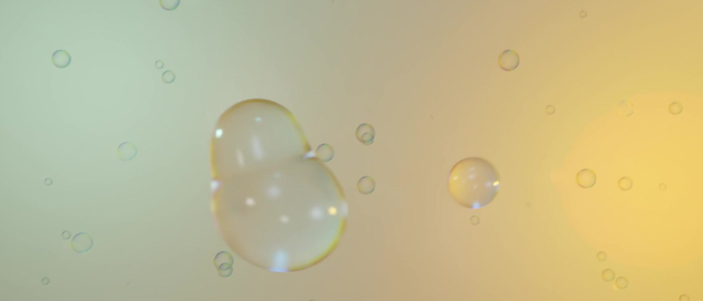
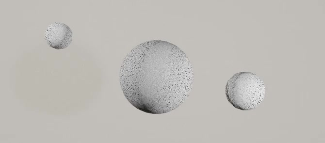
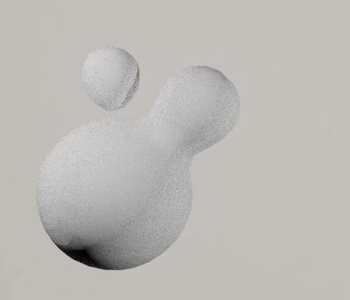
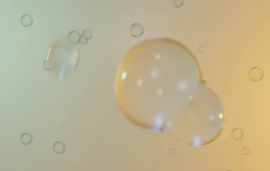

# Q 弹水滴循环动画

用代码创建一段透明水滴在空中追逐、接触、融合和分离的循环动画。一颗较大的主水滴与两颗小水滴轮流靠近，接触时挤压，分离时拉伸，随后弹回圆润形态；柔和的双色背景和缓慢漂浮的小水滴衬托出透明质感。

图 1：透明主体、圆滑融合轮廓和远近小滴的整体外观参考。

## 起始条件

- 目标环境为 Blender 5.1.2，从空场景开始。`input/` 为空，不需要外部模型、贴图或插件。
- 使用 Cycles，并配置 GPU 渲染。提供固定的展示相机，主体运动应发生在场景中。
- 动画周期为 180 帧，保存的播放范围为第 1 至 180 帧，30 fps；第 181 帧用于与第 1 帧对照。令 `D` 为第 1 帧分离状态下主水滴的最大直径，整体尺度自行决定。
- 可以采用融球、可变形网格或其他等效方法；保留能生成所述连续外形和动画的可编辑场景。

## 1. 悬浮水滴组与连续表面

在分离状态中能辨认三颗主体水滴：一颗最大，两颗明显较小。三颗主体均应具有完整的三维体积，基础轮廓接近球形或轻微椭球，表面圆润。小滴的具体比例可自行调整，但应能与更细小的背景水滴区分。

图 2：灰模画面用于观察一大两小的比例关系，成品应采用图 1 的透明材质。

接触区域形成圆滑的连续液桥，并能发展成带多个鼓包的共同外轮廓。过渡处不应出现硬接缝、尖刺、孔洞或两层相交表面。液桥拉开后，分出的水滴应重新收成圆润的封闭体，不留下平切断口。允许连接关系随时间改变。

## 2. 追碰与融合分离

主水滴在画面横向和纵向都有可见位移，轨迹包含弧线、转向和快慢变化，呈轻盈漂浮感。两颗小滴具有各自的相对运动，不能始终作为固定组合跟随主滴。

每颗小滴在一个循环内至少完成一次与主滴的“分开、接近、形成液桥、融合、再次分离”。主要接触安排在主滴减速或转向附近；每段接触与分离都应持续足够时间让正常速度播放时可以看清。融合过程中可形成一个整体，但随后应能重新辨认分开的三颗主体。

图 3：一颗小滴与主滴形成连接，另一颗仍处于分离状态。该图展示接触轮廓，不限定接触方向。

相互接触发生在悬浮状态。相机与背景色域保持稳定，三颗主体不突然跳位、不闪现或消失，也不因彼此穿插留下可见的内部交叉表面。

## 3. 挤压、拉伸与回弹

每颗小滴参与的接触事件都应能看到挤压与回弹：靠近或接触时，至少一个参与水滴沿接触方向变短并向侧面鼓起；分离时，沿离开方向拉长，随后恢复近似球形。主水滴也应参与至少一次可见的挤压或回弹，体现双方受到接触影响。

形变应与相应的接触和离开同步，长轴大致顺着当时的运动或连接方向。快压、拉开、恢复之间要连续，不能只用整体等比缩放代替形变，也不能在形变时突然大幅增加或失去视觉体积。

图 4：实际动画中的非球形状态。左侧小滴已经拉开，右侧主体仍有融合形成的双鼓包轮廓。

## 4. 透明材质与空间层次

三颗主体呈清澈的水或玻璃质感：内部能透见环境色，背景在曲面内有可辨的折射变化，边缘和融合区域仍清楚。材质以近乎无色为主，可以带柔和环境色；避免不透明塑料感或仅靠淡化轮廓形成的空心圆圈。

曲面具有平滑、明亮但不过曝的高光，反射应随形变和视角关系自然变化，不能像固定贴在画面上的白点。主滴和两颗小滴使用一致的透明质感，融合处不应突然变成黑色块或失去材质。

采用类似参考图的浅冷绿至暖黄色的柔和背景。分布大小和远近有差别的细小背景水滴，使主体前后具有空间层次；背景小滴在第 1 帧就存在，并在整段动画中缓慢、非整齐地漂移。背景水滴不能与三颗主体同等抢眼，也不能长时间遮住接触区域。

固定相机应完整容纳主体的运动范围，保持主水滴清晰、融合与分离可读。背景可以适度虚化，但不能把主体或关键液桥模糊到难以辨认。

## 5. 循环与回放

第 1 帧和周期外的对照帧第 181 帧均为三颗主体相互分离、轮廓接近球形的状态。两帧逐颗比较，中心位置差不超过 `0.02D`，各向外形尺寸差不超过该水滴第 1 帧相应尺寸的 5%。这里比较的是应用全部动画与形变后的实际外形和位置。

从第 1 帧播放到第 180 帧并返回第 1 帧时，180 至下一轮 1 应相当于正常前进一帧，主运动、形变和背景漂移自然衔接，无明显跳位、骤变或停顿。循环接缝附近不安排融合或断开事件。逐帧拖动、从头播放和重复播放都应得到一致的结果。

## 6. 交付内容

提交 `submission.blend` 与 `build.py`。`build.py` 应能在 Blender 5.1.2 的空场景中生成并保存完整场景，运行方式写在脚本开头。文件保留可编辑的几何、材质和动画，并以第 1 帧、指定相机及正确播放范围保存。

在 `.blend` 内附简短说明，标出三颗主体、两颗小滴各自的接触与分离帧段，以及从第 1 帧重放的方法。所有必要资源应打包或由代码生成，依赖使用相对路径；如使用缓存，应随交付提供或由脚本确定性重建，不需要联网或读取制作机器上的绝对路径。

参考图均为实际来源画面的裁切。30 fps、事件最低数量、端点分离状态及数值容差是本任务的公开交付约定，具体轨迹与接触帧段可自行设计。

## 渲染效果交付

在原有交付文件之外，另提交 `B30_Q 弹水滴循环动画_动态.mp4`。视频采用 MP4 格式，按本题规定的完整时间范围和帧率，从实际交付工程渲染动画，清楚展示动作与效果变化。使用本题规定的渲染环境；若原题没有指定展示相机，可设置能完整观察主体的相机。该文件应与 `submission.blend` 中的结果一致，不以参考图、视口截图或外部素材代替实际渲染。
