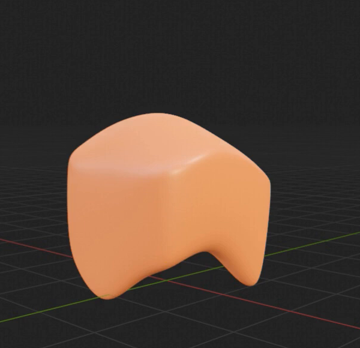
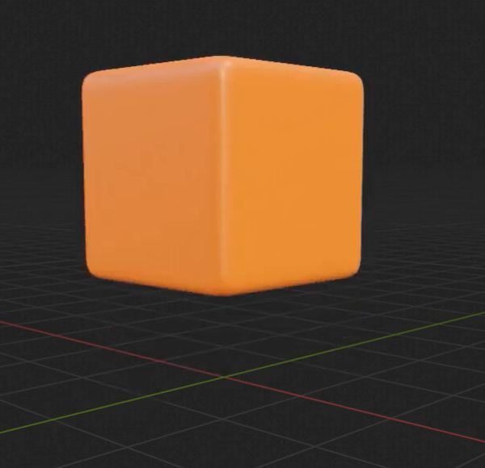
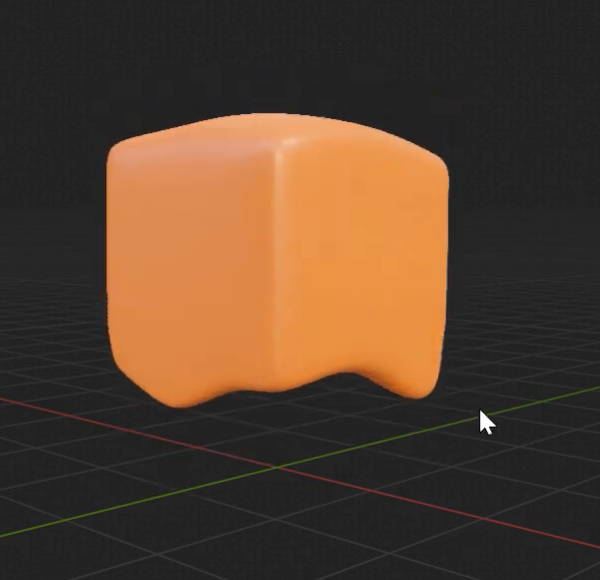

# 橙色方块融化动画

用代码创建一个可编辑的融化资产：悬空的橙色方块逐渐失去方正轮廓，顶部塌软，下缘形成圆润的垂坠，最终成为浅橙色的柔软团块。形体、边缘软化和颜色变化应在播放时共同发生，并可通过保留的控制恢复到方块状态。

图 1：融化终态参考。观察顶部的柔软隆起、连为一体的垂坠，以及垂坠之间向上收起的下缘。

## 起始条件

- 使用 Blender 5.1.2，从空场景或默认场景开始。`input/` 为空，几何和材质均自行创建，无需第三方插件或外部素材。
- 使用 `+Z` 作为竖直方向，整体尺度自行选择。令 `D` 为起始方块的边长；主体下方留出容纳垂坠的空间。
- 设置时间范围为第 1 至 250 帧、24 fps。第 1 至 100 帧完成融化，第 100 至 250 帧保持终态。
- 使用 Cycles GPU 设置展示渲染。相机和灯光应能看清完整主体、顶部与下缘，保持同一观察条件以比较各阶段。

## 1. 清晰的方块起点

第 1 帧呈现完整方块：三个主轴方向尺寸接近，最大与最小尺寸之比不超过 1.1；主要表面平坦，直边和角部关系清楚，可以带小圆角。它应具有实体体积，起点不能已经出现明显塌陷或垂坠。

图 2：起始状态保持方块的大面和直边，小圆角不会改变其方正身份。

## 2. 顶部塌软与下缘垂坠

第 100 帧的主体仍为一个连贯的三维实体，顶部比起点降低，原先平直的顶缘转为有起伏的柔软隆起，顶部与侧面连续过渡。主体呈松软、饱满的块状，不应只是把方块整体压扁。

下缘形成至少两个可分辨的圆润垂坠，长度或体量有所不同；垂坠从宽阔的根部向末端收拢，与主体连成一体，相邻垂坠之间有明显向上收起的弧形下缘。具体数量和方位可自行安排，只需在适当的斜前视图和侧视图中能够辨认这种结构。

全片保留完整表面，终态曲面和垂坠应平滑。不能有破洞、分离的碎片、细针状尖刺、显著面片折线或穿插造成的裂缝。圆润的垂坠末端可参考图 1。

## 3. 连续的融化过程

第 1 至 100 帧需要发生真实的局部几何变化：顶部逐渐下沉，下缘逐渐拉长，边缘随之软化。第 25、50、75 帧应能看出不同程度的中间形态；中间变化保持连贯，不能靠替换可见物体、透明度交叉淡入或只做整体变换来得到两个端点。

图 3：一个中间状态。顶部和下缘已开始弯曲，同时仍保留较多方块特征。

融化应平顺地开始和结束，中段具有清楚的变化，避免突然跳变。主体的整体放置位置和朝向保持稳定，局部形变造成的轮廓或重心变化是正常的。第 100 至 250 帧保持相同的几何形态和外观；回到第 1 帧即可从起点重新播放。

## 4. 随融化变浅的橙色材质

主体使用覆盖整个表面的不透明橙色材质，具有柔和高光，能够读出曲面体积。起点为较饱和的橙色，终态为同一暖橙色系中更浅、更柔和的颜色，参照图 1 和图 2 的关系。

颜色在第 1 至 100 帧之间连续变化，第 25、50、75 帧应处于相应的过渡阶段，之后保持终态颜色。颜色变化来自主体材质本身；固定灯光、世界和色彩管理后仍应可见。具体色值和材质节点组织自行决定。

## 5. 可逆且可继续编辑的形态控制

保留一个容易识别的融化程度控制，使用 `0` 至 `1` 的范围：`0` 对应方块，`1` 对应完整融化。暂停动画后，按文件内说明操作该控制，在 `0.25`、`0.5`、`0.75` 时应得到不同的连续中间形态；再从 `1` 返回 `0`，应恢复原来的方块。

可以使用形态键或其他等效的连续网格变形方式。控制改变后，实际可见几何和相应的圆润程度直接更新，无需重新运行构建脚本。允许暂停时间驱动以测试手动控制，但应有清楚的恢复方法，恢复后时间轴继续正常工作。

在 `.blend` 内保留简短说明，指出主体、融化控制、如何进入手动调整、如何恢复动画以及如何回到起点。控制的往返操作应可重复，恢复状态的表面位置差异不超过 `0.005D`。

## 6. 交付与重放

提交 `submission.blend` 和 `build.py`。脚本应能在 Blender 5.1.2 的空场景中创建并保存完整资产，运行方式写在脚本开头。文件保存于第 1 帧，打开后能够播放第 1 至 250 帧；直接跳转到第 1、50、100、250 帧时，也应得到与顺序播放一致的状态。

几何、材质和动画数据应随文件保存或由脚本生成。必要依赖使用随附资源和相对路径，不能依赖本机绝对路径、缺失缓存或联网下载。重建后应保留上述形态控制、颜色变化和播放行为。

图片为原始视频的实际画面裁切。尺寸比例、控制采样值和恢复容差是本任务的公开约定。

## 渲染效果交付

在原有交付文件之外，另提交 `B31_橙色方块融化动画_动态.mp4`。视频采用 MP4 格式，按本题规定的完整时间范围和帧率，从实际交付工程渲染动画，清楚展示动作与效果变化。使用本题规定的渲染环境；若原题没有指定展示相机，可设置能完整观察主体的相机。该文件应与 `submission.blend` 中的结果一致，不以参考图、视口截图或外部素材代替实际渲染。
