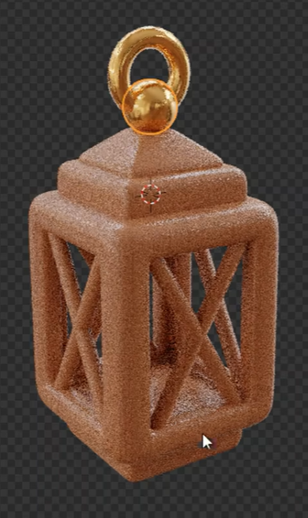
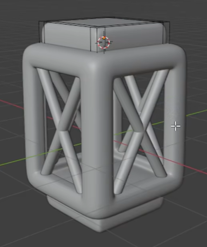

# 圆角镂空手提灯与程序化材质

用代码制作一盏可编辑的装饰手提灯：竖向方形灯架具有四面通透开口，每面都有 X 形撑杆，上下配有层次清楚的盖与底座，顶部连接球承托竖直圆环提手。灯架采用有细微深浅变化的棕色程序化材质，连接球和提环呈金色金属质感。

## 输入与交付

- 使用 Blender 5.1.2，从空场景开始；没有外部输入素材，`input/` 为空。
- 交付 `submission.blend` 和可从空场景重建结果的 `build.py`。所需依赖应随交付提供或打包进文件，不能依赖本机绝对路径、临时下载内容或未提供的插件。
- 整体尺寸、对象名称、坐标朝向和建模方法自由。灯腔保持空置，四面开口通透。
- 提供能检查完整轮廓与材质的视图；如需渲染，使用 Cycles GPU。参考图中的网格、选择轮廓、光标、背景和预览噪点不属于模型外观。

## 1. 有厚度的圆角灯框

主体是高度大于横向宽度的方形灯框，四个立面均有大面积的贯通开口，前后和左右开口可相互看通。四角立柱与上下框沿连成完整框体，具有可见的实体厚度，不能用贴图中的黑色区域代替开口。

灯框、撑杆、盖、底座和提手的轮廓都应圆润，连接处没有明显破洞、尖刺、重叠表面闪烁或异常黑斑。圆滑处理后仍需保留清楚的框沿、盖层和圆环孔洞，不能融成难以辨认的团块。

## 2. 四面 X 形撑杆

每个立面都有两条细长撑杆交叉成一个清楚的 X。撑杆两端连接到相应面的框沿或内侧角部，交叉位置接近开口中央；四面结构相互协调，撑杆不能悬在灯腔中或穿出外框形成长刺。

撑杆周围仍保留足够的镂空区域。交叉处可以融合或合理搭接，允许任何等效的建模实现。

## 3. 分层灯盖与底座

灯框上方有居中的扁平台阶，台阶上方进一步收窄，形成带斜面的低矮盖顶。台阶与斜盖从侧面应有明确的高低层次，并与灯框稳固衔接。

底部有居中的低矮底座，与上方灯盖形成呼应。底座、框沿与顶盖应保持层次可辨，不能互相错位或悬空。

## 4. 圆环提手与连接球

顶盖中央有近球形连接件，连接件上方是竖直的圆环提手。圆环截面饱满，内孔真实贯通，外轮廓连续平顺。连接球与盖顶、圆环下部合理接触，使提手看起来能够连接整个灯体。

## 5. 棕色纹理与金属反射

灯框、灯盖和底座使用协调的暖棕至深棕色材质，表面有细微、非均匀且带拉长趋势的深浅纹理。撑杆同属棕色体系，可以比灯框的纹理更均匀。纹理不能依靠预览噪点形成，也不能把框体变成粗糙结块的表面。

棕色纹理由实际参与材质输出的程序化计算产生，保留可以编辑的颜色与纹理疏密参数。将纹理疏密调为原来的约两倍时，应能看见纹理尺度变化；改变一端棕色时，应能看见对应的颜色变化，几何结构保持不变。无需使用指定节点名称、数量或固定连接配方。

连接球和提环都使用独立的金色金属材质，在有明暗变化的环境中能看到随视角变化的反射与较集中的高光，和棕色灯体有明确区别。金属表现应来自实际材质，不能仅靠黄色底色或自发光模拟。

## 6. 局部编辑与重建

灯框、四面撑杆、盖与底座、连接球与提环应能分别定位并编辑。可以采用独立对象、实例或明确的几何分组；局部修改其中一类结构时，不应被迫重新制作其余部分。

`build.py` 应在空场景中重建相同的主要形体、材质分配和有效材质参数，并生成可再次打开检查的 `submission.blend`。重新打开文件后，程序化纹理与金属材质仍然可用。

## 渲染效果交付

在原有交付文件之外，另提交 `B32_圆角镂空手提灯与程序化材质.png`。图片采用 PNG 格式，从实际交付工程渲染，清楚展示主要成品及其形体或材质效果。使用本题规定的渲染环境；若原题没有指定展示相机，可设置能完整观察主体的相机。该文件应与 `submission.blend` 中的结果一致，不以参考图、视口截图或外部素材代替实际渲染。
