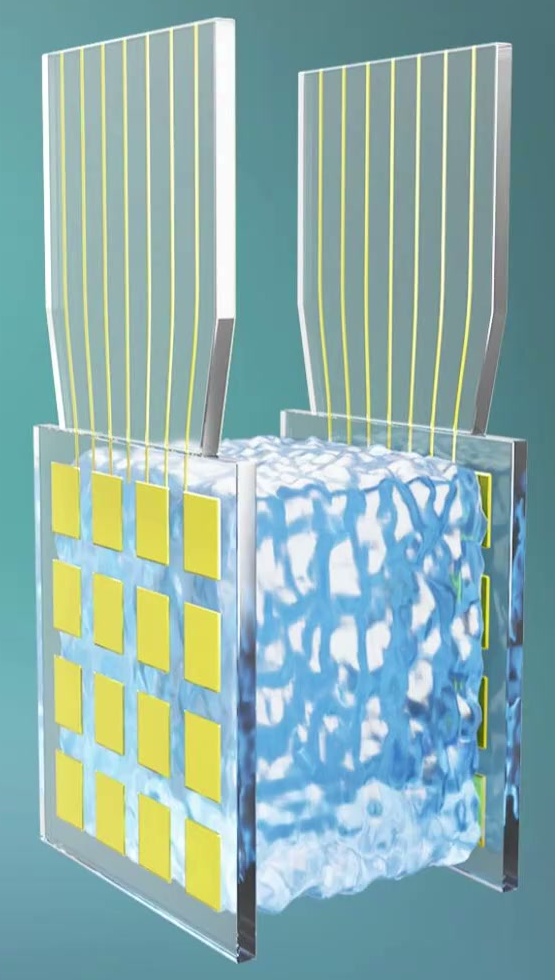
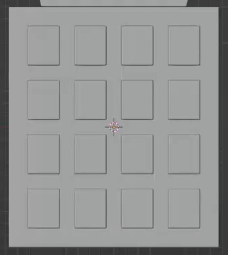
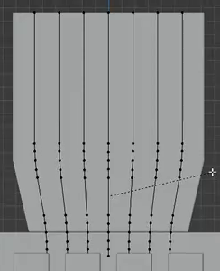
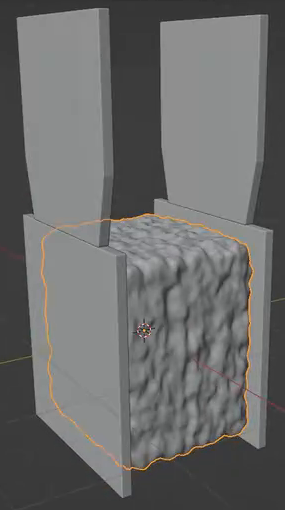

# 多层电极结构

用代码制作一个可编辑的静态多层电极模型：两侧薄电极板夹住连续粗糙芯层，每侧板面都有规则的凸起矩形单元，顶部各延伸一片带平行细导线的极耳。整体应能从不同方向辨认出外板、芯层、极耳和细导线之间的关系。

## 输入与交付

- 使用 Blender 5.1.2，从空场景开始；没有外部输入素材，`input/` 为空。
- 交付 `submission.blend` 和可从空场景重建完整结果的 `build.py`。所有依赖须随交付提供或内嵌，脚本不得依赖原机器上的绝对路径或网络下载。
- 灰模即可；整体参考中的配色、透明效果和背景不作要求。模型尺寸、世界朝向及实现方式自由，图片中的选择高亮、编辑顶点和网格线不属于模型。
- 如需渲染，使用 Cycles GPU。相机与照明只需使结构可辨认，无须复刻参考构图。

## 1. 层叠主体

主体为竖直矩形夹层，正面高度略大于宽度。两块平直薄板位于芯层厚度方向的两侧，彼此平行，各自厚度明显小于中央夹层厚度。它们的外轮廓尺寸相同，顶部、底部和左右边界对应；对应边的错位不得超过板宽的 5%。

中央芯层位于两板之间，呈连续体块，主体高度和宽度与板面基本对应。侧面和顶部应能看见芯层，两块外板仍须清楚可分。芯层不能被替换成分散小球，也不能大量穿过电极板；粗糙起伏可使接触边界略有变化。

## 2. 双极耳

每侧电极板上方各有一片竖直薄极耳，形成沿厚度方向分开的两片极耳。极耳上段为较宽的直边片状轮廓，下段向内收窄后衔接板体，收窄处应有平顺过渡。两片极耳的轮廓和高度相对应，顶端高度差不得超过板宽的 5%。

每片极耳的下端都应与对应电极板实际相接，不能悬浮或接到另一侧板上；极耳之间保留可辨认的间隔。

## 3. 矩形单元与边框

两侧电极板朝外的大面各有 **4 行、4 列，共 16 个**矩形单元。单元大小一致，横向与纵向分别等距排列，四周保留连续边框。沿同一方向比较，单元尺寸和相邻间距相对各自中位数的偏差均不超过 10%；横向间距与纵向间距可以不同。

每个单元都应是略高于板面的实体薄凸片，侧视能看见厚度和与板面的高度差。凸片与板面相接，各凸片之间保留清楚间隔；不能用凹槽、贴图或仅画在平面上的边线代替。

## 4. 极耳细导线

每片极耳朝外的表面至少有 5 根清楚可分的细导线。导线上段沿极耳纵向近似平行、均匀分布，下段随极耳收窄轮廓平顺内收，并一直延伸到对应板体上缘。两侧导线数量一致；上部直线段的相邻间距相对中位数的偏差不超过 10%。

导线须有真实的近圆截面和可辨认厚度，转折处平顺，沿路径连续。各线相互分离，不得交叉粘成一片、出现明显断点，或大段埋入极耳内部。允许用曲线、网格或等效方式实现。

## 5. 粗糙芯层与边缘质量

芯层保持连续的近矩形体积，露出的顶部和侧面布满细密、非规则的圆钝起伏，形成粗糙多孔质感。起伏须体现在实际几何与轮廓中，不能只靠颜色或法线贴图表现；不要求真实贯穿的孔洞。整体不能变成光滑方块、少量巨大的尖峰或彼此散开的颗粒堆。

板体、极耳和凸片的外缘应有窄而平顺的圆角，保持薄片与矩形特征。正常近景中不能出现明显破面、尖刺、重叠面闪烁或破损阴影。粗糙芯层本身的有意起伏不属于表面缺陷。

## 6. 独立编辑与重建

板体和极耳、矩形凸片、细导线、芯层这四类结构应能分别选择、隐藏和编辑；可以使用独立对象、集合、可访问的几何组件或专用参数。修改芯层的粗糙起伏不应意外改变板体和细导线，调整凸片厚度也不应改动芯层。无需保留指定的修改器、节点或建模操作历史。

运行 `build.py` 后应重建同样的四类结构、每侧 4×4 凸片与两侧导线，并得到可继续编辑的 `submission.blend`。

## 渲染效果交付

在原有交付文件之外，另提交 `B33_多层电极结构.png`。图片采用 PNG 格式，从实际交付工程渲染，清楚展示主要成品及其形体或材质效果。使用本题规定的渲染环境；若原题没有指定展示相机，可设置能完整观察主体的相机。该文件应与 `submission.blend` 中的结果一致，不以参考图、视口截图或外部素材代替实际渲染。
