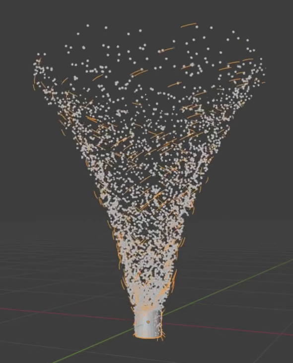
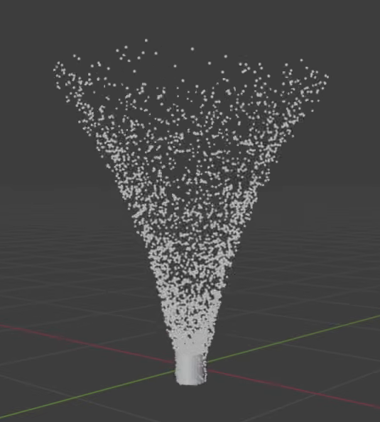
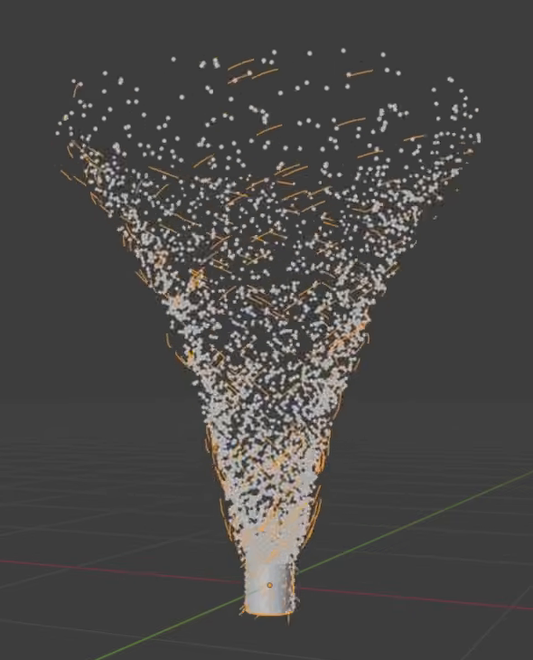

# 双粒子群龙卷风模拟

用代码创建一个由密集细点和稀疏弧线共同组成的龙卷风。两类粒子从同一个紧凑的底部区域出生，受各自的旋涡与向上作用力驱动，逐渐形成下窄上宽的漏斗；修改一组作用力后，只有对应粒子群的运动发生变化。

图 1：细点构成漏斗，较长的弧线穿插其中。图中的橙色是选中显示，不是指定材质颜色。

## 起始条件

- 使用 Blender 5.1.2，从空场景开始。`input/` 为空，无需外部资产或第三方插件。
- 时间轴为第 1 至 500 帧，30 fps。这是从初始状态建立并持续运行的模拟，不要求首尾循环。
- 保留可重新计算的粒子位置、速度及出生状态。可以使用原生模拟系统或等效的数值求解方式；仅播放预存轨迹、摆放静态漏斗或让整组静态粒子绕轴旋转不能替代受力模拟。
- 所有比例以默认状态第 250 帧的点粒子群高度 `H` 为基准。`H` 是粒子高度的第 95 百分位与底部出生区域中心高度之差。轮廓与半径测量可忽略最多 `5%` 的明显离群粒子；每个成熟帧按其自身高度范围划分上、中、下三分之一。典型尺寸指所测元素尺寸的中位数。

## 1. 下窄上宽的空间形态

在第 250、375、500 帧，点粒子形成连续可辨认的竖直漏斗：底端收拢在出生区域，上部张开，中心轴大致竖直。顶部不能封成实体圆盖，漏斗也不能由不透明的实心锥体代替。

从正面和侧面看，上三分之一高度内粒子的平均水平半径至少是下三分之一的 2 倍；最大横向宽度在 `0.4H` 至 `1.2H` 之间。俯视包络近似圆形，两个水平主方向的宽度比在 `0.7` 至 `1.4` 之间。粒子允许有自然不规则分布，但不能变成平盘、等宽直柱、球团或明显漂离底部的云团。

图 2：点粒子独立形成的漏斗，用于观察底部收拢与向上展开。

## 2. 可区分的细点与浅弧线

成熟状态同时保留两类可区分的元素。第一类是大量细小、近似点状的粒子；第二类是较稀疏的短浅弧线。点粒子数量应为弧线数量的 5 至 20 倍，且第 250 帧至少有 20 条可见弧线。单个点的典型直径不超过 `0.01H`，不能呈现为大块颗粒。

弧线是开放、平滑、略有弯曲的细线，不能全是直棒、完整圆环、折线或宽带。其典型长度在 `0.03H` 至 `0.15H` 之间，线宽不超过长度的十分之一；弧线中部偏离两端连线的距离为弦长的 `1%` 至 `12%`。弧线沿漏斗的低、中、高区域分布，整体方向以环绕中心轴为主，不能全部扎成竖直的一束或堆在底部。

提供清楚显示两类粒子的视口状态；若使用相机渲染，采用 Cycles GPU，并使点和弧线真实出现在渲染结果中。背景、灯光、粒子颜色可自行选择，以能辨认上述空间形态为准。

## 3. 建立过程与持续运动

从第 1 帧顺序播放。第 1 帧的活跃粒子数不超过第 250 帧的 `10%`；第 125 帧能看到由底部向上发展的粒子群，第 250 帧已形成完整漏斗。两类粒子在第 1 至 500 帧期间持续出生，出生位置位于同一个固定区域，该区域宽度不超过 `0.1H`。保留有限寿命和粒子更新，不能在形成漏斗后停住。

第 250 至 500 帧，个体粒子持续围绕中心轴运行并向上运动；同一批粒子在连续帧之间改变位置，粒子群的底部仍锚定出生区域。对第 250 至 280 帧始终存活的粒子，两类各至少能跟踪 10 个；每类至少一半的跟踪粒子应有同向、超过 10 度的累计绕轴角位移，以及超过 `0.01H` 的净上升。不能用整组对象平移、突然换一团粒子或周期性整体消失来制造运动。

图 3：与图 1 不同的后续时刻，粒子位置发生变化，整体漏斗与底部位置保留。

## 4. 两组作用力确实驱动模拟

在文件内标明两组的旋涡驱动与向上驱动位置、默认值，以及清除临时缓存后从第 1 帧重算的方法。可直接使用现有作用力参数，不必额外制作控制面板。旋涡作用使粒子产生绕轴运动，向上作用使其升高；这些作用必须参与粒子状态的逐步计算。

使用同一随机种子，每次只改变一个驱动并从第 1 帧顺序重新计算：

- **点粒子的旋涡驱动置零：** 第 250 至 280 帧可跟踪点粒子的累计绕轴角位移中位数，降到不超过默认状态的 `30%`。
- **点粒子的向上驱动置零：** 第 250 帧点粒子高度的第 95 百分位相对出生区域的高度，至少比默认状态降低 `30%`。
- **弧线粒子的旋涡驱动置零：** 按相同方法测得的弧线粒子累计绕轴角位移中位数，降到不超过默认状态的 `30%`。
- **弧线粒子的向上驱动置零：** 第 250 帧弧线中心高度的第 95 百分位相对出生区域的高度，至少比默认状态降低 `30%`。

角位移按各粒子位置相对共同竖直轴的连续展开角计算，取累计位移的绝对值；默认值必须已有第 3 节要求的运动。比较旋涡开关时，使用两次运行中均在第 250 至 280 帧存活的相同出生标识。允许驱动关闭后漏斗形状改变，但两组粒子仍须正常出生，不能通过关闭粒子群的显示或删除粒子伪造效果。恢复默认参数并重算后，应恢复默认形态。

## 5. 两类粒子的作用范围相互独立

第 4 节的四次改动，都只影响对应的粒子群。修改点粒子驱动时，弧线粒子群保持默认运动；修改弧线粒子驱动时，点粒子群保持默认运动。

在相同种子和出生顺序下，比较第 250、280 帧未被修改的粒子群，其存活粒子数保持相同，按出生标识配对的粒子中心位置最大差值不超过 `0.01H`。不能仅把两组对象放入不同集合，却让它们仍然受到对方的作用力。用于调整的辅助物可在展示视图中隐藏，但隐藏后模拟仍应正常运行。

## 6. 交付与重算

提交 `submission.blend` 和 `build.py`。脚本应能在 Blender 5.1.2 的空场景中构建、保存资产，并在脚本开头说明运行方式。所需资源由脚本生成或随文件保存，不依赖网络、第三方插件或作者机器上的绝对路径。

文件内保留简短说明，标出两类粒子、出生区域、作用力参数、默认值、随机种子、清除缓存和顺序重算方法。保存时使用默认参数，并给出能够看清成熟漏斗的视图。允许随附便于预览的缓存，但删除缓存后必须可从初始状态重算，也必须能完成第 4、5 节的改动测试。相同默认值和种子重新计算后，第 250 帧的粒子数应相同，配对中心位置差不超过 `0.01H`。

图片来自参考视频的真实画面裁切。本文的比例、时间采样与功能测试容差是本任务的公开验收约定。

## 渲染效果交付

在原有交付文件之外，另提交 `B34_双粒子群龙卷风模拟_动态.mp4`。视频采用 MP4 格式，按本题规定的完整时间范围和帧率，从实际交付工程渲染动画，清楚展示动作与效果变化。使用本题规定的渲染环境；若原题没有指定展示相机，可设置能完整观察主体的相机。该文件应与 `submission.blend` 中的结果一致，不以参考图、视口截图或外部素材代替实际渲染。
