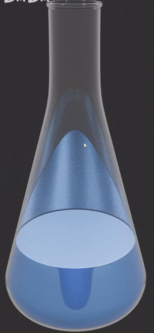
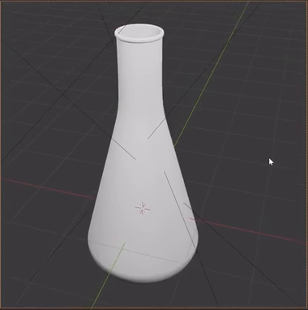
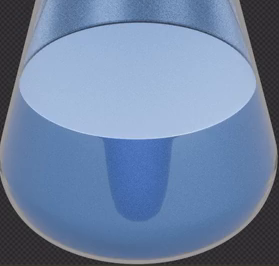

# 透明锥形瓶与蓝色液体产品渲染

制作一只装有蓝色液体的透明玻璃锥形瓶，并完成可用于透明背景合成的方形产品画面。成品应同时读得出玻璃的薄壁、瓶内空腔、水平液面和蓝色液体的光学层次；玻璃边缘清楚，液体颜色鲜明而不过曝。

## 起始条件与输入

- 使用 **Blender 5.1.2**，从空场景开始，以 Python 构建工程；最终渲染使用 **Cycles GPU**。
- `../input/` 为空，没有提供瓶体工程、贴图或其他资产。需要自行建立下述简洁瓶体和液体几何，不依赖未提供的模型。
- 建模、材质与照明方法可自行选择，允许达到相同结果的不同实现。
- 参考图中的棋盘格表示透明背景。界面网格、辅助线、采样噪点与鼠标指针都不是成品内容。液体在空腔中的蓝色反射或折射像不代表那里还有一层真实液体。

## 1. 锥形瓶与瓶内液体

瓶体直立，具有较宽的锥形下部、向上收窄并平顺连接的细长瓶颈，以及略加厚的环形瓶口。底部圆滑收边并具有可放置的底面；外轮廓保持旋转对称的简洁实验器皿形态，不能出现明显折面、破洞或突兀的肩部折线。

瓶口真实敞开，内外壁之间有连续薄层厚度，底部封闭。需要能够从斜上方观察到瓶口内部，并在工程中检查到瓶壁和空腔；不能用实心透明锥体或单层无厚度曲面代替。

瓶内具有可与外瓶分别编辑、分别赋材质的液体体积。液体只占瓶身下部，液面低于瓶肩和瓶颈，保留明显空腔。液体顶部形成连续、基本水平的封闭液面；体积贴合瓶内空间，不穿出瓶壁，不在底部悬浮，也不留下显著的环状空隙。允许液面边缘有轻微弯月面，不要求流体模拟。

## 2. 清透的玻璃外壁

外瓶整体近乎无色，能够透过瓶壁看清内部蓝色液体和未充液的空腔。玻璃应有真实的透射、折射与反射响应：厚边、瓶口和弯曲瓶壁能形成与中央薄壁不同的光学层次，不能只是降低不透明度后的灰色壳体。

外壁反光清晰但克制，玻璃轮廓连续可辨。轻微改变观察方向或照明方向时，高光与折射关系应随之改变；不可把固定亮边、背景或液体外观画在瓶壁贴图上。

## 3. 蓝色液体的光学层次

液体呈明确的浅蓝至中蓝色，与近乎无色的外瓶区分。液体本体保留透射或折射形成的深浅变化，较深处、弯曲边缘和液面附近有可辨层次，不应成为均匀不透光的蓝色固体。

液面与液体侧面均具有柔和的光泽，液面在略俯视镜头中可读为一个连续椭圆。液面可以比液体本体明亮，但亮部仍保留边界和轻微明暗变化。反射与透射的比例应随观察角度变化，在接近掠射角时呈现更强的表面反射；允许不同物理材质实现，不规定着色器类型或折射率数值。

## 4. 柔光产品构图

保存一个有效的活动相机，输出为至少 **1080 × 1080** 的正方形画面。瓶体竖直并大致居中，占画面高度的 **60%–90%**；瓶口、瓶底和两侧均完整入镜并保留留白。使用略俯视角度，使瓶口开口与液面可见，避免强透视使瓶颈歪斜或瓶身畸变。

照明应呈现柔和、连续的反光，让瓶身两侧、瓶口与底部都能从透明背景中分辨出来。主体明暗均衡，蓝色液体与空腔清楚分离；不能因大片死黑、白色过曝或过强反射而遮住关键结构。以实际照明结果为准，不规定灯具数量、类型或固定功率。

默认渲染应清晰，近看瓶口和液面时没有明显颗粒、火花点或破坏透明边缘的降噪涂抹。场景内不添加遮挡瓶体的道具、标签或装饰。

## 5. 可合成的透明背景

默认渲染具有真实 Alpha 透明背景，保存支持 Alpha 的输出设置。把渲染叠加到纯白与深灰底色上时，瓶外背景应被完全替换，玻璃轮廓、蓝色液体和透明过渡仍然有效；不能把棋盘格、灰色背景或白边烘焙进画面。

透明设置不得使整个瓶体消失，也不能切掉玻璃的反射、液面或底部。环境可以参与照明与反射，但不作为最终的不透明背景显示。

## 提交文件

- `submission.blend`：完整、可编辑的瓶体、液体、材质、活动相机与照明，保存上述默认状态及 Cycles GPU 渲染设置；所有必要依赖随工程打包。
- `build.py`：能够在 Blender 5.1.2 的空场景中重建同一默认工程。脚本注明运行方法及输出路径，不依赖网络、个人机器绝对路径或未提供的插件；如有随机过程，应固定种子。

在工程文本中简要注明外瓶与液体的定位方式、活动相机和脚本运行方法。工程能够打开并存在有效三维瓶体与液体，是进入内容验收的前提；单张效果图或空工程不构成有效提交。

## 渲染效果交付

在原有交付文件之外，另提交 `B35_透明锥形瓶与蓝色液体产品渲染.png`。图片采用 PNG 格式，从实际交付工程渲染，清楚展示主要成品及其形体或材质效果。使用本题规定的渲染环境；若原题没有指定展示相机，可设置能完整观察主体的相机。该文件应与 `submission.blend` 中的结果一致，不以参考图、视口截图或外部素材代替实际渲染。
