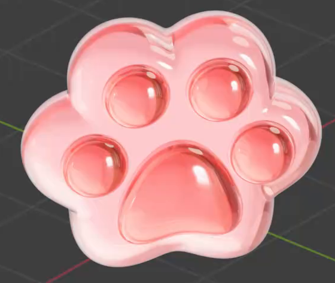
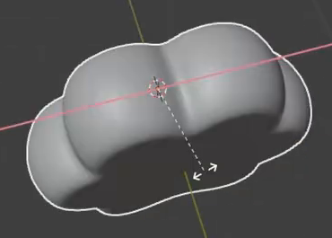
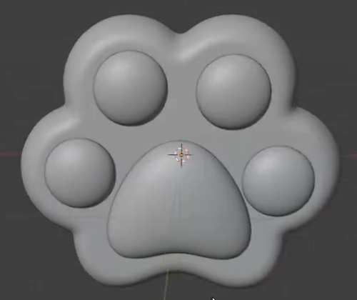

# 玻璃猫爪挂件

制作一枚粉色透光的猫爪造型挂件主体：圆润的爪体上有四枚小趾垫和一枚较大的中央肉垫，整体具有玻璃的折射、反射高光和厚薄色彩层次。

## 起点与交付

从空场景开始，使用 Blender Python 创建资产。目标环境为 Blender 5.1.2，使用 Cycles GPU 渲染。`input/` 为空，形状和外观参考均在本文中。

交付 `submission.blend` 和 `build.py`。脚本应能从空场景重新生成资产、材质以及用于观察玻璃效果的相机和照明。使用 Blender 自带功能；所有外部依赖须打包进 `.blend`，或随交付提供并使用相对路径。保存可继续编辑的三维几何和真实参与渲染的材质。

本任务的挂件主体以参考图为准，不要求吊环、绳索、穿孔或金属配件。参考图中的网格、坐标轴、游标、选中轮廓和反光以外的视图叠加不属于资产。可以选择等效的建模和着色方式，下列要求表示最终结果，不表示制作顺序。

## 1. 花瓣状爪体与圆润厚度

爪体是一个完整的三维底座，正面接近参考图的六瓣轮廓：上方两瓣较高，左右各一瓣向外展开，下方两段圆弧之间有浅凹口。左右布局基本对称，各瓣之间平顺衔接，整体仍应读作猫爪轮廓。

爪体具有清楚可见、相对宽高较薄的实体厚度。正反面由圆润侧壁连接，边缘饱满，没有刀口、贯穿破洞、明显塌陷或尖刺；中性实体视图中也应保持平滑。

## 2. 中央肉垫与四枚趾垫

中央肉垫位于爪体下半部，明显大于单枚趾垫，轮廓上窄下宽，顶部圆钝，底部中间轻微内凹。它是从爪体正面隆起的饱满体积，而非平面图案或凹洞。

四枚趾垫位于中央肉垫上方及两侧，形成两枚较高、两枚较低的弧形分布。它们大小接近，正面呈圆形或轻微椭圆形，侧面是压扁的圆润凸起。各垫之间留有可辨的爪体表面，中央肉垫和四枚趾垫均贴合底座，不悬空、不互相吞没，也不凸出底座轮廓之外。

## 3. 粉色透光玻璃

爪体和肉垫均呈浅粉至较浓粉色，色彩关系接近完整外观图。粉色应来自资产自身的材质；换用中性白光后仍保留粉色，而非完全依赖粉色灯光染色。

实际表面应能透光，并对其后的可见内容产生玻璃式折射。透过较清澈的区域能够辨认背后明暗或图案的变化，曲面附近产生可见的偏移、弯曲或放大。不能只用不透明粉色高光表面，也不能仅靠无折射的透明贴片模拟玻璃。

## 4. 随视角和光照变化的玻璃层次

表面保持光洁，具有随照明位置或观察方向变化的反射高光。正视的清澈区域与掠射角的明亮反射边缘应有区别；反光应跟随曲面，不能是固定贴在表面的白色斑点。

避开明亮反射后，较长透射光程的区域应呈现较浓粉色，较短光程的区域较浅且清澈，形成参考图中肉垫、侧壁和薄部之间的层次。允许体积吸收或产生等效光程着色的实现。应同时保留透光感，不能把全体做成浓重浑浊的实色物体，也无需添加合成光晕。

## 5. 可重建的完整资产

`build.py` 从空场景运行后，应生成与 `submission.blend` 一致的爪体、肉垫布局、粉色玻璃及可观察这些效果的场景。相机应完整展示猫爪，照明应让透光与反射可辨；具体相机、灯光类型及数量自行决定。

交付在移动到另一目录后仍能重建并渲染，不依赖本机绝对路径、临时缓存或未随附的外部资源。重建后的几何和材质须可继续编辑；不要求保留特定修改器、节点布局、对象名称或原始网格数量。

## 渲染效果交付

在原有交付文件之外，另提交 `B36_玻璃猫爪挂件.png`。图片采用 PNG 格式，从实际交付工程渲染，清楚展示主要成品及其形体或材质效果。使用本题规定的渲染环境；若原题没有指定展示相机，可设置能完整观察主体的相机。该文件应与 `submission.blend` 中的结果一致，不以参考图、视口截图或外部素材代替实际渲染。
