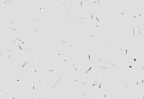
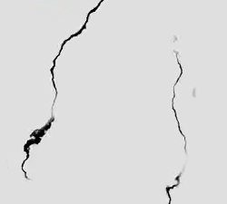

# 程序化划痕材质

制作一种可编辑的程序化划痕材质，并将其展示在光滑球体上：宝蓝色塑料底面带有柔和光泽，表面散布深色、细长、略有弯曲与破碎感的划痕。默认结果应是轻度磨损，干净的蓝色底面仍占绝大部分。

## 起始条件与输入

- 目标环境为 **Blender 5.1.2**，从空场景开始，使用 Python 构建工程。
- `../input/` 为空，没有需要导入的模型、贴图或其他输入资产。参考图仅用于观察结果。
- 自行创建光滑球体承载材质，尺寸与网格组织可自定。球体用于观察材质，无需复制特定拓扑、对象名称或灯光数量。
- 使用 **Cycles GPU** 设置展示场景，准备能看清整球与表面局部的相机和照明。灯光与背景可自定，高光应保留足够的蓝色与划痕细节。
- 第一张图是最终颜色效果；后面的黑白图只说明划痕分布或不规则度，白色不是默认成品的底色。无需逐条复制参考图的划痕位置。

## 1. 宝蓝色底面与深色划痕

默认材质以饱和的宝蓝色为主体。划痕呈近黑色或很深的蓝黑色，在非高光区域与蓝色底面形成清楚但克制的明暗差异；不能成为彩色花纹、白色亮纹或大片灰色污渍。

划痕必须实际改变表面的颜色：在均匀照明、弱反射条件下仍能辨认。它们不能只靠某个角度的反光、物体阴影或凹槽边缘表现。

## 2. 光泽塑料的表面响应

底面具有不透明、非金属的塑料质感。适当侧光下可见柔和且有宽度的高光，离开高光后保留蓝色主体；不能呈现完全漫反射的粉笔感、清晰镜面、金属镀层或自发光表面。

最终表面保持平滑，划痕主要是颜色变化，不能被深沟槽、凸起线条或破裂表面取代。可以使用细微的辅助表面变化，但它不能主导划痕效果，也不能破坏连续塑料高光。

## 3. 细长且略有不规则的划痕

近看能够辨认多条相互分离的细长痕迹，其长度明显大于宽度。划痕以弯曲的短线、细弧和不完整环状片段为主，长短与方向有变化；整体不能变成直尺刻出的平行线、粗裂缝、整片网格或只有圆点的噪声。

在保持细线可辨的前提下，部分划痕有轻微曲折、局部宽窄变化、细碎中断或逐渐变细的末端。默认程度应克制，不能将每条线处理成粗重锯齿或大块碎斑。

## 4. 稀疏分布与连续覆盖

默认划痕的实际着色面积不超过球体表面积的 **10%**，蓝色底面保持连通并占主导；允许少量微小斑点，但不能靠把划痕全部隐藏来达到稀疏要求。不同区域都有可见划痕，局部密度可以变化，不应出现明确的周期网格、成排复制或大片重复图案。

材质围绕球体连续分布。从正面、背面和顶部观察时，不能出现接缝、极点挤压、大片空白或无缘由的纹理尺度突变。平移、旋转球体后，图案应固定在物体表面并随物体移动。

## 5. 可编辑的程序化划痕

划痕由工程中可重新求值的材质系统生成，不依赖图片纹理、烘焙贴图、预先渲染的结果或逐条手工绘制。允许采用能够达到目标的等效材质实现。

保留并清楚标识一个控制划痕路径不规则程度的参数。它应能在较平顺的细线与更曲折、破碎的细线之间产生可见变化；这项控制改变的是划痕本身，不能只改变整体颜色、塑料光泽或随机替换整张图案。两种有效状态都应保留细线特征与蓝色基底，默认保存为轻度不规则的最终效果。

工程内的简短文本说明应标出该控制的位置、默认值以及较平顺和更不规则的有效设置。调整后能够立即重新求值，恢复默认值后回到原来的划痕分布。颜色也应保持可编辑。

## 提交文件

- `submission.blend`：完整、可编辑的工程，球体实际使用目标材质，保存默认状态与有效的相机、照明及 Cycles GPU 设置。
- `build.py`：在 Blender 5.1.2 空场景中重建工程的脚本，包含运行方式与输出路径说明。不得依赖网络下载、本机绝对路径、外部贴图或未提供的插件；随机过程应固定种子。重建结果应保持默认材质、划痕分布与有效参数控制。

能够打开并观察到有效材质球是内容验收的前提。只有图片、空工程或未实际赋给球体的材质不构成有效提交。

## 渲染效果交付

在原有交付文件之外，另提交 `B37_程序化划痕材质.png`。图片采用 PNG 格式，从实际交付工程渲染，清楚展示主要成品及其形体或材质效果。使用本题规定的渲染环境；若原题没有指定展示相机，可设置能完整观察主体的相机。该文件应与 `submission.blend` 中的结果一致，不以参考图、视口截图或外部素材代替实际渲染。
