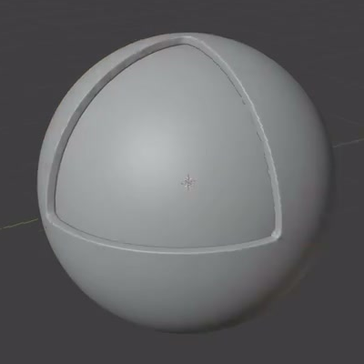
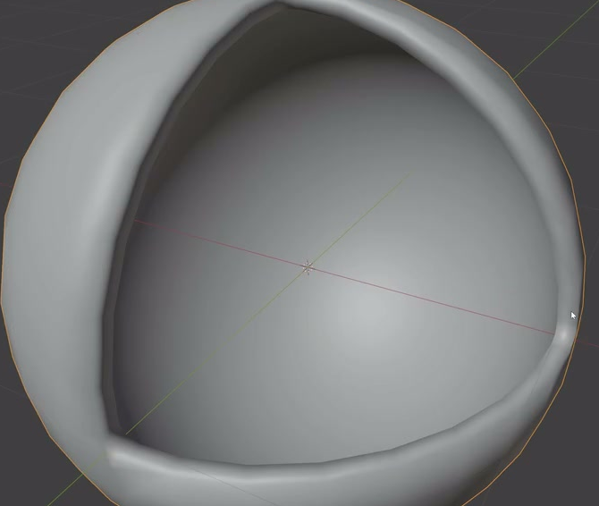
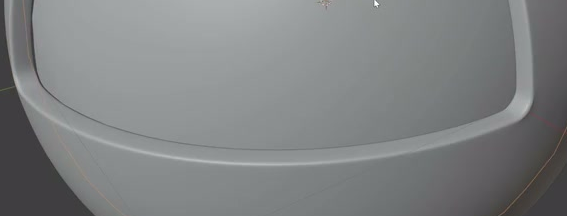

# 八分之一剖面球壳

用代码制作一个可编辑的剖面模型：完整内球位于同心厚外壳之内，外壳缺少一个八分之一角区，从三条弧边围成的开口能看见内球。外壳有连续厚度，开口的三个角圆滑，整体保持球形。

## 输入与交付

- 使用 Blender 5.1.2，从空场景开始；没有外部输入素材，`input/` 为空。
- 交付 `submission.blend` 和可从空场景重建结果的 `build.py`。内球与外壳须能分别选择、隐藏和编辑。
- 灰模即可。模型整体尺寸、世界朝向、对象名称及建模方法自由；参考画面的选择高亮、网格、灯光和视角不需要复现。
- 如需渲染，使用 Cycles GPU；可以添加相机和灯光，但它们不计入模型的两个主体组件。

## 1. 球形主体与八分之一开口

外壳的主体是球面，缺口位于一个球面八分区。理想缺口由三个位于球心、两两垂直的平面界定，留下三条弧边围合的开口；圆角过渡处允许偏离理想边界。缺口应贯穿外壳厚度，其余区域不能另有破洞，也不能用表面凹坑或一张贴图代替剖口。

## 2. 完整同心内球

内球必须是完整、闭合的球体。它与外壳同心，能够在开口中形成凸出的球面，而不是凹面。隐藏外壳后应能看到完整内球；隐藏内球后应能看到真实的空心外壳。

以完整内球半径为 R，两者球心距离不超过 0.01R。内球可以与外壳内表面贴合，但不得穿出外壳外表面，也不能出现明显悬空间隙。

## 3. 连续厚度与封闭切面

外壳具有内外两层表面，开口周围由连续侧壁连接，形成有体积的闭合壳体。名义厚度为 0.05R 至 0.15R；除圆角和边缘过渡带外，厚度应基本一致。不要留下零厚度边、未封闭切面或明显自相交。

## 4. 圆角与表面质量

开口三个角都有平顺的圆角，三边围合的形状仍清晰可辨。外壳、内球与开口边缘在正常近景下应平滑，没有明显锯齿、夹痕、尖刺、重叠表面闪烁或破损阴影。

## 5. 独立编辑

内球和外壳是两个独立主体，隐藏或移动其中一个不会同时隐藏或移动另一个。对其中一个进行局部几何编辑，或修改其专用形状参数，不应意外改变另一个。可以用任何合理的网格、修改器或程序化方法实现上述结果，不要求保留某种修改器名称或操作历史。

## 渲染效果交付

在原有交付文件之外，另提交 `B38_八分之一剖面球壳.png`。图片采用 PNG 格式，从实际交付工程渲染，清楚展示主要成品及其形体或材质效果。使用本题规定的渲染环境；若原题没有指定展示相机，可设置能完整观察主体的相机。该文件应与 `submission.blend` 中的结果一致，不以参考图、视口截图或外部素材代替实际渲染。
