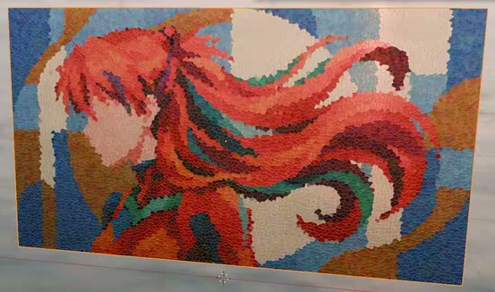
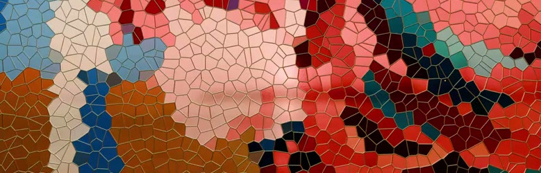
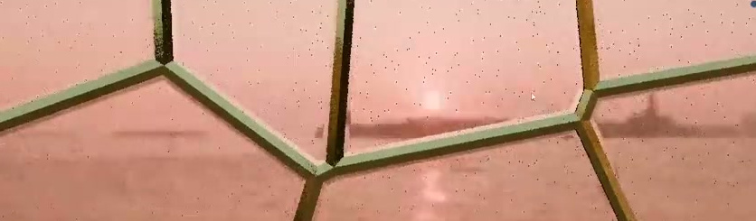
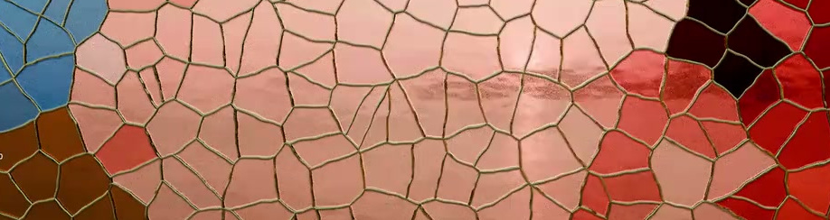
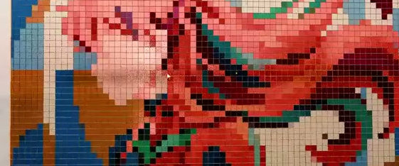
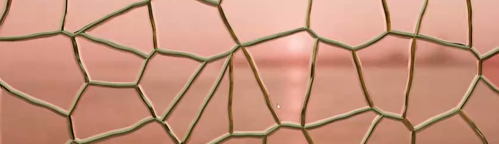

# 程序化彩绘玻璃花窗

将提供的二维插画制作成可编辑的彩绘玻璃面板：整幅画由许多不规则、半透明的彩色玻璃单元组成，单元之间具有连续的金属分隔条；近看能够分辨玻璃的细微表面变化和分隔条的立体感。材质应保留可调的分块密度与规则程度，修改后颜色、玻璃和分隔条仍然对应。

## 起始条件与输入

- 目标环境为 **Blender 5.1.2**，从空场景开始，使用 Python 构建工程。
- 必须使用 `../input/原始彩绘插画.png` 作为画面的颜色与构图来源。无需其他外部资产。
- 自行选择建模和材质实现。面板尺寸可自定，宽高比例应与输入图像一致。
- 参考图来自原视频的不同制作阶段，只描述各段对应的形态或材质目标。以第 1 张图为默认整体效果，局部图不要求逐格复制分块。图中的环境倒影、视口采样噪点不属于成品内容。

## 1. 完整的薄玻璃面板

面板为横向矩形，能够容纳完整的输入构图。人物朝向、面部位置、长发延展方向及画面边缘内容应保持输入图像的关系，不镜像、不重复铺满，也不把主体拉伸变形。

面板具有实际、连续的薄层厚度，侧面闭合；从斜侧观察仍是薄玻璃板。默认展示画面完整包含面板，能够看清人物与彩色分块。

参照上方整体图；展示背景、照明和镜头角度可自行选择。

## 2. 从插画形成彩色玻璃单元

在整体可辨认人物和长发的前提下，将连续插画转译为紧密相邻的小块玻璃。默认状态的单元是大小有变化、分布不规则的多边形，横纵方向没有整体被拉成狭长条的变形。

每个单元主要呈现其所在图像区域的代表色；相邻单元共同表达脸部、衣服、发丝色带和背景。单元内可以有克制的色泽变化，但不能在每一块中重复整幅插画，或仅在未经分块的原图上叠加网线。红橙长发、肤色区域、深色轮廓及蓝青与浅色背景保持可辨。

## 3. 连续且对齐的金属分隔条

相邻玻璃单元之间形成细窄、连续的金属条网络，围合单元并在交会处连接。分隔条沿着彩色单元的边界，不能横穿单元造成一套色块、另一套边线的错位；整片不得出现无故断开的边线、大片漏缝或覆盖人物的粗重金属面。

分隔条具有暖黄至黄铜色的金属高光，边缘和转角有明暗层次。近看时，金属条略高于玻璃内侧表面，玻璃边缘有轻微收低的视觉关系。可以使用着色凹凸或真实几何表达这一细节。

## 4. 玻璃与金属的材质差异

彩色单元具有玻璃的透光与反射表现，能在适当的背光或侧光下与不透光的金属条区分。高光不能完全抹掉插画颜色，也不能把整片做成不透光的彩色印刷板。

玻璃表面保留细微的起伏或纹理，使局部反射略有变化；分隔条的边缘可有轻微不规则曲折。变化应小于玻璃单元本身的尺度，不能形成大波浪、明显破碎或遮蔽人物的强噪声。

## 5. 可调且保持对应的分块系统

在工程中保留并清楚标识以下两类可编辑控制，默认值保存为整体参考图所示的不规则玻璃效果：

- **分块密度**：能够切换为明显较疏和明显较密两种状态；改变后，玻璃单元数量或平均尺寸随之变化，人物构图与图像比例保持稳定，颜色分块和金属条仍同步对齐。
- **分布规则程度**：能够在接近规则网格和明显不规则的单元分布之间调整；改变后单元继续完整铺满面板，颜色与金属条仍然对应。此控制改变的是单元分布，不只是更换随机颜色。

控制可以由材质、节点组、修改器或可重求值的参数提供。应在工程的文本说明中注明控制所在位置、默认值及两种有效对照设置。调整控制应直接更新结果，无需逐块手工修改，也无需替换成预先渲染好的图像。

*较规则分布的对照状态；默认成品仍应是不规则玻璃单元。*

*不规则分布的局部参考。两张对照图的观察范围不同，不用它们比较分块密度。*

## 提交文件

提交以下两个文件：

- `submission.blend`：完整、可编辑的面板工程，输入图像已打包；包含可用的相机、照明和保存好的默认材质状态。近看材质时可调整观察角度，无需依赖源视频中的环境贴图。
- `build.py`：在 Blender 5.1.2 的空场景中重建 `submission.blend` 的脚本。可读取本题提供的输入图像，不依赖本机绝对路径、网络下载或未提供的插件。脚本中注明运行方式及输入、输出路径；随机过程应固定种子，以便重建相同默认结果。

工程能够打开并观察到有效面板，是进入内容验收的前提；只有图片、空工程或无法载入的工程不构成有效提交。工程内的简短文本说明应列出第 5 节的控制位置与有效设置。

## 渲染效果交付

在原有交付文件之外，另提交 `B39_程序化彩绘玻璃花窗.png`。图片采用 PNG 格式，从实际交付工程渲染，清楚展示主要成品及其形体或材质效果。使用本题规定的渲染环境；若原题没有指定展示相机，可设置能完整观察主体的相机。该文件应与 `submission.blend` 中的结果一致，不以参考图、视口截图或外部素材代替实际渲染。
