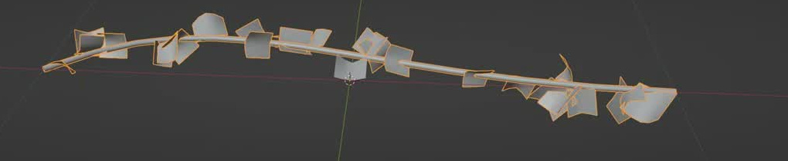
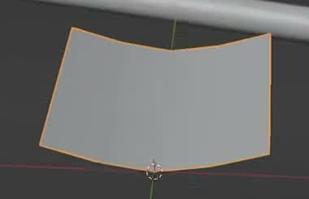

# 可编辑的程序化藤蔓

用代码创建一株沿曲线生长的藤蔓资产。它由一条细茎和许多有浅杯状弯曲的叶片原型组成；改变曲线、茎粗、叶片密度或叶片尺寸后，资产仍能正确生成。

图 1：细茎、沿茎分布的叶片和不一致的叶片朝向。参考的是尚未贴叶片纹理的阶段，叶片保留宽阔、近方形的原型轮廓。

## 起始条件

- 目标环境为 Blender 5.1.2。评测环境提供 GPU 渲染能力。
- 从空场景开始；`input/` 为空，无需外部资产或第三方插件。
- 图片提供形态参考，以下文字规定需要交付的形态和功能。整体尺度自行选择。令 `L` 为交付状态下茎中心线的弧长。

## 1. 连续的曲线茎

茎沿一条舒缓弯曲、不分叉的路径延伸；从合适的俯视方向可看出轻微的 S 形变化。茎具有实体管状截面，沿线连续，不能只是没有体积的线、断开的短棒或一排球体。默认直径在 `0.5%L` 至 `1.5%L` 之间，整体粗细均匀，弯曲处没有明显扭结或塌陷。茎两端可以开口，也可以封口。

保留可编辑的驱动曲线，并使用 Geometry Nodes 使茎和叶片共同随曲线更新。曲线控制点数量、截面边数和节点连接方式自行决定。

## 2. 具有曲面的叶片原型

每片叶子是一张宽阔、近方形的薄曲面，而非立方体或完整球体。叶片宽长比在 `0.7` 至 `1.5` 之间，典型叶长在 `2%L` 至 `8%L` 之间。横向两侧略高于中间，形成开口的浅杯或浅槽；纵向也有柔和弯曲。从侧面能看出曲面，不能全为平面卡片。叶片表面连续，无明显撕裂或尖锐折叠。

图 2：单片叶片的近方形轮廓与浅杯状弯曲。保留可编辑的叶片原型，使其形状修改能传播到藤蔓上的叶片；无需复制图中的网格划分。

## 3. 沿茎分布的叶片

交付状态至少有 12 片叶片，沿茎弧长划分的前、中、后三段均有分布。至少 90% 的叶片根部位于茎表面，或距茎表面不超过一个默认茎半径；不能将叶片整体悬浮在旁边。叶片之间允许自然重叠，但不能全部堆在同一个位置。

叶片朝向与尺寸存在变化：至少能辨认三种不同朝向，最大的叶片线性尺寸至少是最小叶片的 `1.2` 倍。尺寸变化应主要保持原型的宽长比例，不能靠将部分叶片压成细线制造差异。无需复现参考图中的逐片位置或随机序列。

## 4. 可复用的形态控制

在资产的可见控件中提供茎半径、叶片密度、叶片尺寸三个调节项。名称可自行选择，但用途应清楚；在 `.blend` 内的简短说明中标出驱动曲线、叶片原型、控件位置、默认值以及叶片尺寸的低档和高档。

- **曲线变化：** 将驱动曲线中一个控制点沿原曲线平面的法线移动 `0.1L`，茎和叶片应一起更新到新路径。除编辑曲线外，无需重跑构建脚本或逐片移动叶片。恢复控制点后应恢复原资产。
- **茎半径：** 将控件设为默认值的一半、两倍，输出茎的典型半径应分别变为原来的约一半、两倍，允许 20% 的相对误差。中心路径不变；叶片仍附着在更新后的茎上。叶片数量可以随茎表面积改变。
- **叶片密度：** 设为零时只保留完整的茎；设为默认值的两倍时，叶片数至少比默认状态增加 50%。茎的路径与半径不变。
- **叶片尺寸：** 可调节最小尺寸，也可调节整体尺寸。说明中标出的高档平均叶片线性尺寸应至少为低档的 1.2 倍，同时保持叶片数量、茎形态和叶片间的大小差异。
- **原型与重算：** 修改叶片原型的一处边缘后，所有生成叶片应相应更新。控件与随机种子不变时，重新求值或重新打开文件不能随机改变分布。

## 5. 茎与叶片的材质区分

茎呈深棕色，叶片呈不透明的中性浅灰或白色；中性照明下二者容易区分。茎材质不应覆盖到叶片上。此任务的范围止于未贴图原型，无需叶脉、照片纹理、透明裁切或附着在建筑物表面的攀爬效果。

图 3：原视频完成茎材质时的整体状态。图中预览光照和选中轮廓不属于资产要求；材质颜色以本节文字为准。

## 6. 交付内容

提交 `submission.blend` 和 `build.py`。`build.py` 应能在 Blender 5.1.2 的空场景中生成并保存该资产；运行方式写在脚本开头。所有必要资源应随文件保存或由脚本生成，不依赖作者机器上的路径或联网下载。

`submission.blend` 以正常可编辑状态保存，控件处于所述默认值，资产在视口中清楚可见。内部保留前述控件说明。相机、灯光和展示背景可自行安排，不要求复现视频界面或提供固定镜头。

图片为参考视频的实际画面裁切。本文的比例范围、调节幅度和容差是本任务的验收约定。

## 渲染效果交付

在原有交付文件之外，另提交 `B40_可编辑的程序化藤蔓.png`。图片采用 PNG 格式，从实际交付工程渲染，清楚展示主要成品及其形体或材质效果。使用本题规定的渲染环境；若原题没有指定展示相机，可设置能完整观察主体的相机。该文件应与 `submission.blend` 中的结果一致，不以参考图、视口截图或外部素材代替实际渲染。
