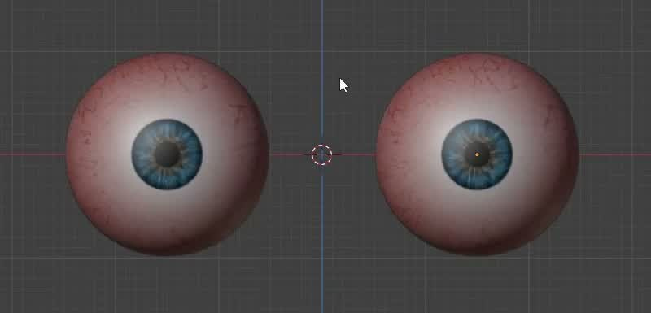
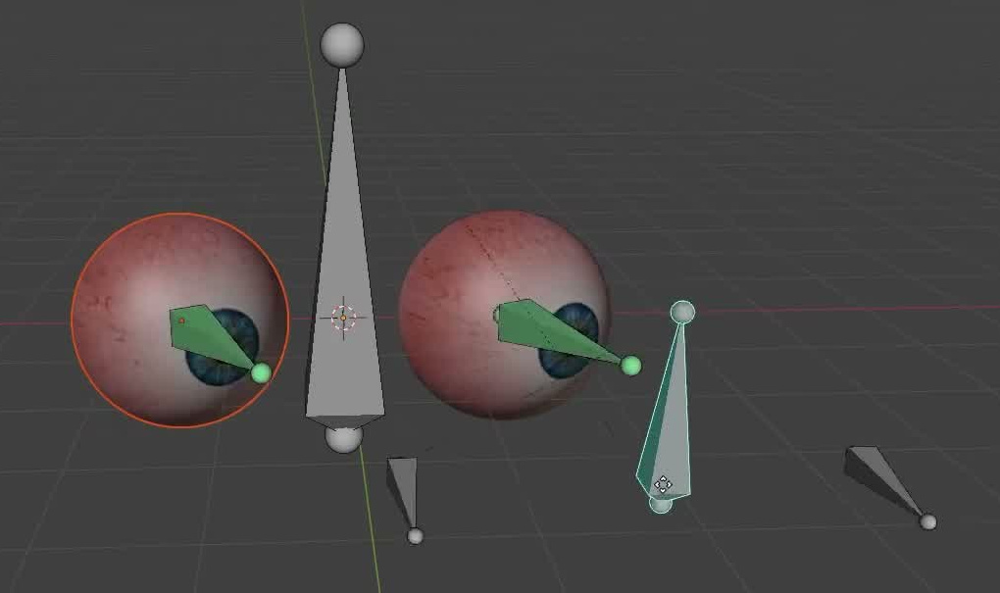
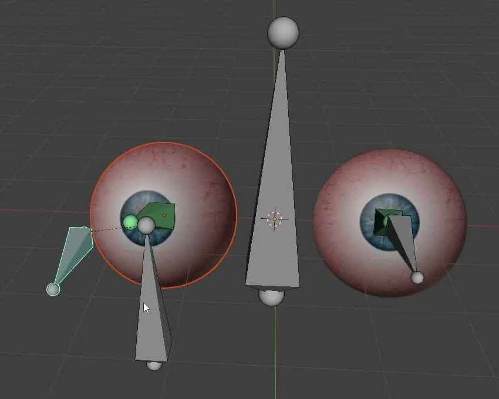
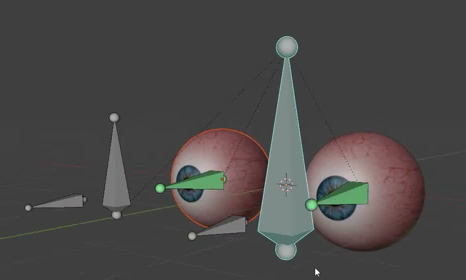

# 双眼注视控制资产

用代码创建一对能够独立和共同转向的眼睛，以及可继续编辑的眼部绑定。移动共同控制器时双眼一起改变注视方向；移动单眼目标时只改变对应眼睛；头部整体移动或旋转时，眼睛和注视控制系统一起跟随。

图 1：两个对称眼球，正面具有能辨认视线方向的虹膜和瞳孔。本任务无需复制参考图中的血丝或照片纹理。

## 起始条件

- 目标环境为 Blender 5.1.2。评测环境提供 GPU 渲染能力。
- 从空场景开始；`input/` 为空。自行创建眼睛，不需要第三方插件、现成角色或外部纹理。
- 坐标约定：`+Z` 向上，静止时双眼向 `-Y` 看，人物左眼位于 `+X` 一侧。令 `D` 为默认状态下两眼中心间距，整体尺度自行选择。

## 1. 对称且可辨方向的眼睛

两眼形状为完整、平滑的球体，相对于 `X=0` 对称，中心等高且处于同一前后位置。两眼尺寸相同，球半径在 `0.25D` 至 `0.35D` 之间，彼此不相交。表面不能有可见的大洞、破面或尖刺。

每只眼睛的正面均具有浅色眼白、彩色虹膜和更暗的瞳孔，背面不能也出现同样的瞳孔。材料、贴图或实际几何均可实现这些外观，但标记必须附着于眼球并随眼球真实转动。虹膜颜色、血丝细节和球体拓扑自行决定。

## 2. 静止状态与控制接口

交付时两眼均看向 `-Y`，视线偏差不超过 5 度。提供一个头部整体控制器、一个双眼共同控制器，以及左右眼各自的目标控制器；控制器可以是骨骼、对象或等价的可编辑控制结构。名称和数量不作固定要求，但这四种用途应可辨认。

默认时，每个单眼目标位于对应眼球的正前方，目标距离为 `D` 至 `2D`，两眼的目标距离相同。共同控制器平移时，应将这两个目标一起平移，并保留二者之间的偏移。无需让双眼在默认时汇聚到同一个空间点。

在 `.blend` 内保留简短说明，标出两只眼睛、四类控制用途、单眼实际注视的空间目标位置，以及如何恢复默认状态。只需恢复可观察的默认状态，不要求所有内部变换通道等于零。

## 3. 双眼共同注视

从默认状态出发，将共同控制器分别沿 `+X`、`-X`、`+Z`、`-Z` 平移 `0.5D`，每次从默认状态独立开始。两只眼球的虹膜和瞳孔均应真实转动，朝向各自移动后的目标，实际视线与“眼球中心指向目标”的方向偏差不超过 5 度。

图 2：共同控制带动双眼转向的一个状态。参考图中的骨骼形状和内部层级不是必须复现的实现方法。

## 4. 单眼独立注视

保持共同控制器与另一只眼的目标不动，分别将一个单眼目标沿 `+X` 和 `+Z` 移动 `0.5D`，每次从默认状态独立开始。对应眼球应朝向自己的目标，视线偏差不超过 5 度；另一只眼的视线变化不超过 2 度。左右眼都应支持这种独立控制，不能串线或出现目标移动后两眼始终同步的情况。

图 3：原视频单眼目标调整时的状态，用于说明独立控制的含义；不要求提交时停留在这一姿态。

## 5. 稳定转轴与头部跟随

在第 3、4 节的控制变化中，每只眼球应绕自己的中心旋转。眼球中心漂移不超过 `0.01D`，球体半径变化不超过 2%，不得滑出原位置、缩放或被拉扯变形。

头部整体控制器支持平移和旋转。以默认状态为起点，分别验证整体平移 `(0.5D, 0.25D, 0.25D)`、绕竖直 Z 轴旋转 30 度，以及绕头部局部 X 轴俯仰 15 度。两眼、共同控制器和左右目标应一起跟随；其相对头部的位置关系保持不变。跟随后再操作共同或单眼目标，仍应满足前两节的注视行为，此时控制偏移方向按当前头部坐标系解释。无需创建头部网格，也无需制作预设动画。

图 4：原视频整体控制后的状态。重点是眼球和目标作为一个系统跟随头部，控制器的外形和具体位置可自行安排。

## 6. 交付内容

提交 `submission.blend` 和 `build.py`。`build.py` 应能在 Blender 5.1.2 的空场景中生成并保存整个资产；运行方式写在脚本开头。必要资源应随文件保存或由代码生成，不依赖本机绝对路径、缺失贴图或联网下载。

绑定应保留可编辑的实时关系，在视口中操作控制器即可更新眼球，不需重跑脚本或手动修改眼球。文件以第 2 节的默认状态保存，包含所述控制说明。相机、灯光和展示背景自行安排。

图片为参考视频的实际画面裁切。尺寸比例、控制测试幅度和容差是本任务的验收约定。

## 渲染效果交付

在原有交付文件之外，另提交 `B41_双眼注视控制资产.png`。图片采用 PNG 格式，从实际交付工程渲染，清楚展示主要成品及其形体或材质效果。使用本题规定的渲染环境；若原题没有指定展示相机，可设置能完整观察主体的相机。该文件应与 `submission.blend` 中的结果一致，不以参考图、视口截图或外部素材代替实际渲染。
