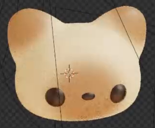
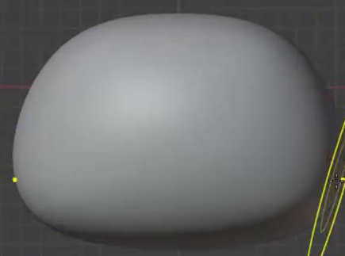
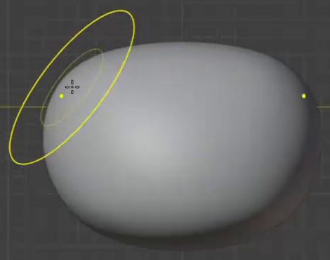
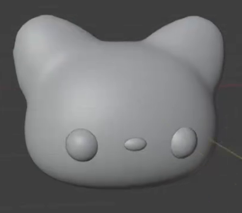
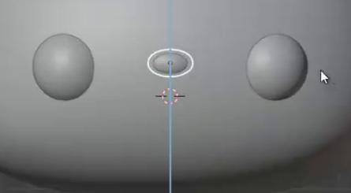

# 米白棕色猫头资产

## 起点与交付

从空场景开始，用 Blender Python 创建一枚具有可编辑顶点花色的卡通猫头。`input/` 为空；所需形状和花色参考均在本文中。目标环境为 Blender 5.1.2，使用 Blender 自带功能，渲染引擎为 Cycles。

交付 `submission.blend` 和 `build.py`。脚本须能从空场景重新生成提交资产；资产依赖须打包进 `.blend` 或使用随交付提供的相对路径。保留可检查的三维几何、材质和颜色数据。无需制作手机、支架、文字、背景道具或实体打印件。

## 总目标

完成一个横向圆润的猫头：两只短耳与头部自然衔接，正面下半部有两只深色眼睛和一枚小鼻子；米白底色上分布柔和的棕色耳尖及面部花色。整体比例与下图一致，花色可在模型表面继续局部编辑。

参考图中的网格线、游标、选中轮廓及渲染噪点属于视频视图叠加，不属于资产。可自由选择建模方法和实现结构；下列编号表示应同时满足的结果，不表示制作顺序。

## 1. 圆润且有体积的头部

不计耳朵，头部正面宽于高；额头平缓拱起，两颊丰满，底部较平但转角圆润，形成接近圆角方形的轮廓。侧面应有饱满厚度和圆滑过渡，不能只做成正面贴片或薄板。以参考轮廓为准，无需匹配视频中的网格密度或雕刻笔触。

## 2. 成对短耳与连续表面

头顶左右各有一只短耳。两耳大小和高度基本对称，耳根较宽、顶部较窄且圆钝；中央保留低于两耳的额头凹口。耳朵有厚度，不应成为圆球、细长尖锥或平面三角片。

耳根与头部表面连续，正面和斜侧面均无明显接缝、空隙或穿插线。最终头耳表面光滑，无明显棱面或局部尖刺。

## 3. 两只眼睛与居中的小鼻子

两只眼睛位于脸部下半部，左右基本对称、大小接近，呈圆形或轻微竖椭圆，并从脸面略微凸起。鼻子位于两眼之间的中线附近，明显小于单只眼睛，呈横向扁椭圆。鼻子中心与两眼中心连线接近；不要求鼻子低于该连线。

五官贴合脸面，无悬空间隙，也不应深埋到难以辨认。正面布局参照下图；这张图只表示五官比例与位置。

## 4. 米白底色、柔和棕色花区与深色五官

头部和耳朵以米白色为底。两只耳朵上部各有棕色区域，颜色向耳根逐渐减弱；脸部中央至下半部有一片围绕眼鼻区域的棕色花区。额头中部及面部外缘仍能看到米白底色，不能把整张脸或整颗头涂成均匀棕色。

棕色与米白之间应有柔和渐变，不呈硬边色块、棋盘格或明显分块。两眼和鼻子均为比棕色花区更深的近黑色，能清楚辨认。颜色关系以总目标图为准，允许不同光照与显示变换带来的合理差异，无须匹配十六进制色值。

## 5. 保留可继续修改的资产

头耳的米白与棕色花色须保存在网格颜色属性中，并实际影响最终表面颜色。改变一只耳朵上的局部颜色数据时，该处外观应随之变化，而头部其余区域保持原样；无需采用指定节点连接或绘制笔刷。

眼睛组与鼻子的大小或位置须能分别调整，调整时不移动或破坏头耳主体。允许镜像、实例或其他对称实现，两只眼睛可以联动，不要求它们是两个独立对象。保存的场景与脚本重建的场景应保留同样的形状、花色和上述编辑能力。

## 渲染效果交付

在原有交付文件之外，另提交 `B42_米白棕色猫头资产.png`。图片采用 PNG 格式，从实际交付工程渲染，清楚展示主要成品及其形体或材质效果。使用本题规定的渲染环境；若原题没有指定展示相机，可设置能完整观察主体的相机。该文件应与 `submission.blend` 中的结果一致，不以参考图、视口截图或外部素材代替实际渲染。
