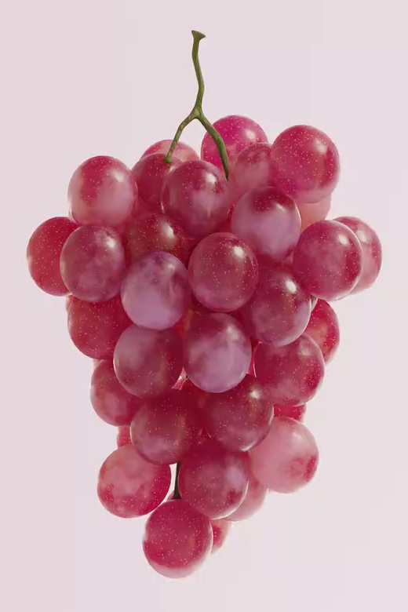
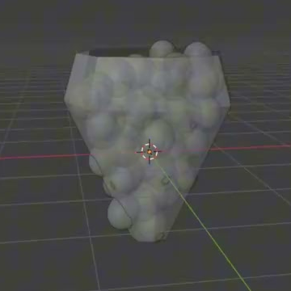
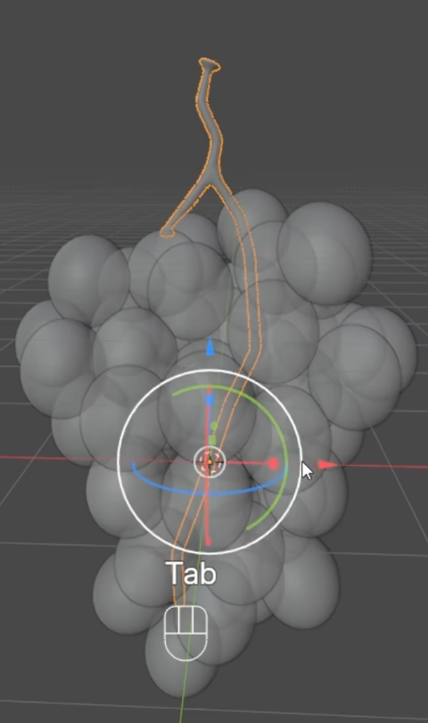

# Translucent Grape Cluster

Create a static studio asset of a naturally packed red-purple grape bunch, with softly translucent speckled skins and a slender yellow-green branching stem.

## Starting Scene and Inputs

Use Blender 5.1.2 and Cycles with GPU rendering. Start from an empty or default scene. The input directory is empty; construct the fruit, stem, and supporting geometry from native Blender geometry and procedural materials.

## Grape Geometry and Arrangement

Build a dense bunch of individually editable grapes. Each grape is a smooth, slightly elongated rounded fruit. Arrange them in an irregular three-dimensional cluster that is broad across its upper portion and tapers to a small lower tip. Front, side, and oblique views must reveal staggered depths rather than a flat wall or a regular grid.

Keep neighboring fruits close enough to read as one bunch while preserving their individual silhouettes. Avoid large empty holes, detached outliers, obvious faceting, and deeply intersecting fruit surfaces. The final layout must remain fixed when changing frames in the presentation scene.

## Branching Stem and Editable Structure

Create a continuous stem that rises above the bunch and divides into branches entering the upper fruit cluster. It should have gentle bends, a thicker trunk, and narrower branches, with rounded transitions and no disconnected junctions.

Retain a non-destructive skeletal path with local thickness control. Moving one path point must move the corresponding stem region, and changing a local radius must change its thickness while retaining the connected branch structure. Equivalent procedural implementations are acceptable.

## Fruit and Stem Materials

Give the grapes red-purple skins with broad soft color variation and much finer scattered pale speckles. The pattern must cover the fruit surfaces without a conspicuous stretched seam or uniform repeated spot arrangement.

Add restrained surface relief and roughness variation that catch highlights without making the fruit look rocky. Light should spread softly beneath the skin and through thinner edge regions, while the grape bodies remain visibly solid and distinguishable. Avoid a clear empty-glass appearance.

Give the stem a separate yellow-green to muted brown material with subtle organic variation and surface relief. Its color and highlight response must distinguish it from the fruit.

## Studio Presentation

Present the entire bunch and stem against a pale lavender studio backdrop with a smooth floor-to-wall transition. Frame the asset clearly, leave visible space around its silhouette, and use lighting that reveals the fine speckles, rounded fruit forms, and translucent skin response. Keep preparation geometry out of this view.

## Deliverables

- `submission.blend`: the editable static presentation scene, procedural stem, and materials.
- `build.py`: a reproducible Blender Python script that builds the submitted scene from the stated starting scene.
- `B43_Translucent_Grape_Cluster.png`: a final PNG rendered from the actual submitted presentation scene. Source images, viewport screenshots, and external image replacements are not acceptable.
