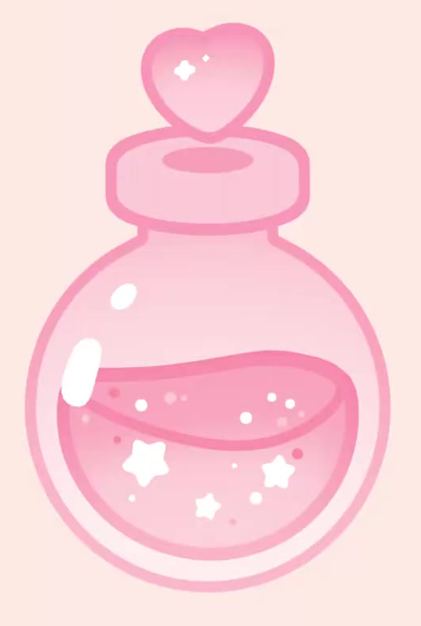
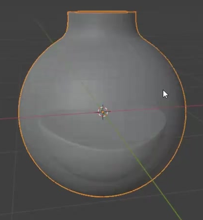
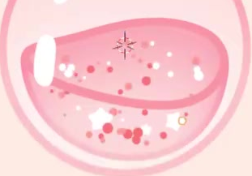

# Cartoon Magic Potion

Create an editable three-dimensional potion bottle that renders like a soft pink illustration: a transparent round bottle, a wavy liquid surface, a heart-shaped stopper, white highlights and stars, and scattered two-color bubbles.

## Starting Scene and Inputs

Use Blender 5.1.2 with EEVEE GPU rendering for the illustrated surface treatment. Start from an empty or default scene. The input directory is empty; all geometry and materials must be created in Blender. The final asset is static.

## Bottle and Liquid Geometry

Make a rounded bottle body with a short narrow neck and a broad, softly rounded mouth ring. The bottle is a real three-dimensional shell with visible thickness, not a flat image. Keep the shell and its surface smoothing editable.

Inside the lower portion of the bottle, place a separate editable liquid volume that follows the body's curvature without breaking through the wall. Its closed upper surface should form a gently tilted wave with an elliptical boundary when viewed from the presentation camera. Keep a clear empty region between the liquid and the neck.

## Heart Stopper and Decorations

Center a thick, rounded heart above the mouth ring. Its front silhouette has two lobes, a readable cleft, and a tapered lower point; side views must reveal real depth. The heart, ring, and bottle should form a coherent vertical arrangement.

Add several white star shapes of varied size inside the liquid and small round bubbles distributed through it. Their placement must keep the liquid readable, avoid a regular grid, and avoid protruding through the bottle. Stars and bubbles must remain editable three-dimensional elements. The final decoration layout must remain fixed across the timeline.

## Illustrated Transparency and Pink Layers

Render the outer shell as a light transparent pink body with a stronger pink contour. The liquid must be clearly visible through the bottle, and overlapping transparent surfaces must not produce black patches, missing layers, or distracting sorting artifacts.

Use smooth pink gradients and flat, clean illumination to distinguish the pale outer bottle, more saturated liquid, mouth ring, and heart. The liquid's upper surface and lower volume must read as related but separate layers. Keep the color and transparency controls editable; the result should resemble the reference's illustrated treatment rather than clear photorealistic glass.

## Highlights and Bubble Color Control

Place a large and a small white highlight along the left side of the bottle, following its curved surface. Give the liquid boundary a continuous bright accent. The highlights and stars should keep a clean white self-lit appearance without flickering, heavy bloom, or visible separation from the surfaces they accent.

Bubbles must vary in size and use two discrete pink tones from a shared editable material. Individual bubbles must receive stable differing colors. Provide a material control that shifts the balance between the two colors without manually assigning a separate material to each bubble. Both tones must be visible in the delivered state.

## Final Composition

Use a pale peach-pink background and a front-biased view that shows the full bottle, ring, and heart with clear margins. Keep the silhouette and liquid boundary legible at reduced viewing size. The final image should have gentle gradients, distinct pink layers, and crisp white accents, without grids, interface overlays, or supporting construction objects.

## Deliverables

- `submission.blend`: the editable bottle, inner liquid, heart, decorations, and illustrated materials.
- `build.py`: a reproducible Blender Python script that builds the submitted scene from the stated starting scene.
- `B44_Cartoon_Magic_Potion.png`: a final PNG rendered from the actual submitted scene. Source images, viewport screenshots, and external image replacements are not acceptable.
