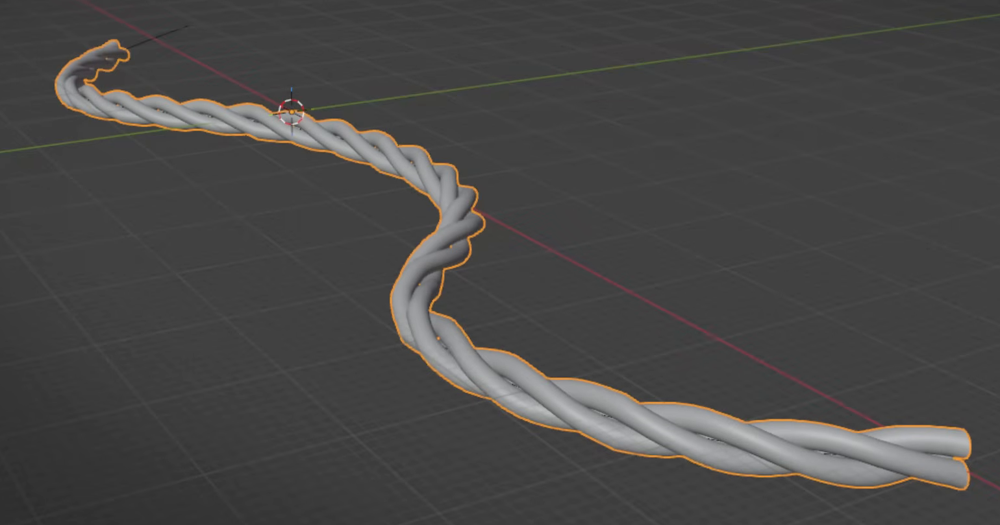
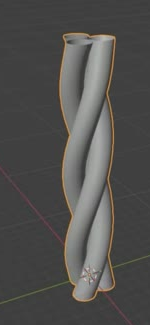
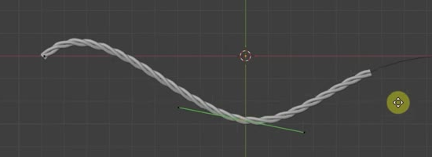

# Procedural Three-Strand Cable

Build a long three-strand twisted cable with continuous rounded cords and a shallow S-shaped path. Keep its strand generation, twist, length, and path deformation live and editable.

## Starting Scene and Inputs

Use Blender 5.1.2 and Cycles with GPU rendering. Begin with an empty scene. The input directory is empty: the asset requires only native Blender geometry and procedural systems. This is a static modeling task.

## Cable Form and Scale

Make exactly three equally thick strands wound around one common centerline. They must remain closely bundled along the whole cable, with a steady twist and clearly distinguishable cord surfaces. Preserve the narrow grooves between neighboring cords without large separating gaps or deep crossings through one another.

Before path bending, the cable should be approximately 160 m long, with an acceptable length of 155-165 m. Its default twist has one full revolution per approximately 20 m section, repeated eight times along the cable. The result should read as a long slender cable, with the overall proportions shown in the references.

## Rounded Strands and Continuous Joins

Each strand must have a round cross-section and a smooth silhouette, including at the cable's bends. Avoid visible low-sided facets, shading discontinuities, pinched cord sections, and abrupt thickness changes.

The repeated sections must form continuous strand surfaces. Internal joins must have no gaps, stepped alignment, exposed internal caps, doubled seam rims, or sudden twist-phase jumps. The cable's outer ends may remain open as in the reference.

## Live Cable Generator

Generate the cable non-destructively from a single simple open tube source. Retain the source and the procedural relationship that extends it into a strand, places the three strands around a common axis, twists the bundle, and repeats the finished twisted section. Equivalent procedural implementations are acceptable if they produce and retain these geometric relationships.

Expose effective controls for source profile size, twist per section, and section repetition. Changing the source profile must update all generated cords consistently. Changing twist must visibly alter the winding. Changing repetition from eight sections to four must approximately halve the unbent length while keeping the local twist pitch and strand thickness unchanged. The generator must continue to produce real evaluated geometry after each change.

## Editable Planar Path

Bend the completed cable along an editable curve into a shallow S. Seen from above, its centerline must bend in opposite directions on the two sides of the middle region. Keep it in one plane, with smooth transitions and no self-crossing or sharp kink. All three strands must follow the bends while retaining the bundle structure.

Moving a middle curve control point within the plane must update the cable path. Disabling the path deformation must reveal the straight generated cable with its full twist intact. Keep the path and generator editable in the delivered state.

## Deliverables

- `submission.blend`: the live procedural cable, editable source tube, and editable deformation path.
- `build.py`: a reproducible Blender Python script that creates the submitted scene from the stated starting scene.
- `B45_Procedural_Three_Strand_Cable.png`: a final PNG rendered from the actual submitted scene. Use a neutral material, clear lighting, and an oblique or overhead camera that shows the complete cable, both bends, and the individual strands. Source images, viewport screenshots, and external image replacements are not acceptable.
