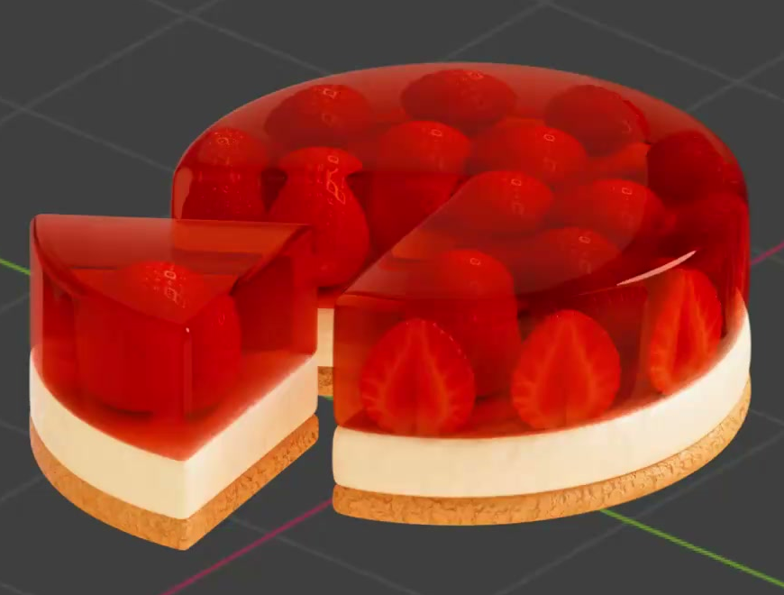
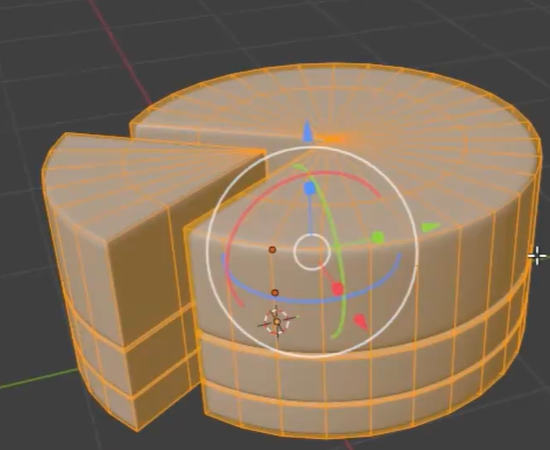
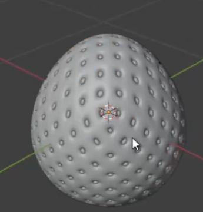

# Strawberry Jelly Cake

Create a layered round strawberry jelly cake with a missing wedge and a matching detached slice. The transparent red jelly must reveal modeled strawberries and image-textured cut faces above a pale cream layer and a thin golden biscuit base.

## Starting Scene and Inputs

Use Blender 5.1.2 and Cycles with GPU rendering. Start from an empty or default scene and build the cake and strawberries from native geometry.

Use `../input/strawberry_slice_texture.jpg` as the image texture for the exposed strawberry cut faces. It is the supplied strawberry cross-section image on a red background. Keep the image available through a relative path or pack it into the blend; do not substitute a different fruit image.

## Cake and Detached Slice

Make a broad round cake with a wedge removed from the front and a matching wedge placed slightly away from the opening. Both pieces must contain the same three aligned layers: a tall upper jelly layer, a shorter cream layer, and a thin biscuit base. Their cut faces and layer heights must visibly correspond as pieces of the same cake.

Keep layers independently editable, closed, and closely stacked without open cracks or deep overlap. Use softly rounded outer edges while retaining readable flat cut faces and a crisp wedge silhouette. The slice should remain near the cake without blocking the view into the missing sector.

## Strawberry Form and Surface Detail

Model strawberries with rounded shoulders and a tapered tip. Include many small recessed seed sockets and distinguishable small seed forms seated within them, rather than painted dots on an otherwise featureless surface. Their size must suit the jelly layer.

Use glossy red fruit skins and pale yellow seeds that remain distinguishable under the final lighting. Keep the fruit rounded and smooth between the small sockets, without a uniformly rough or metallic appearance. Include cut strawberries with real flat cut faces while retaining the surrounding skin and seed geometry.

## Fruit Placement and Editable Repetition

Embed whole strawberries within the jelly and arrange cut strawberries around the retained outer arc, with cut faces facing outward so the fruit interior can be seen through the side. Include fruit in the detached slice, and keep the removed wedge area free of floating remnants.

Retain a live arc-repetition setup for the peripheral cut strawberries. Editing its arc span or radius must reposition the fruit and associated seeds together. Changing the repetition count must change the number of complete fruit units along the arc, with each cut face retaining its outward orientation. The delivered arrangement should follow the retained cake perimeter with balanced spacing and no protruding seed fragments.

## Strawberry Cut-Face Mapping

Map the supplied image onto the actual flat cut faces. Align the pale central core with the fruit's long direction and fit the red flesh to the cut-face silhouette. The rendered face must show recognizable internal strawberry structure, without unrelated red-background patches, obvious stretching, or a misplaced image border. Keep the glossy outer skin and seeds visually separate from the cut flesh.

## Transparent Red Jelly

Use the same coherent red jelly treatment on the main cake and slice. The layer must transmit enough light to reveal the fruit inside, while stronger red coloration in longer light paths gives it visible depth. Reflections and edge refraction should make the jelly read as a solid transparent food layer rather than an opaque red block or an empty glass container.

Keep the jelly surfaces smooth, with controlled highlights that do not obscure most of the fruit. Its cut faces, top, and curved outer wall must all render cleanly without black seams or missing surfaces.

## Cream and Biscuit Materials

Give the cream a warm pale color with fine, soft, irregular surface relief. Give the biscuit base a golden-brown color with a visibly coarser crumb texture and a rougher highlight response than the cream. Use editable procedural texture controls for both finishes and carry each finish consistently across the main cake and slice.

## Deliverables

- `submission.blend`: the editable layered cake and slice, modeled fruit and seeds, live peripheral fruit repetition, UV mapping, and applied materials, with the supplied texture packed or correctly linked.
- `build.py`: a reproducible Blender Python script that builds the scene from the stated starting scene and supplied input image.
- `B46_Strawberry_Jelly_Cake.png`: a final PNG rendered from the actual submitted scene. Frame the whole cake and detached slice from an oblique view that reveals the layer stack, cut sector, jelly depth, and visible fruit interiors. Source images, viewport screenshots, and external image replacements are not acceptable.
