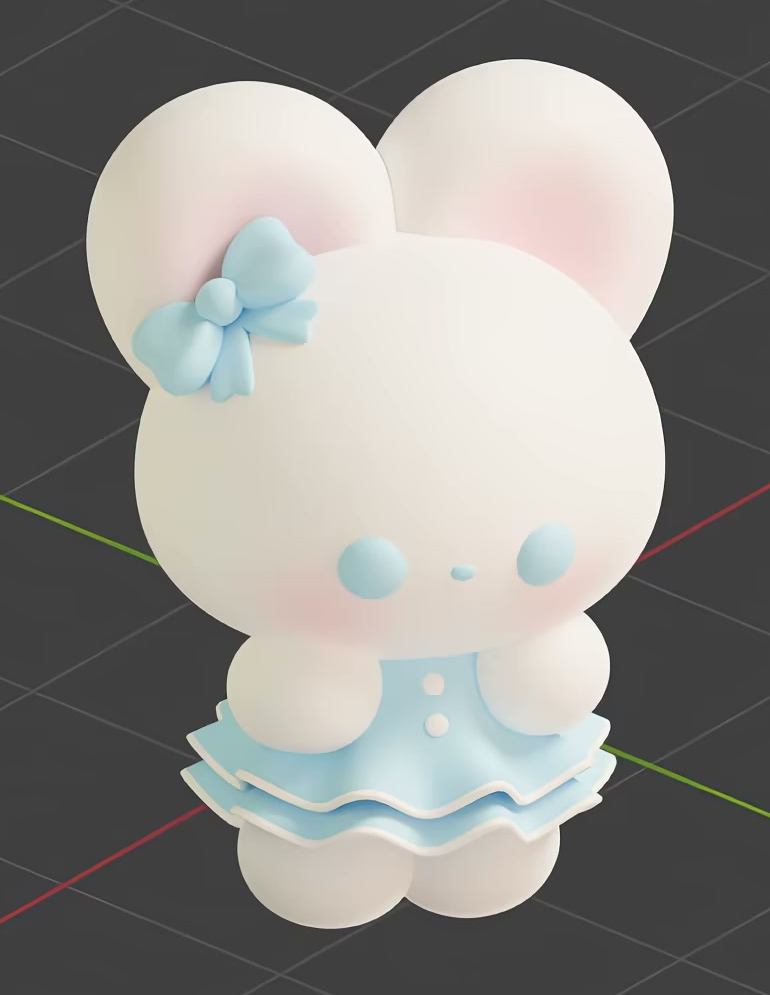
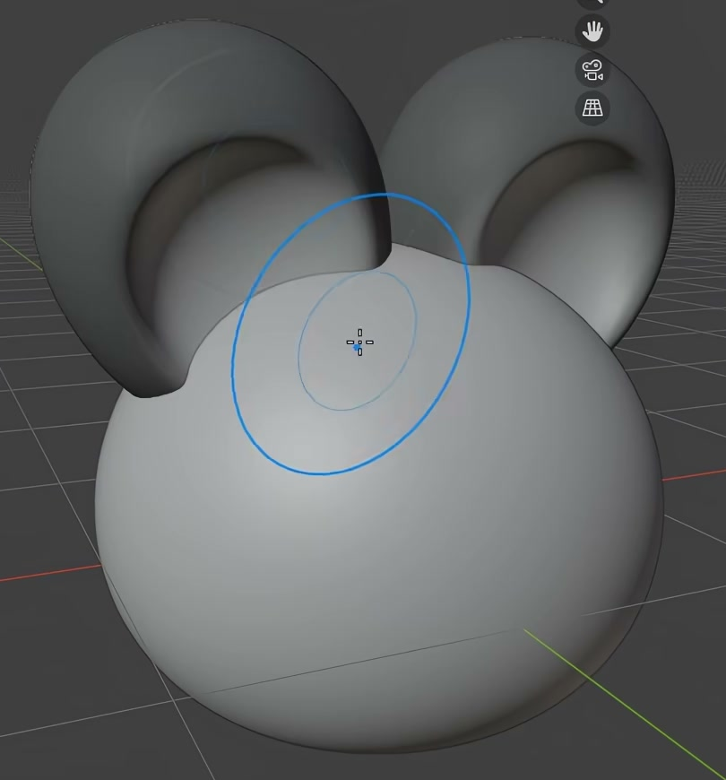
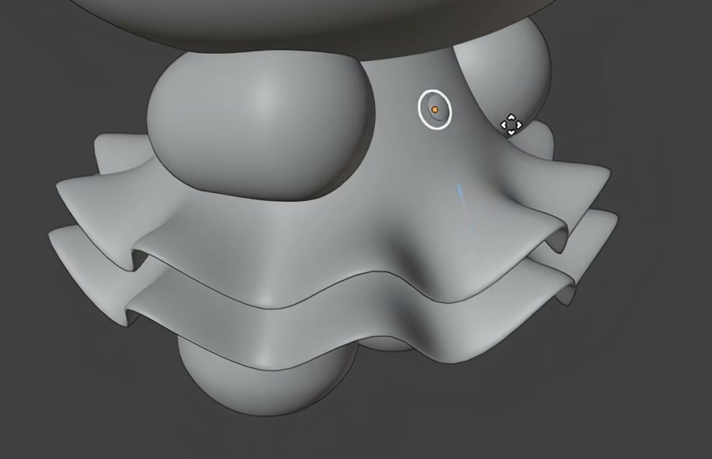

# Pastel Rabbit Character

Create a small, rounded rabbit character wearing a pale blue double-flounce dress and an ear-side bow. The finished asset should preserve the soft proportions, recessed ears, compact limbs, and pastel details shown below.

## Starting Scene

Use Blender 5.1.2 and start from an empty scene. The `input/` directory is empty; no external model, texture, reference asset, or plugin is needed. Create the geometry and colors in the submitted scene. Use Cycles with GPU rendering for the final image.

## Head and Ears

Give the head a broad rounded silhouette, fuller at the sides with a gently flattened lower contour. Attach two large, upright, rounded oval ears above the head. Each ear must have a shallow front recess surrounded by a substantial rounded rim; the recess must not pass through the ear. Match the broad, soft ear proportions in the references.

## Face and Body

Place two small, evenly spaced raised eyes on the lower front of the head, with a smaller centered nose slightly below them. Fit these features to the curved head surface. Below the head, include a compact rounded torso, two short arms beside it, two rounded feet below the skirt, and two small buttons arranged vertically on the front of the garment. Keep the body connected to the head and the limbs attached to the body without floating gaps.

## Layered Dress

Surround the lower torso with two distinct, vertically offset flounces. Each flounce must form a continuous flared surface with a soft repeating wavy hem and visible edge thickness. The upper layer is slightly smaller than the lower layer. Both layers must remain distinguishable from the front and an oblique view, without crossing each other or exposing large gaps at the waist.

## Bow and Surface Form

Attach a bow at one ear root. Include a rounded central knot, two outward-spreading lobes with pinched inner ends, and two short hanging tails. The bow must read as an attached accessory from the front and an oblique view. Keep curved surfaces smooth: avoid faceted silhouettes, broken normals, unintended creases, and accidental surface holes. Preserve editable geometry for the character and its accessories.

## Pastel Finish

Use warm white on the exposed character, pale blue on the eyes, nose, garment, and bow, and white buttons and narrow white hem trim. Apply soft pink cheek blush and pink ear interiors. The cheek and ear colors must be editable mesh color attributes that are actually used by the corresponding surface materials. Preserve a soft, nonmetallic finish, with diffuse color transitions and gentle highlights rather than mirror-like reflections.

## Deliverables

- `submission.blend`: the complete editable character and a camera composition showing the full character, ear recesses, face, bow, and both skirt layers clearly.
- `build.py`: a reproducible Blender Python script that builds the submitted scene from an empty scene without external assets.
- `B47_Pastel_Rabbit_Character.png`: a Cycles GPU render from the actual submitted scene. Use a front-oblique view with enough margin to keep the ears and feet visible, and lighting that makes the form and pastel colors legible. Do not substitute a source image, viewport screenshot, or externally created picture.
