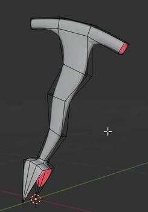
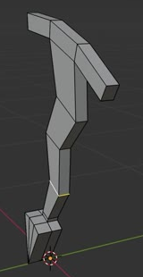
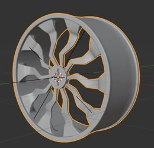

# Editable Radial Wheel

Create a ten-spoke wheel, approximately 2 m in diameter, generated from one editable simple segment. The segment has a narrow rim arc, a shallow bent and tapering spoke, and a small centre web. Editing this segment must update the whole wheel, and a single placement control must move the wheel intact.

## Starting Scene

Use Blender 5.1.2 with an empty scene. The `input/` directory is empty: the simple segment is built from native mesh geometry, with no external asset or plugin. Use Cycles with GPU rendering for delivery. This is a static asset with editable controls; timeline animation is not required.

## Segment Form

Build a segment spanning one tenth of a circle. Its outer arc is a narrow rim band. From the middle of that band, a single broad spoke tapers inward, changes direction gently along its length, and reaches a small fan-like centre web. Preserve the simple, shallow S-like spoke profile in the first reference. The centre web must reach the wheel axis and form part of a closed central hub after repetition.

## Depth and Refinement

Give the spoke and centre web a shallow solid depth along the wheel axis. The outer rim band must project farther along that axis, producing a visible tread lip and a T-like side profile. Round the spoke, rim edges, and hub transition while retaining the intended bends and a defined centre shoulder. Curved surfaces must have coherent normals and smooth silhouettes without accidental creases, pinching, or faceting.

## Closed Wheel

The final wheel stands upright, with its axis horizontal, and has an overall diameter of approximately 2 m. Arrange ten equal segments at 36-degree intervals around a common centre. They must form a continuous circular outer rim and a closed central hub with open spaces between the spokes. Join every neighbouring rim and hub boundary, including the last-to-first join. The evaluated wheel must have no unintended boundary edges, overlapping seam shells, or internal seam caps.

The arrangement reference shows a more detailed demonstration wheel. Its ornate spokes and deep barrel are outside the required segment design. Build the simple rim lip, bent spoke, and centre web shown in the first two references.

## Live Construction

Keep one editable source segment driving all ten repeated sectors. A local change to the source spoke must appear consistently in every sector without manually editing the copies. Retain a live radial construction and editable smooth refinement; equivalent procedural implementations are acceptable. The submitted state must be the complete wheel, while the source segment remains accessible for further editing.

## Placement Control

Provide one clearly identifiable placement control centred on the wheel. Translating this control must carry the complete wheel rigidly in any direction while preserving the radial spacing, shape, and joined boundaries. The source segment and any generation dependencies must travel together. Identify the placement control in `build.py` with a short comment.

## Deliverables

- `submission.blend`: the complete editable wheel, its live source construction, placement control, and final camera setup.
- `build.py`: a reproducible Blender Python script that constructs the scene from empty using no external assets.
- `B48_Editable_Radial_Wheel.png`: a Cycles GPU render of the actual submitted scene from a front-oblique view showing the full rim, all spokes, closed hub, and relative rim/spoke depth. Use a neutral surface and readable lighting. Do not substitute source images, viewport screenshots, or externally created pictures.
