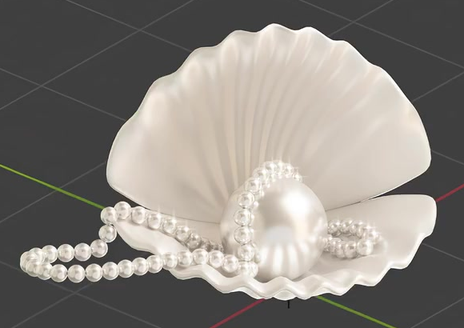
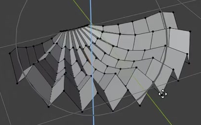
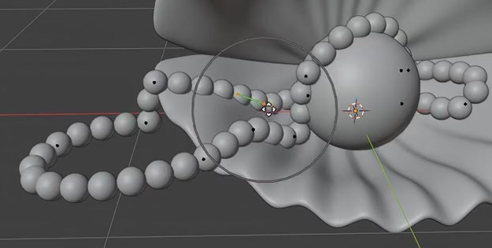

# Pearl Shell and Strand

Create an open pair of fluted shells holding a large white pearl, with a smaller pearl strand curving around it and looping outside the shell. Preserve the fan-shaped ribs, rounded shell edges, and contrast between soft shell reflections and brighter pearl highlights.

## Starting Scene

Use Blender 5.1.2 and begin with an empty scene. The `input/` directory is empty; create the shell surfaces, spheres, and editable strand path using native Blender geometry. No external model, texture, or plugin is required. Use Cycles with GPU rendering for the final image. This task is a static composition.

## Fluted Shell Surfaces

Make each shell a broad fan shape narrowing toward the rear hinge region and widening to a rounded scalloped front edge. Raised ribs and recessed channels must radiate from the narrow region toward the broad edge. Shape the surface into a shallow bowl rather than leaving it flat. Both shells need visible thin edge thickness, smooth curved surfaces, and rounded rib transitions without self-intersections, accidental holes, or faceted silhouettes.

## Open Shell Pair and Main Pearl

Arrange two similarly shaped shells as an open pair: the lower shell supports the contents, and the upper shell rises behind them. Bring their narrow rear regions close together like a hinge while leaving a generous front opening. Keep both shells visible without broad interpenetration. Place one smooth, rounded main pearl within the lower shell, slightly toward the front. It must appear supported by the lower shell and remain clear of the upper shell rather than floating or protruding through either surface.

## Pearl Strand

Create one continuous strand of small, similarly sized round pearls. Its path must curve around the main pearl, include a bend within the lower shell, and form a visible loop outside the front or side edge. Preserve smooth changes in direction. Beads must have consistent close spacing, with no large gaps, severe mutual overlap, or stretched shapes at bends. The strand should sit across the shell and near the main pearl without visibly tunnelling through either.

## Editable Strand Generation

Keep an editable curve driving the strand and one editable bead source driving its repeated geometry. Changing a local part of the curve must update the corresponding portion of the strand. Changing the bead source must update the repeated beads consistently. Preserve close spacing and rounded bead shapes in the submitted configuration. Equivalent live curve-based generation is acceptable; the result must remain editable in the saved scene.

## Shell and Pearl Finish

Both shells must use a coherent milky-white finish with broad, soft reflections and subtly light-transmitting thin edges. They should retain visible ribs and read as shell material rather than clear glass. Give the main pearl and strand a consistent silver-white pearl finish with tighter, brighter rounded highlights. The pearl surfaces should be visibly glossier than the shells. Apply materials to the actual rendered geometry and avoid unassigned default surfaces.

## Deliverables

- `submission.blend`: the complete editable shell pair, main pearl, live bead strand, materials, lighting, and final camera.
- `build.py`: a reproducible Blender Python script that builds the submitted scene from empty without external assets.
- `B49_Pearl_Shell_and_Strand.png`: a Cycles GPU render from the actual submitted scene. Frame the complete open shell pair and outer strand loop from a front-oblique view, with lighting that shows ribs, shell depth, main-pearl support, and material contrast. Do not substitute source images, viewport screenshots, or externally created pictures.
