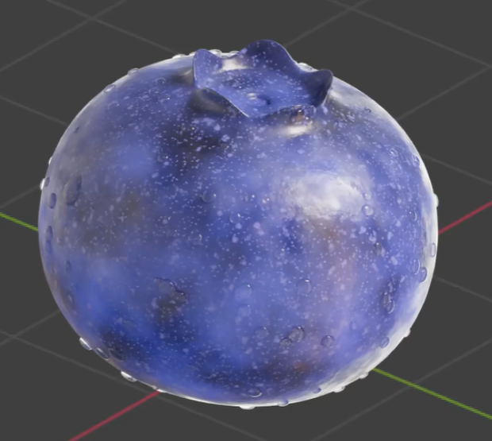
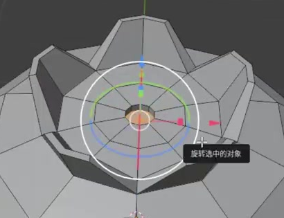
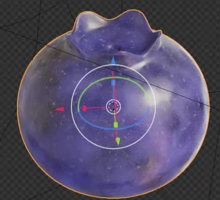

# Procedural Blueberry

Create one rounded blueberry with a raised five-lobed crown and recessed top centre. Build an editable procedural skin material with blue-purple variation, scattered marks, varied gloss, and fine surface relief.

## Starting Scene

Use Blender 5.1.2 and start from an empty scene. The `input/` directory is empty. Build the berry from native mesh geometry and create its skin procedurally, without external textures, models, or plugins. Use Cycles with GPU rendering for the final image.

## Berry Body

The body must be a plump, broadly round fruit with gently flattened top and bottom. Keep its width and depth balanced, with soft curvature rather than an elongated or angular silhouette. The body and top structure must form a coherent editable surface. Curved surfaces must remain smooth, with no accidental holes, normal discontinuities, or visible polygon faceting.

## Crown and Recess

Form five distinct, short, raised lobes around the top opening. Give each lobe a rounded tip and let the lobes flare slightly outward. They must read as a compact fruit crown connected to the body. Recess the centre below the surrounding crown, creating a clearly visible bowl-like depression with a smooth transition into the fruit. The depression must end in a surface rather than pass through the berry.

## Broad Skin Color

Use an editable procedural material on the complete berry. Blend dark blue and blue-purple with lighter blue regions to create broad, soft irregular mottling. Add subtle distorted band-like color variation that wraps around the curved surface and blends into the mottling. Preserve an overall blueberry appearance without obvious straight stripes, abrupt texture seams, or a flat single color. Keep the palette and broad-pattern scale editable.

## Scattered Surface Marks

Overlay irregular marks at two visibly different scales: larger sparse darker patches and numerous much finer pale speckles. They must vary naturally across the skin, remain subordinate to the broad blue-purple color, and avoid looking like one uniform repeated dot pattern. Generate these marks procedurally, with editable scale and coverage.

## Gloss and Fine Relief

Vary roughness across the skin so some patches carry more concentrated highlights while others reflect more softly. Add fine irregular procedural bump or equivalent material-driven relief, visible under oblique lighting without turning the fruit into a coarse rocky surface or changing its basic silhouette. Keep roughness variation and fine relief independently editable. Apply all material effects to the actual berry surface, including the crown.

## Deliverables

- `submission.blend`: the complete editable berry, procedural material, lighting, and final camera.
- `build.py`: a reproducible Blender Python script that constructs the submitted scene from empty without external assets.
- `B50_Procedural_Blueberry.png`: a Cycles GPU render from the actual submitted scene. Use an elevated oblique view showing the whole fruit, all readable crown structure, the recessed centre, and the skin detail. Provide enough margin around the berry and lighting that preserves both dark and light surface regions. Do not substitute a source image, viewport screenshot, or externally created picture.
