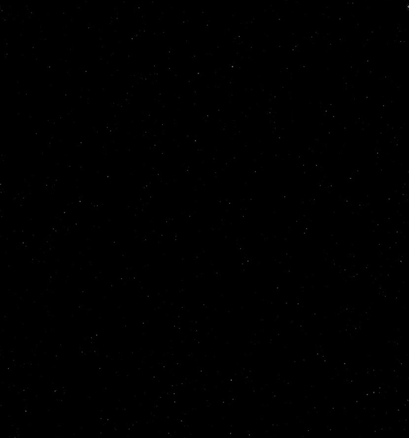
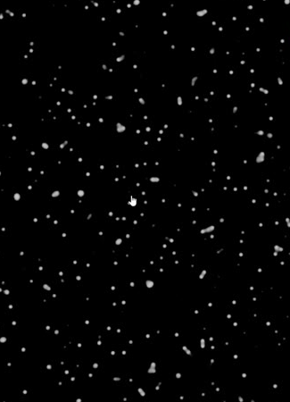

# Procedural Starfield World

Create a procedural World environment that renders as a black night sky scattered with many tiny, restrained white stars. Keep the star pattern, point shaping, and brightness editable in the World shader.

## Starting Scene and Inputs

Use Blender 5.1.2 and Cycles with GPU rendering. Begin with an empty scene and add a camera for the final sky render. The input directory is empty. The reference images describe appearance only; the starfield must be generated procedurally without image textures, HDRIs, imported images, star meshes, or particle systems.

## Procedural World Construction

Build the stars entirely in the active scene's World shader. A procedural spatial pattern must produce localized bright points against a dark field and drive the actual rendered environment. Keep all active controls and their connections editable. Equivalent procedural shader implementations are acceptable.

The final camera view contains sky only. No foreground object, surface carrying an image, or finite dome may supply or obscure the star pattern.

## Star Character and Distribution

Make many small, roughly circular white points with compact cores and subtle edge falloff. Most points in the final 1920-by-1080 render should occupy only a few pixels. Avoid large blobs, elongated streaks, polygonal cell borders, and starburst decorations.

Scatter the points across the full view with broadly even coverage and natural local irregularity. The field must not show a square grid, obvious tiling, broad artificial bands, or one dense corner surrounded by empty sky. Mild variations between individual stars are acceptable, but the overall scale should remain fine and consistent.

## Darkness and Contrast

Keep the space between stars black or near-black. The stars should be neutral white and clearly distinguishable at full image size, but restrained and faint overall as in the finished reference. Avoid a washed-out gray background, colored haze, or a broadly overexposed field.

## Full-Sky Behavior

The environment must cover every viewing direction with the same kind of starfield, including views upward, downward, and across any mapping boundary. No seam, pole concentration, finite edge, or untextured region should become visible when rotating the camera.

Translating the camera while holding its orientation and lens fixed must leave the star directions and apparent point sizes unchanged. This behavior must come from the World environment, not a camera-attached star card. The pattern must also remain stable when rendering the same view again.

## Editable Shader Controls

Provide effective World-shader controls for pattern scale, point threshold or falloff, and master brightness. Adjusting pattern scale must change angular spacing and star frequency. Adjusting the point threshold or falloff must change the size or prominence of the bright regions while preserving a black surrounding field.

Master brightness must dim and brighten the same spatial pattern without moving the stars; zero brightness must remove the star signal. The controls may be ordinary connected shader inputs or a node-group interface. Restore the restrained fine-point state for delivery.

The second reference illustrates an adjustment state. The delivered image must use the faint, fine-point appearance of the first reference.

## Deliverables

- `submission.blend`: the active editable procedural World shader, its effective controls, and a sky-only render camera.
- `build.py`: a reproducible Blender Python script that creates the submitted scene and World shader from the stated starting scene.
- `B51_Procedural_Starfield_World.png`: a 1920-by-1080 PNG rendered from the actual submitted scene. Source images, viewport screenshots, and external image replacements are not acceptable.
